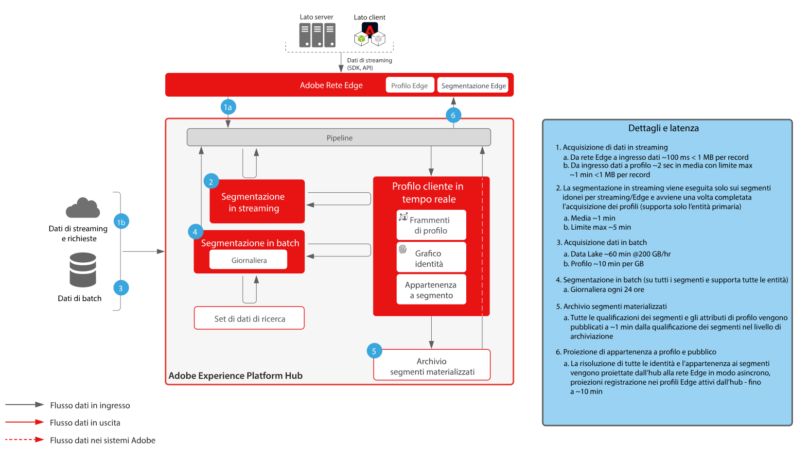
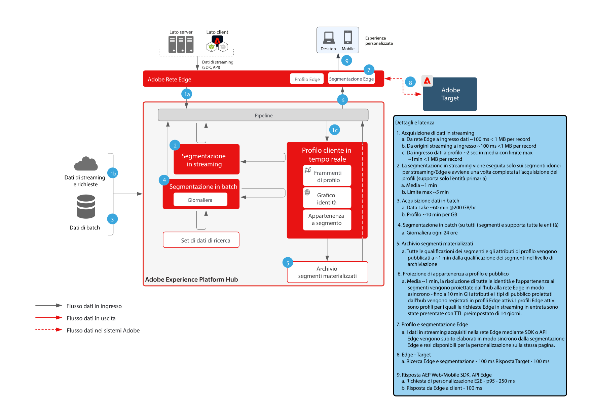
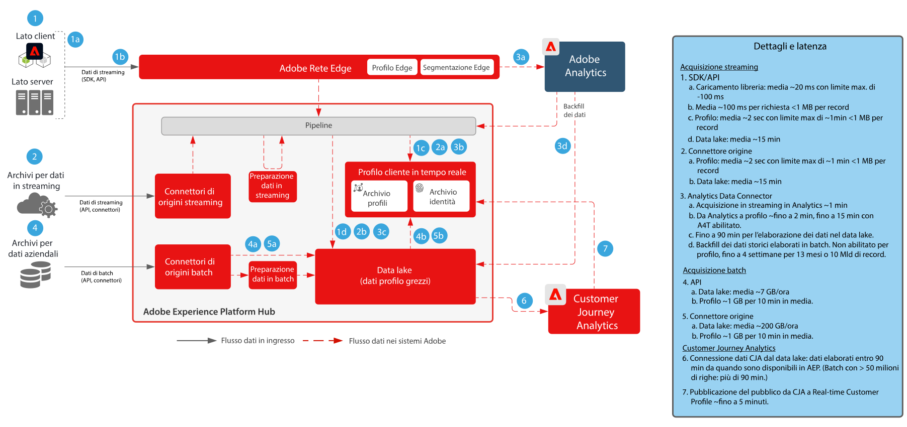

# Guardrail

I guardrail forniscono le soglie consigliate da utilizzare come guida in termini di utilizzo del sistema e dei dati e ottimizzazione delle prestazioni, per evitare errori o risultati imprevisti in Adobe Experience Platform e nelle relative applicazioni. I guardrail rispecchiano i vincoli di sistema e le prestazioni previste per agevolare l’ottimizzazione dell’architettura e delle prestazioni dei casi d’uso del cliente. I guardrail non devono essere intesi come accordi di livello di servizio (SLA). Per informazioni sugli SLA di specifici prodotti, consulta la documentazione di descrizione dei prodotti, accessibile dai collegamenti riportati di seguito.

## Guardrail per Adobe Experience Platform e relative applicazioni

[Guardrail per l’acquisizione dei dati](https://experienceleague.adobe.com/docs/experience-platform/ingestion/guardrails.html?lang=it)

[Guardrail per Edge Network API](https://experienceleague.adobe.com/docs/experience-platform/edge-network-server-api/guardrails.html?lang=it)

[Guardrail per profilo cliente in tempo reale](https://experienceleague.adobe.com/docs/experience-platform/profile/guardrails.html?lang=it)

[Guardrail per il servizio Identity](https://experienceleague.adobe.com/docs/experience-platform/identity/guardrails.html?lang=it)

[Guardrail di condivisione del pubblico di Customer Journey Analytics](https://experienceleague.adobe.com/docs/analytics-platform/using/cja-components/audiences/publish.html?lang=it-IT#latency)

[Guardrail di acquisizione dati di Customer Journey Analytics](https://experienceleague.adobe.com/docs/experience-platform/sources/connectors/adobe-applications/analytics.html?lang=it-IT#what-is-the-expected-latency-for-analytics-data-on-platform%3F)

[Guardrail per il servizio Query](https://experienceleague.adobe.com/docs/experience-platform/query/guardrails.html?lang=it)

[Guardrail per l’attivazione delle destinazioni](https://experienceleague.adobe.com/docs/experience-platform/destinations/guardrails.html?lang=it)

[Guardrail per Journey Optimizer](https://experienceleague.adobe.com/docs/journey-optimizer/using/get-started/guardrails.html?lang=it)

 

## Diagrammi di latenza end-to-end

### Acquisizione dei dati

 

### Segmentazione

 

### Real-time Customer Data Platform e Adobe Target

 

### Customer Journey Analytics

 

### Journey Optimizer

 

## Descrizioni dei prodotti

[Experience Platform Collection Enterprise](https://helpx.adobe.com/it/legal/product-descriptions/adobe-experience-platform-collection-enterprise.html)

[Real-time Customer Data Platform](https://helpx.adobe.com/it/legal/product-descriptions/real-time-customer-data-platform.html)

[B2B Customer Data Platform](https://helpx.adobe.com/it/legal/product-descriptions/adobe-experience-platform-b2b.html)

[Experience Platform Activation](https://helpx.adobe.com/it/legal/product-descriptions/adobe-experience-platform0.html)

[Experience Platform Intelligence](https://helpx.adobe.com/it/legal/product-descriptions/adobe-experience-platform-intelligence---product-description.html)

[Intelligent Services](https://helpx.adobe.com/it/legal/product-descriptions/intelligent-services.html)

[Data Distiller](https://helpx.adobe.com/it/legal/product-descriptions/data-distiller.html)

[Customer Journey Analytics](https://helpx.adobe.com/it/legal/product-descriptions/customer-journey-analytics.html)

[Journey Optimizer](https://helpx.adobe.com/it/legal/product-descriptions/adobe-journey-optimizer.html)

[Journey Orchestration](https://helpx.adobe.com/it/legal/product-descriptions/journey-orchestration.html)

[Offer Decisioning](https://helpx.adobe.com/it/legal/product-descriptions/offer-decisioning-app-service.html)
