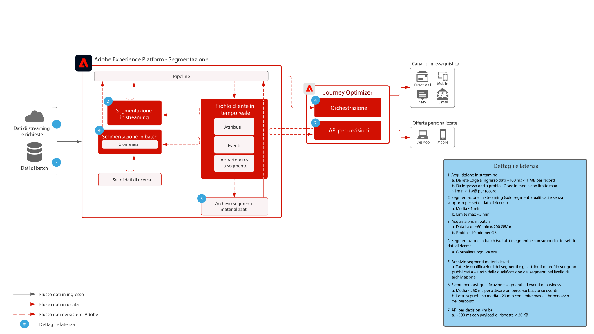

# Guardrail

I guardrail sono soglie consigliate che forniscono indicazioni sull’utilizzo dei dati e del sistema, ottimizzando le prestazioni ed evitando errori o risultati imprevisti in Adobe Experience Platform e nelle applicazioni. I guardrail sono destinati a riflettere i vincoli di sistema e le aspettative di prestazioni per facilitare l&#39;architettura del cliente e l&#39;ottimizzazione delle prestazioni dei casi d&#39;uso. I guardrail non sono destinati ad essere accordi a livello di servizio. Per informazioni sugli accordi a livello di servizio specifici per i prodotti, fare riferimento alla documentazione relativa alle descrizioni del prodotto, disponibile qui di seguito.

## Guardrail per Adobe Experience Platform e applicazioni

[Guardrail per l’acquisizione dei dati](https://experienceleague.adobe.com/docs/experience-platform/ingestion/guardrails.html?lang=en)

[Guardrail API di rete Edge](https://experienceleague.adobe.com/docs/experience-platform/edge-network-server-api/guardrails.html?lang=en)

[Guardrail del profilo cliente in tempo reale](https://experienceleague.adobe.com/docs/experience-platform/profile/guardrails.html?lang=en)

[Guardrail di identità](https://experienceleague.adobe.com/docs/experience-platform/identity/guardrails.html?lang=en)

[Guardrail di servizio query](https://experienceleague.adobe.com/docs/experience-platform/query/guardrails.html?lang=en)

[Journey Optimizer Guardrail](https://experienceleague.adobe.com/docs/journey-optimizer/using/get-started/guardrails.html?lang=en)

 

## Latenza fine

### Acquisizione dei dati

Il diagramma seguente illustra i guardrail per prestazioni e la latenza media per l’acquisizione dei dati in Adobe Experience Platform.

 

### Journey Optimizer

 

## Descrizioni dei prodotti

[Experience Platform Collection Enterprise](https://helpx.adobe.com/legal/product-descriptions/adobe-experience-platform-collection-enterprise.html)

[Real-time Customer Data Platform](https://helpx.adobe.com/it/legal/product-descriptions/real-time-customer-data-platform.html)

[Piattaforma dati cliente B2B](https://helpx.adobe.com/legal/product-descriptions/adobe-experience-platform-b2b.html)

[Experience Platform Activation](https://helpx.adobe.com/it/legal/product-descriptions/adobe-experience-platform0.html)

[Experience Platform Intelligence](https://helpx.adobe.com/legal/product-descriptions/adobe-experience-platform-intelligence---product-description.html)

[Intelligent Services](https://helpx.adobe.com/legal/product-descriptions/intelligent-services.html)

[Customer Journey Analytics](https://helpx.adobe.com/it/legal/product-descriptions/customer-journey-analytics.html)

[Journey Optimizer](https://helpx.adobe.com/legal/product-descriptions/adobe-journey-optimizer.html)

[Journey Orchestration](https://helpx.adobe.com/legal/product-descriptions/journey-orchestration.html)

[Offer Decisioning](https://helpx.adobe.com/legal/product-descriptions/offer-decisioning-app-service.html)