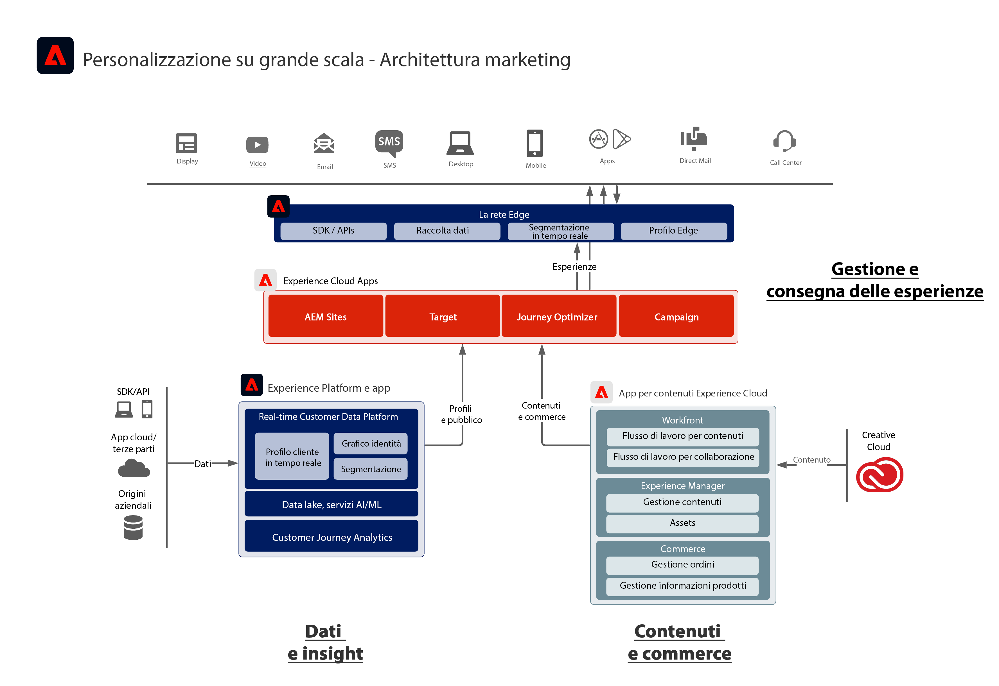

# Diagramma dell’architettura di Adobe Experience Cloud

Il diagramma di architettura seguente illustra il modo in cui Adobe Experience Platform si connette e si integra con le applicazioni Adobe Experience Cloud per ottenere una personalizzazione su larga scala tra dati, contenuti e distribuzione di esperienze.
 
 

 
 
Il diagramma di architettura seguente illustra come le applicazioni Adobe Experience Cloud e Adobe Experience Platform si integrano in un’architettura di customer experience aziendale.
 
 

 
 

Il diagramma di architettura seguente illustra il modo in cui Adobe Experience Platform si connette e si integra con le applicazioni Adobe Experience Cloud.
 
 

