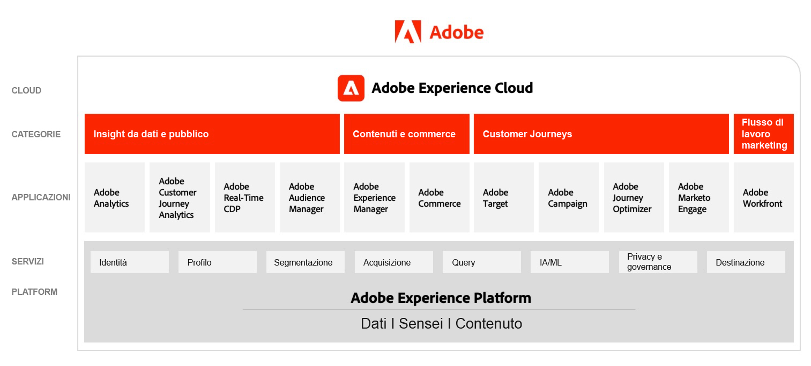

# Diagrammi dell&#39;architettura Adobe Experience Cloud

## Adobe Experience Cloud Marketettura

Il diagramma seguente illustra i vari componenti di Adobe Experience Cloud tra Data Insights &amp; Audiences, Content &amp; Commerce, Customer Percorsi, Marketing Workflow, generati e integrati alla base di Adobe Experience Platform.

 

## Architettura dell’integrazione di dati e informazioni, contenuti e commercio e distribuzione delle esperienze

Il diagramma di architettura seguente illustra come i vari componenti di Adobe Experience Cloud si collegano e si integrano per ottenere una personalizzazione su larga scala tra dati, contenuti e distribuzione di esperienze.

 

## Adobe Experience Cloud nel paesaggio aziendale

Il diagramma di architettura seguente illustra come le applicazioni Adobe Experience Cloud e Adobe Experience Platform si integrano in un’architettura di customer experience aziendale nelle quattro categorie di dati, informazioni, orchestrazione e coinvolgimento.

