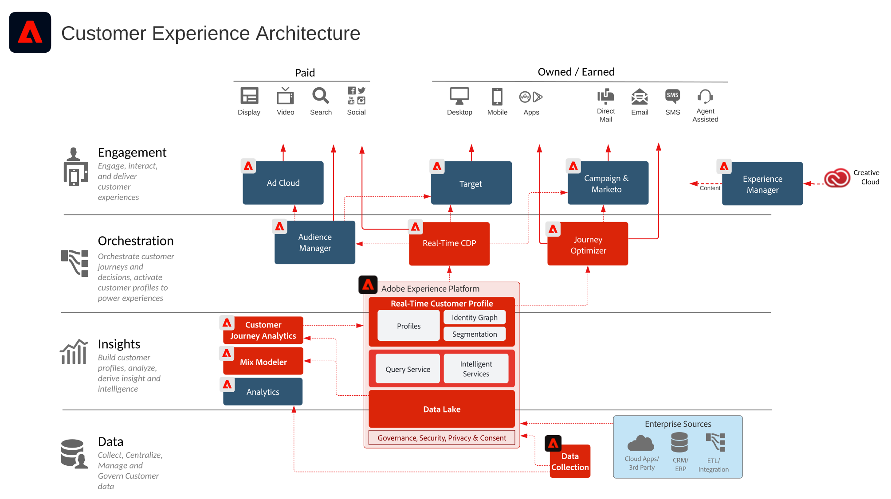

# Diagrammi dell’architettura di Adobe Experience Cloud

## Architettura delle soluzioni marketing Adobe Experience Cloud

Il diagramma seguente illustra i vari componenti di Adobe Experience Cloud per insight e pubblico, contenuti e Commerce, customer journey e flussi di lavoro marketing, creati e integrati nella base di Adobe Experience Platform.

 

## Architettura dell’integrazione di dati e insight, contenuti e Commerce, e distribuzione delle esperienze

Il diagramma di architettura seguente illustra come i vari componenti di Adobe Experience Cloud si collegano e si integrano per consentire la personalizzazione su larga scala di dati, contenuti e distribuzione di esperienze.

 

## Adobe Experience Cloud nel panorama Enterprise

Il diagramma di architettura seguente illustra come le applicazioni Adobe Experience Cloud e Adobe Experience Platform si integrano in un’architettura per customer experience di livello Enterprise nelle quattro categorie di dati, insight, orchestrazione e coinvolgimento.

