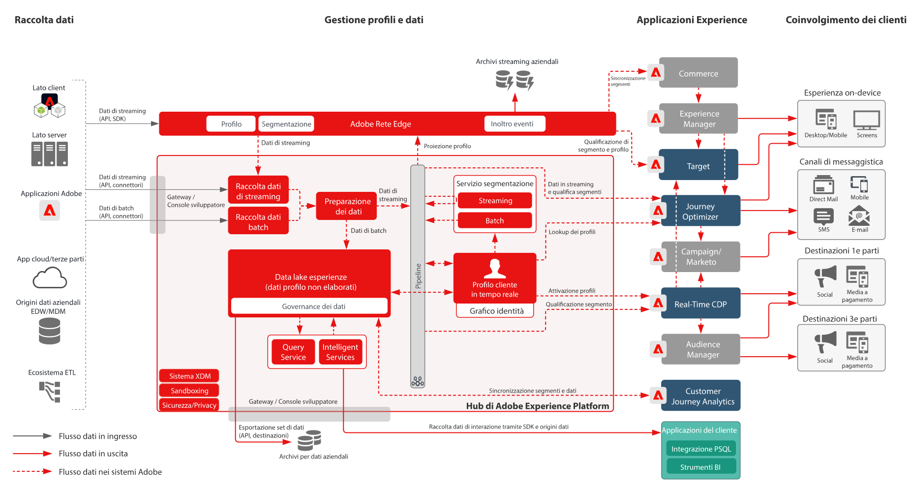

# Diagrammi dell&#39;architettura di Adobe Experience Platform e applicazioni

## Diagramma dell&#39;architettura di Adobe Experience Platform e delle applicazioni

Questo diagramma di architettura mostra come Adobe Experience Platform si correla alle applicazioni e ai servizi applicativi Adobe Experience Cloud.

## Diagramma dettagliato dell&#39;architettura di Adobe Experience Platform e delle applicazioni

>[!VIDEO](https://video.tv.adobe.com/v/32456/?quality=12&learn=on)

## Integrazioni di applicazioni Adobe Experience Platform e Experience Cloud

<table class="relative-table wrapped" style="width: 100%;">
<colgroup>
<col style="width: 16.0202%;" />
<col style="width: 29.3423%;" />
<col style="width: 33.5582%;" />
<col style="width: 21.0793%;" />
</colgroup>
<tbody>
<tr>
<th>Applicazione</th>
<th>Da Experience Platform all’applicazione</th>
<th>Dall’applicazione a Experience Platform</th>
<th>Blueprint correlati</th>
</tr>
<tr>
<td colspan="1">Ad Cloud</td>
<td colspan="1">
<ul>
<li>I tipi di pubblico definiti in Real-time Customer Data Platform possono essere condivisi con Ad Cloud per il targeting tramite Audience Manager.</li>
</ul>
</td>
<td colspan="1">
<ul>
<li>Nessuna integrazione corrente</li>
</ul>
</td>
<td colspan="1">
<ul>
<li><a href="https://experienceleague.adobe.com/docs/blueprints-learn/architecture/audience-activation/anonymous.html?lang=it">Attivazione del pubblico con dati anonimi</a></li>
<li><a href="https://experienceleague.adobe.com/docs/blueprints-learn/architecture/audience-activation/known-customer-audience-activation/known.html?lang=it">Attivazione dei clienti noti</a></li>
<li><a href="https://experienceleague.adobe.com/docs/blueprints-learn/architecture/architecture-overview/platform-applications.html?lang=it">Attivazione con Experience Platform e applicazioni correlate</a></li>
</ul>
</td>
</tr>
<tr>
<td>Analytics</td>
<td>
<ul>
<li>I dati raccolti tramite Web/Mobile SDK possono essere inoltrati ad Adobe Analytics.</li>
</ul>
</td>
<td>
<ul>
<li>I dati raccolti da Analytics possono essere inviati al data lake Experience Platform e all’archivio dei profili. <a href="https://experienceleague.adobe.com/docs/experience-platform/sources/connectors/adobe-applications/analytics.html?lang=it">Connettore dati per Analytics</a></li>
</ul>
</td>
<td>
<ul>
<li><a href="https://experienceleague.adobe.com/docs/blueprints-learn/architecture/architecture-overview/platform-data-flow.html?lang=it">Flussi di dati in Experience Platform</a></li>
</ul>
</td>
</tr>
<tr>
<td>Audience Manager</td>
<td>
<ul>
<li>I tipi di pubblico definiti in Real-time Customer Data Platform possono essere condivisi con Audience Manager per l’attivazione a destinazioni di cookie di terze parti.</li>
</ul>
</td>
<td>
<ul>
<li>I dati raccolti e valutati per l’appartenenza al pubblico da Audience Manager possono essere condivisi con l’archivio dei profili e il data lake di Experience Platform. <a href="https://experienceleague.adobe.com/docs/experience-platform/sources/connectors/adobe-applications/audience-manager.html?lang=it">Connettore origine per Audience Manager</a></li>
</ul>
</td>
<td>
<ul>
<li><a href="https://experienceleague.adobe.com/docs/blueprints-learn/architecture/audience-activation/anonymous.html?lang=it">Attivazione del pubblico con dati anonimi</a></li>
<li><a href="https://experienceleague.adobe.com/docs/blueprints-learn/architecture/audience-activation/known-customer-audience-activation/known.html?lang=it">Attivazione dei clienti noti</a></li>
<li><a href="https://experienceleague.adobe.com/docs/blueprints-learn/architecture/audience-activation/platform-and-applications.html?lang=it">Attivazione con Experience Platform e applicazioni correlate</a></li>
</ul>
</td>
</tr>
<tr>
<td colspan="1">Campaign Classic</td>
<td colspan="1">
<ul>
<li>I tipi di pubblico definiti in Real-time Customer Data Platform possono essere condivisi con Campaign Classic e utilizzati come pubblico per avviare campagne.</li>
</ul>
</td>
<td colspan="1">
<ul>
<li>I dati di interazione e campagna raccolti da Campaign possono essere acquisiti in Experience Platform come origine dati per essere poi utilizzati nella creazione del pubblico tramite Real-time Customer Data Platform e nell’analisi tramite Customer Journey Analytics ed Experience Platform Query Service.</li>
</ul>
</td>
<td colspan="1">
<ul>
<li><a href="https://experienceleague.adobe.com/docs/blueprints-learn/architecture/customer-journeys/overview.html?lang=it">Customer journey</a></li>
</ul>
</td>
</tr>
<tr>
<td colspan="1">Campaign Standard</td>
<td colspan="1">
<ul>
<li>I tipi di pubblico definiti in Real-time Customer Data Platform possono essere condivisi con Campaign Standard e utilizzati come pubblico per avviare campagne.</li>
</ul>
</td>
<td colspan="1">
<ul>
<li>I dati di interazione e campagna raccolti da Campaign possono essere acquisiti in Experience Platform come origine dati per essere poi utilizzati nella creazione del pubblico tramite Real-time Customer Data Platform e nell’analisi tramite Customer Journey Analytics ed Experience Platform Query Service.</li>
</ul>
</td>
<td colspan="1">
<ul>
<li><a href="https://experienceleague.adobe.com/docs/blueprints-learn/architecture/customer-journeys/overview.html?lang=it">Customer journey</a></li>
</ul>
</td>
</tr>
<tr>
<td colspan="1">Customer Journey Analytics</td>
<td colspan="1">
<ul>
<li>I dati raccolti e acquisiti nel data lake Experience Platform sono disponibili per l’elaborazione in Customer Journey Analytics. </li>
<li>I dati di profilo e pubblico da Real-time Customer Data Platform possono essere acquisiti in CJA. <a href="https://experienceleague.adobe.com/docs/analytics-platform/using/cja-usecases/ingest-aep-segments.html?lang=it">Integrazione tra RTCDP e CJA</a>.
</li>
</ul>
</ul>
</td>
<td colspan="1">
<ul>
<li>Crea il pubblico in Customer Journey Analytics e condividi i risultati del pubblico in Real-time Customer Data Platform. <a href="https://experienceleague.adobe.com/docs/analytics-platform/using/cja-components/audiences/publish.html?lang=it">Pubblicazione del pubblico da CJA</a></li>
</ul>
</td>
<td colspan="1">
<ul>
<li><a href="https://experienceleague.adobe.com/docs/blueprints-learn/architecture/customer-journey-analytics/overview.html?lang=it">Customer Journey Analytics</a></li>
</ul>
</td>
</tr>
<tr>
<td colspan="1">Experience Manager</td>
<td colspan="1">
<ul>
<li>Il profilo di Experience Platform è accessibile direttamente dal lato server per il potenziamento di esperienze personalizzate distribuite tramite Experience Manager. Le attività di personalizzazione vengono generalmente distribuite tramite Experience Manager grazie all’integrazione di Target. </li>
</ul>
</td>
<td colspan="1">
<ul>
<li>L’integrazione, i comportamenti e le interazioni correnti eseguiti sui siti di Experience Manager non vengono raccolti direttamente tramite l’SDK per web e dispositivi mobili di Experience Platform.</li>
</ul>
</td>
<td colspan="1">
<ul>
<li><a href="https://experienceleague.adobe.com/docs/blueprints-learn/architecture/audience-activation/known-customer-audience-activation/known.html?lang=it">Attivazione dei clienti noti</a></li>
</ul>
</td>
</tr>
<tr>
<td colspan="1">Journey Optimizer</td>
<td colspan="1">
<ul>
<li>Gli eventi dati e i profili acquisiti in Experience Platform sono resi disponibili a Journey Optimizer per avviare e alimentare i percorsi.</li>
</ul>
</td>
<td colspan="1">
<ul>
<li>I dati di interazione e campagna prodotti da Journey Optimizer possono essere acquisiti in Experience Platform per essere poi utilizzati nella creazione del pubblico tramite Real-time Customer Data Platform e nell’analisi tramite Customer Journey Analytics ed Experience Platform Query Service.</li>
</ul>
</td>
<td colspan="1">
<ul>
<li><a href="https://experienceleague.adobe.com/docs/blueprints-learn/architecture/customer-journeys/journey-optimizer.html?lang=it">Journey Optimizer</a></li>
</ul>
</td>
</tr>
<tr>
<td colspan="1">Adobe Commerce</td>
<td colspan="1">
<ul>
<li>I profili e i tipi di pubblico incorporati in Real-time Customer Data Platform possono essere resi disponibili per la personalizzazione in Adobe Commerce. </li>
</ul>
</td>
<td colspan="1">
<ul>
<li>I dati nativi di Adobe Commerce possono essere inviati ad Experience Platform tramite un connettore di origine di Adobe Commerce. </li>
</ul>
</td>
<td colspan="1">Nessuna integrazione corrente</td>
</tr>
<tr>
<td colspan="1">Marketo</td>
<td colspan="1">
<ul>
<li>I tipi di pubblico definiti in Real-time Customer Data Platform possono essere condivisi con Marketo come audience per avviare campagne e aggiornare oggetti Marketo.</li>
</ul>
</td>
<td colspan="1">
<ul>
<li>Gli account Marketo e i relativi contatti e dati sulle opportunità, insieme ai dati di interazione e campagna prodotti da Marketo, vengono acquisiti in Experience Platform e possono poi essere usati per creare il pubblico tramite B2B-CDP e nell’analisi tramite Customer Journey Analytics ed Experience Platform Query Service. <a href="https://experienceleague.adobe.com/docs/experience-platform/sources/connectors/adobe-applications/marketo/marketo.html?lang=it">Connettore per Marketo Engage</a></li>
</ul>
</td>
<td colspan="1">
<ul>
<li><a href="https://experienceleague.adobe.com/docs/blueprints-learn/architecture/b2b-activation/b2bactivation.html?lang=it">Blueprint per l’attivazione B2B</a></li>
</ul>
</td>
</tr>
<tr>
<td colspan="1">Real-time CDP</td>
<td colspan="1">
<ul>
<li>I dati acquisiti e raccolti in Experience Platform vengono usati come origine dati per assemblare i profili cliente in tempo reale che alimentano Real-time Customer Data Platform.</li>
</ul>
</td>
<td colspan="1">
<ul>
<li>Le metriche Pubblico e Profilo vengono inviate al data lake di Experience Platform per abilitare i dashboard di reportistica con informazioni approfondite sui profili.</li>
<li>I dati Pubblico e Profilo nel data lake possono essere utilizzati per ulteriori approfondimenti tramite Query Service e Customer Journey Analytics.</li>
</ul>
</td>
<td colspan="1">
<ul>
<li><a href="https://experienceleague.adobe.com/docs/blueprints-learn/architecture/audience-activation/known-customer-audience-activation/known.html?lang=it">Attivazione dei clienti noti</a></li>
<li><a href="https://experienceleague.adobe.com/docs/blueprints-learn/architecture/audience-activation/platform-and-applications.html?lang=it">Attivazione con Experience Platform e applicazioni correlate</a></li>
</ul>
</td>
</tr>
<tr>
<td colspan="1">Target</td>
<td colspan="1">
<ul>
<li>Gli attributi di pubblico e profili definiti in Real-time Customer Data Platform possono essere condivisi con Target e utilizzati nelle esperienze di personalizzazione e targeting fornite da Target.</li>
</ul>
</td>
<td colspan="1">
<ul>
<li>I dati raccolti per le esperienze e le interazioni Target possono essere raccolti in Experience Platform tramite Experience Platform Web/Mobile SDK. Questi dati possono essere utilizzati nella creazione del pubblico tramite Real-time Customer Data Platform e per l’analisi tramite Customer Journey Analytics ed Experience Platform Query Service.</li>
</ul>
</td>
<td colspan="1">
<ul>
<li><a href="https://experienceleague.adobe.com/docs/blueprints-learn/architecture/audience-activation/known-customer-audience-activation/known.html?lang=it">Attivazione dei clienti noti</a></li>
<li><a href="https://experienceleague.adobe.com/docs/blueprints-learn/architecture/audience-activation/platform-and-applications.html?lang=it">Attivazione con Experience Platform e applicazioni correlate</a></li>
</ul>
</td>
</tr>
</tbody>
</table>