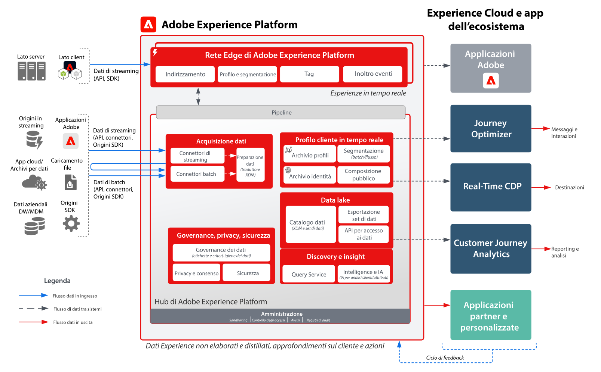
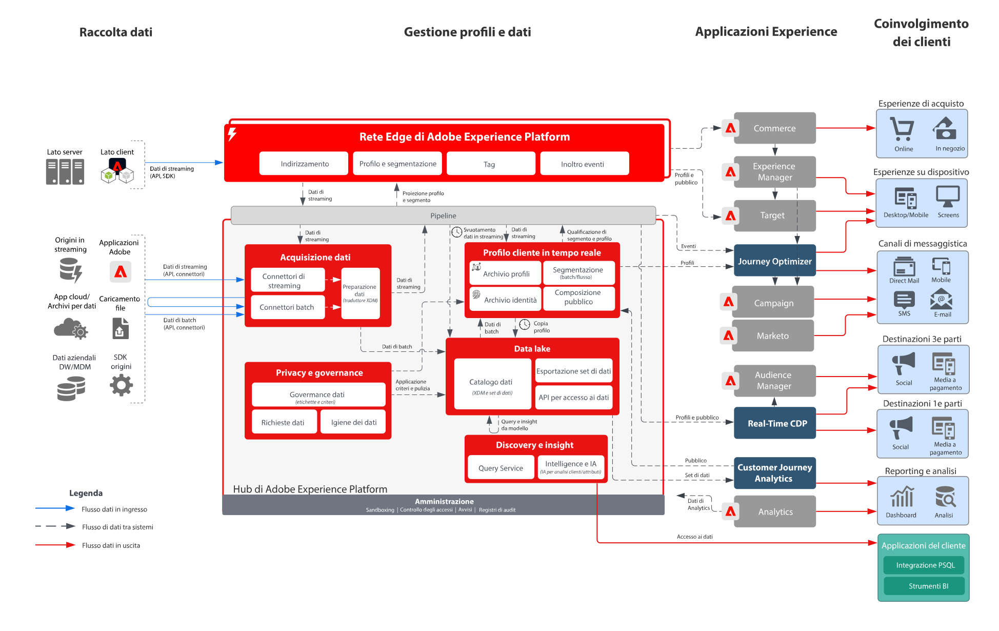

# Diagrammi di architettura di Adobe Experience Platform e applicazioni

Questi diagrammi dell’architettura mostrano le relazioni di Experience Platform (AEP) con altre applicazioni e servizi applicativi di Experience Cloud.

>[!MORELIKETHIS]
>
>[Configurazioni di integrazione per le integrazioni di applicazioni Experience Cloud](https://experienceleague.adobe.com/docs/integrations-learn/experience-cloud/overview.html?lang=en).

## Diagramma dell’architettura

Questo diagramma di architettura mostra come Adobe Experience Platform si correla alle applicazioni e ai servizi applicativi Adobe Experience Cloud.

## Diagramma panoramica

## Diagramma dettagliato dell’architettura

>[!VIDEO](https://video.tv.adobe.com/v/32456/?quality=12&learn=on)

## Integrazioni di applicazioni AEP e Experience Cloud

| Applicazione | Da Experience Platform all’applicazione | Dall’applicazione a Experience Platform |
|------------------------------|-----------------------------------|-----------------------------------|
| **Ad Cloud** | : i tipi di pubblico definiti in Real-time Customer Data Platform possono essere condivisi con Ad Cloud per il targeting tramite Audience Manager. | - Nessuna integrazione corrente |
| **Analytics** | - I dati raccolti tramite Web/Mobile SDK possono essere inoltrati ad Adobe Analytics. | - I dati raccolti da Analytics possono essere inviati al data lake di Experience Platform e all’archivio profili. [Connettore dati di Analytics](https://experienceleague.adobe.com/docs/experience-platform/sources/connectors/adobe-applications/analytics.html?lang=it) |
| **Audience Manager** | : i tipi di pubblico definiti in Real-time Customer Data Platform possono essere condivisi con Audience Manager per l’attivazione su destinazioni di cookie di terze parti. | : i dati raccolti e valutati insieme all’iscrizione al pubblico da Audience Manager possono essere condivisi con il data lake di Experience Platform e l’archivio profili. [Connettore origini di Audience Manager](https://experienceleague.adobe.com/docs/experience-platform/sources/connectors/adobe-applications/audience-manager.html?lang=it) |
| **Adobe Campaign** | - I tipi di pubblico definiti in Real-time Customer Data Platform possono essere condivisi con Campaign Classic per avviare le campagne. | : i dati di interazione e campagna raccolti da Campaign possono essere acquisiti in Experience Platform per un ulteriore utilizzo in audience building, Customer Journey Analytics e Query Service. |
| **Campaign Standard** | - I tipi di pubblico definiti in Real-time Customer Data Platform possono essere condivisi con Campaign Standard per avviare le campagne. | - I dati di interazione e campagna raccolti da Campaign possono essere acquisiti in Experience Platform per un ulteriore utilizzo. |
| **Customer Journey Analytics** | : i dati raccolti e acquisiti nel data lake di Experience Platform sono disponibili per l’elaborazione in Customer Journey Analytics.   - I dati di profilo e pubblico da Real-time Customer Data Platform possono essere acquisiti in CJA. [Integrazione tra RTCDP e CJA](https://experienceleague.adobe.com/docs/analytics-platform/using/cja-usecases/ingest-aep-segments.html?lang=it) | : crea tipi di pubblico in CJA e condividi i risultati del pubblico su Real-time Customer Data Platform. [Pubblicazione del pubblico da CJA](https://experienceleague.adobe.com/docs/analytics-platform/using/cja-components/audiences/publish.html?lang=it) |
| **Experience Manager** | : è possibile accedere al profilo Experience Platform lato server per sviluppare esperienze personalizzate in Experience Manager. | - Nessuna integrazione corrente, le interazioni eseguite sui siti Experience Manager vengono raccolte tramite Experience Platform Web e Mobile SDK. |
| **Journey Optimizer** | : i dati, gli eventi e i profili acquisiti in Experience Platform vengono resi disponibili a Journey Optimizer. | - I dati di interazione e campagna prodotti da Journey Optimizer vengono raccolti in Experience Platform per un ulteriore utilizzo. |
| **Adobe Commerce** | : profili e tipi di pubblico incorporati in Real-time Customer Data Platform possono essere utilizzati per la personalizzazione in Adobe Commerce. | - I dati nativi di Adobe Commerce possono essere inviati ad Experience Platform tramite un connettore di origine di Adobe Commerce. |
| **Marketo** | - I tipi di pubblico definiti in Real-time Customer Data Platform possono essere condivisi con Marketo per avviare campagne e aggiornare oggetti. | : gli account, i contatti e i dati della campagna di Marketo vengono acquisiti in Experience Platform per ulteriori analisi. [Connettore Marketo Engage](https://experienceleague.adobe.com/docs/experience-platform/sources/connectors/adobe-applications/marketo/marketo.html?lang=it) |
| **Real-Time CDP** | - I dati acquisiti in Experience Platform sono la fonte dei profili cliente in tempo reale che alimentano Real-time Customer Data Platform. | : le metriche di pubblico e profilo vengono inviate al data lake di Experience Platform per ottenere informazioni approfondite. |
| **Target** | - I tipi di pubblico e gli attributi del profilo da Real-time Customer Data Platform possono essere condivisi con Target per la personalizzazione. | - I dati raccolti per le esperienze Target possono essere inviati ad Experience Platform per la creazione e l’analisi del pubblico. |
