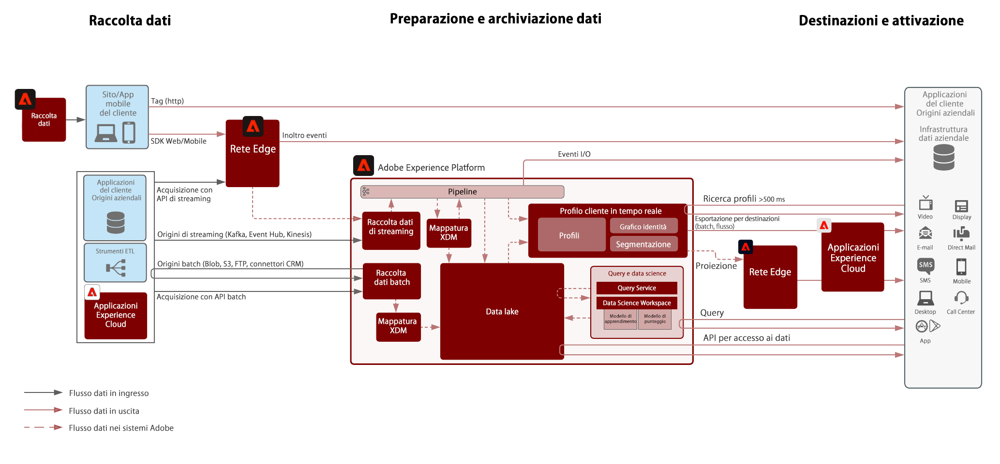
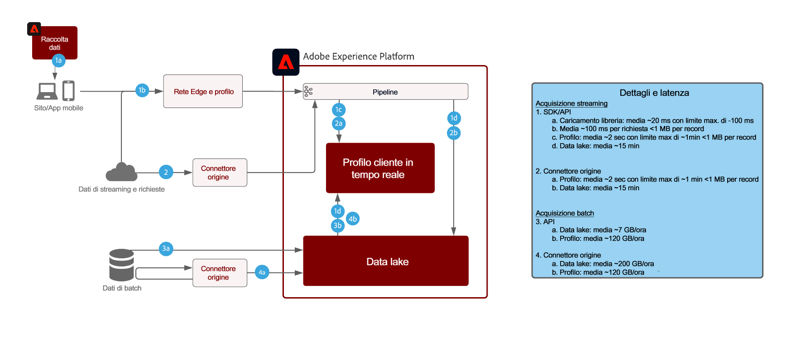

# Architettura del flusso di dati Adobe Experience Platform

## Diagramma del flusso dei dati

Il diagramma seguente illustra i vari percorsi per l’inserimento e l’uscita dei dati da Adobe Experience Platform.

## Guardrail di acquisizione dei dati

Il diagramma seguente illustra le protezioni delle prestazioni medie e la latenza per l’inserimento dei dati in Adobe Experience Platform.

