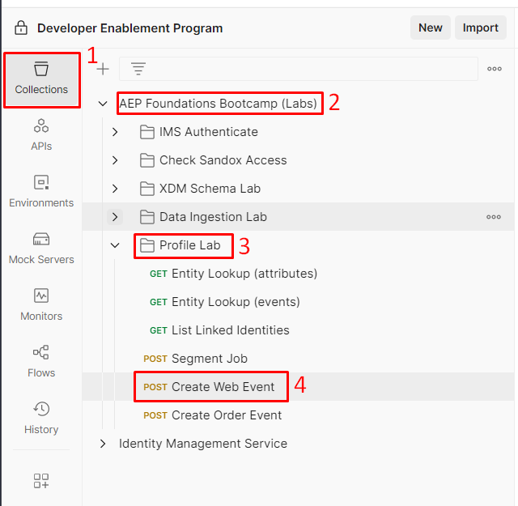

# Invia evento web all’hub

>[!IMPORTANT]
>
>Completare l&#39;[installazione di Postman](../../postman-setup/postman-installation.md) prima di avviare questa esercitazione. È inoltre necessario accedere a [webhook.site](https://webhook.site/) per il [flusso di lavoro di attivazione con destinazione esterna](../use-case-1-acquisition/configure-destinations/setup-streaming-destination.md) correlato.

## Apri Postman

Avvia postman sul computer e passa alla seguente chiamata API:

1. **Barra laterale sinistra Postman** —> `Collections`
1. **Raccolta** —> `AEP Foundations Bootcamps (labs)`
1. **Cartella** —> Laboratorio profili
1. **Richiesta API** —> `Create Web Event`




## Modifica richiesta API

Per creare la richiesta API di esempio è necessario compilare i seguenti elementi nel corpo della richiesta API.

Inizia raccogliendo i seguenti valori:


## Trova endpoint di streaming dell’account

1. Passa a **Origini** nella barra a sinistra, quindi fai clic su **Account** nel menu di navigazione in alto
1. Cerca **dep: API HTTP \[raw]**, evidenzia la riga, copia e salva il valore dell&#39;**endpoint di streaming** da qualche parte a cui potrai fare riferimento in seguito

Account  e copia il relativo endpoint di streaming](assets/send-order-event-to-hub-http-api-raw-streaming-endpoint.png &quot;dep: HTTP API \[raw]&quot;)

## Trova ID flusso di dati web

1. Fai clic sull&#39;account **API HTTP \[raw]**
1. Trova e seleziona la riga del flusso di dati denominata **dep: Web (flusso)**
1. Nella barra a destra copia e salva i valori **ID flusso di dati** da qualche parte a cui puoi fare riferimento in seguito

>[!NOTE]
>
>Fare clic in uno spazio vuoto sulla riga.  NON fare clic sui collegamenti blu.


## Crea richiesta API finale

Copia i valori salvati nei passaggi precedenti nelle posizioni evidenziate di seguito.

- **Rosso** —> `Streaming Endpoint URL`
- **Verde** —> `Dataflow ID`

Al termine, la richiesta API finale dovrebbe essere simile a questa

>[!CAUTION]
>
>NON ESEGUIRE ANCORA!


## Eseguire l’API

1. Salva la chiamata API facendo clic sul pulsante **Salva**
1. Esegui la richiesta facendo clic sul pulsante **Invia**

In caso di esito positivo, la chiamata dovrebbe dare la seguente risposta...


## Convalida

1. Vai sul tuo profilo e controlla il tuo profilo per vedere che l’evento è stato acquisito sul profilo.  Dovrebbe apparire in secondi.
   1. Utilizza l’e-mail nella chiamata per cercare il profilo
1. A seconda di quanto tempo è trascorso dall’ultimo invio in un evento, potresti non essere idoneo per i nuovi segmenti. In caso contrario, potrebbe vedere questi o altri:
   1. Qualsiasi evento Edge (entro 15 minuti)
      1. Ricorda: anche tutti i tipi di pubblico salvati con una valutazione Edge vengono valutati sull’hub quando vengono inseriti i dati in streaming
   2. dep: qualsiasi streaming di eventi (entro un’ora)
1. Questo evento Hub non viene inviato al tuo webhook.
   1. L’inoltro degli eventi elabora gli eventi inviati ad Edge, non quelli inviati direttamente all’hub. Utilizza il [flusso di lavoro di attivazione con destinazione esterna](../use-case-1-acquisition/configure-destinations/setup-streaming-destination.md) per acquisire un evento in webhook.site.
1. Dopo almeno 30 minuti, puoi anche controllare il set di dati con quanto segue:
   1. Modifica il nome della tabella seguente con quello della sandbox.  Per trovarlo, vai all&#39;elenco dei set di dati e filtra su &quot;`dest`&quot;, apri il set di dati e copia il nome della tabella nella barra a destra.

```sql
SELECT * FROM profile_export_for_destination_merge_policy_xxx
WHERE extSourceSystemAudit.LASTREFERENCEDDATE >= CURRENT_DATE
AND identitymap['email'][0].ID in ('depche.mode@dep.com')
ORDER BY extSourceSystemAudit.LASTREFERENCEDDATE DESC
LIMIT 10
```
