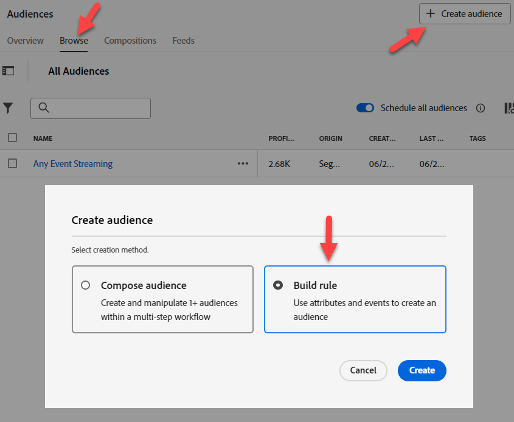
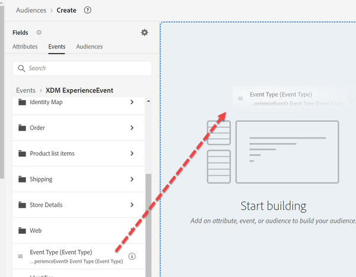
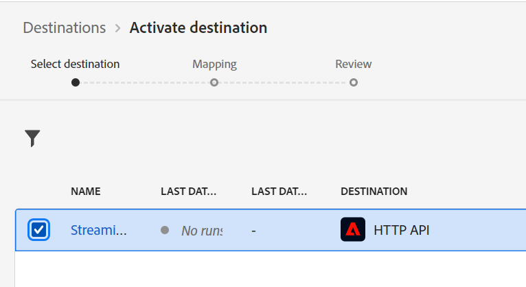

# Creare #1 di pubblico

## Obiettivo del laboratorio

Creare un pubblico che trovi solo i profili che hanno effettuato un ordine per un iPhone 14

## Suddivisione del pubblico

Inizia creando il tuo primo pubblico. È composto da molti pezzi che abbiamo bisogno di incorporare. Fai clic su Pubblico nella barra a sinistra, quindi fai clic sul pulsante Crea pubblico in alto a destra.

Divideremo questo caso d’uso in più parti e risolverle con più tipi di pubblico. Il motivo è che stiamo cercando di rendere questo uno streaming e due cose lo stanno impedendo:

1. La clausola di esclusione &quot;nessun ordine esistente per iPhone 14/Pixel 7&quot;
1. La clausola di esclusione &quot;nessun iPhone 14/Pixel 7 attivo&quot;. Alla fine ne esamineremo le implicazioni.

## Parte 1 - scoperta

La prima parte del nostro pubblico consiste nel cercare &quot;nessun ordine esiste per un iPhone 14&quot;. Immagina che siamo un nuovo addetto al marketing per AEP e non abbiamo progettato lo schema. Cerca &quot;Ordine&quot; nella scheda Eventi nella barra a sinistra

Si ottengono molti oggetti correlati a un ordine

- Attributi: ad esempio ID ordine, Data ordine
- Cartelle: ad esempio Ordine, Dettagli ordine piano
- Tipi di evento: ad esempio Ordine inoltrato, Ordine spedito, ecc.

>[!NOTE]
>
>&#x200B;* Non c&#39;è nessuna &quot;i&quot; per la &quot;cartella&quot; dell&#39;ordine. Anche se la nostra descrizione è stata compilata, non la contiene e questo può essere fonte di confusione per l’addetto al marketing, in quanto potrebbe provare a utilizzarla o voler sapere di cosa si tratta.
>&#x200B;* La &quot;i&quot; per le schede evento ripete semplicemente il tipo, poiché il Tipo evento è un campo, non molti.
>&#x200B;* I dati di riepilogo vengono visualizzati solo se il valore è presente in più del 2% dei profili uniti. Questo determina anche il completamento automatico quando si filtra su una stringa.

Utilizza la scheda Tipo evento inserito ordine e trascinala nell’area di lavoro.

>[!TIP]
>
>**Facoltativo:**
>
>Ogni evento ha un tipo di evento.  È possibile filtrare in base al tipo di evento invece di utilizzare una scheda del tipo di evento.
>
>Ricorda quando abbiamo esteso il tipo di evento dello schema dell’ordine. Abbiamo aggiunto i valori che ora vediamo nel menu a discesa.  Questi stessi valori vengono visualizzati come schede Tipo evento
>
>Se lo desideri, puoi utilizzare entrambi gli approcci.
>
>In un nuovo pubblico, vai in XDM Experience Event (Evento esperienza XDM) e trascina su Event Type (Tipo evento).
>
>
>
>Filtrare utilizzando le schede Tipo evento equivale a filtrare utilizzando il campo Tipo evento
>
>
>
>Vantaggi dell&#39;utilizzo delle schede dei tipi di evento:
>
>- Mostra il nome del Tipo di evento nel pubblico per facilitarne la comprensione
>- È veloce e richiede meno passaggi
>
>Vantaggi dell&#39;utilizzo del campo Tipo evento:
>
>- Consente di selezionare più tipi di evento (ad esempio &quot;Ordine ritirato&quot; o &quot;Ordine consegnato&quot;) se si desidera includere più tipi in un unico criterio
>- Supporta la distinzione tra maiuscole e minuscole

>[!NOTE]
>
>Ci sono alcune opzioni da considerare per &quot;Nessun ordine esiste&quot;.  Stiamo scegliendo un approccio semplice, ma ci sono cose a cui pensare nel mondo reale:
>
>- Ordine effettuato ma prelevato o spedito
>- Ordine effettuato ma annullato
>- Più ordini inseriti ma uno annullato

Il nostro addetto al marketing sa, in base alla sua formazione, che è stata caricata più di un’origine dati:

- Ordini (acquisiti dal sistema di ordini su tutti i canali)
- Web (monitoraggio lato client degli utenti che fanno clic su, inclusi gli ordini inseriti sul sito)
- eCommerce (acquisito dal sistema eCommerce sul sito)

Quale origine utilizzare? Tutti rappresentano logicamente lo stesso evento &quot;Ordine effettuato&quot;. Ma sono fisicamente immagazzinati in sistemi diversi. Come sappiamo quale usare? Il modo migliore è quello di esaminare le descrizioni di ogni oggetto Schema e di ogni campo da conoscere.

>[!NOTE]
>
>Le descrizioni devono contenere informazioni utili per prendere queste decisioni, ad esempio:
>
>1. Da dove vengono i dati?
>2. Cosa contiene o meno?
>3. Qual è la latenza?
>4. C&#39;è un sistema che è stato definito &quot;fonte di verità&quot;?
>5. Ci sono sfumature che dobbiamo prendere in considerazione?

Per noi, vogliamo utilizzare Ordine effettuato, ma tieni presente che, a seconda del nostro caso d’uso, avremmo potuto avere i seguenti requisiti, che possono influenzare la fonte da cui estraiamo:

- Acquisti on-site negli ultimi 30 minuti
- Ordini inseriti e non annullati
- Ordini raccolti entro 1 giorno dalla data di preparazione

>[!TIP]
>
>Esercizio di pensiero opzionale, immagina di aver effettuato un unico Ordine sul nostro sito oggi (ricorda che l’Ordine è registrato da tutti e tre i sistemi):
>
>1. Quanti eventi verrebbero conteggiati per gli ordini effettuati oggi?
>2. Quanti ordini sono stati inoltrati dal punto di vista dei clienti?
>3. Quanti eventi verrebbero conteggiati se si filtrasse su Metodo di spedizione = durante la notte (supponendo che sia stato scelto questo valore)?
>4. Come dovremmo risolvere questo problema (pubblico o modello di dati)?

Dopo aver eseguito alcune analisi, seguirò `Orders Event of Event Type=”order. placed”`. Vogliamo assicurarci che il nostro pubblico utilizzi la fonte di verità al compromesso della velocità (i dati web vengono trasmessi con ogni clic mentre l’ordine viene sottoposto a un’elaborazione prima dell’invio). Inoltre, in futuro potremmo voler escludere coloro che hanno annullato e ciò potrebbe essere fatto attraverso qualsiasi canale.

## Parte 2 - creare il pubblico

Attiva Mostra schema completo

Sviluppa in base a ciò che hai iniziato.  Fai clic sulla scheda Inserito, quindi **cancella &quot;inserito&quot; dalla ricerca** nella barra a sinistra ed espandi in:

Evento esperienza XDM -> cartella elementi elenco prodotti

>[!WARNING]
>
>Una confusione comune per l’addetto al marketing potrebbe essere l’utilizzo di Device invece del Prodotto qui (in quanto verrà applicato il filtro su iPhone). Ancora una volta, un altro motivo per una buona descrizione.

Stiamo cercando qualcosa su cui poter filtrare che potrebbe contenere iPhone. Avviso che sono disponibili tre opzioni

- Nome
- Prodotto
- SKU

Potrebbero essere tutti buoni candidati, ma non lo sappiamo.  Fai clic sulla &quot;i&quot; per maggiori dettagli su ciascuna.

>[!NOTE]
>
>È possibile modificare le descrizioni per qualsiasi campo OOTB. Aggiorna o nascondi i campi che non vengono utilizzati per ridurre la confusione per gli utenti. Queste descrizioni OOTB potrebbero non avere senso nel tuo settore o azienda.
>
>Una buona descrizione potrebbe anche contenere esempi
>
>- Nome Descrizione = il nome visualizzato del prodotto presentato all&#39;utente per questa visualizzazione prodotto. Ad esempio: iPhone 14, Pixel 7
>- SKU Description = Stock Keeping Unit (SKU), l’identificatore univoco di un prodotto definito dal fornitore. Ad esempio: iP14, Pix7
>- Product Description = Identificatore XDM del prodotto stesso. Ad esempio: 123, 456

Attiva &quot;Mostra solo campi con dati&quot;

>[!NOTE]
>
>**Schema osservabile**
>
>Questo è ciò che contengono i dati dei campi.  È un modo per le app basate su AEP di escludere dall’utilizzo i campi che sono effettivamente inutili.
>
>**Schema XDM completo**
>
>Questi sono tutti i campi dello schema di unione, indipendentemente dal fatto che in essi siano stati caricati dati.

Quando si attiva &quot;mostra solo campi con dati&quot;, si notano i campi che si stava pensando di utilizzare andare via.

Espandi a XDM ExperienceEvent > Elementi elenco prodotti > Dep > Modello

Il modello è simile, ma non contiene alcuna descrizione.

Trascinarlo nella scheda evento posizionato.

Aggiungere iPhone 14

Sopra l’evento inserito, cambia &quot;Qualsiasi momento&quot; in &quot;Oggi&quot;

>[!NOTE]
>
>Filtriamo oggi perché non ci importa degli ordini di una settimana, un mese o un anno fa.  Nella prossima sezione verrà inoltre trattato un lookback più lungo.  A un certo punto l&#39;ordine diventa &quot;*owned*&quot; e per questo verrà creato un segmento.

Fornisci una descrizione

Cambia il metodo di valutazione in **Streaming**

**Salva pubblico** come &quot;*Ordine inoltrato iPhone 14*&quot;

Fai clic sul pulsante blu **Attiva pubblico** nella destinazione

Selezionare la destinazione del webhook **Protezione esecuzione programmi in streaming** e fare clic su Avanti

Non modificare la mappatura, fai clic su Avanti e su Fine

>[!NOTE]
>
>**Contenitori**
>
>Nota quando si filtra in base al nome nell’elenco dei prodotti, vengono aggiunti automaticamente alcuni contenitori. Il motivo è che gli elementi dell’elenco dei prodotti sono di tipo dati Array. Quando si applica un filtro a un array, viene creato un contenitore (denominato voci dell’elenco dei prodotti nel nostro esempio).
>
>
>
>
>
>I contenitori consentono di fare riferimento a una variabile evento o a un elemento Array. Puoi saperne di più sulle ramificazioni di questo in questo Blog, ma per semplicità, questo ti consente di specificare se un singolo elemento nell’array soddisfa entrambe le condizioni o se la condizione può essere distribuita su due elementi.
>
>[https://experienceleaguecommunities.adobe.com/t5/adobe-experience-platform-blogs/how-exactly-do-containers-work-in-aep-segmentation-a-deeper-look/ba-p/458780](https://experienceleaguecommunities.adobe.com/t5/adobe-experience-platform-blogs/how-exactly-do-containers-work-in-aep-segmentation-a-deeper-look/ba-p/458780)

>[!WARNING]
>
>**Filtri ora**
>
>Anche se non è specificato nulla nei requisiti, questo pubblico ha un problema che dovremmo tornare indietro e chiarire con l&#39;azienda.
>
>I requisiti non disponevano di un filtro temporale. Ciò significa che se qualcuno ha effettuato un ordine un anno o cinque anni fa, si qualificherebbe per questo. Prova sempre a incorporare un metodo per assicurarti di non cadere in questa trappola o di dover aggiornare sempre i tuoi tipi di pubblico quando esce la nuova versione.
>
>Se modifichiamo il filtro dell’ora aggiunto, quanto indietro possiamo andare prima che un segmento di Edge diventi in streaming o anche batch?

>[!CAUTION]
>
>**Il prodotto è archiviato in due luoghi?**
>
>Osservate le diverse convenzioni e descrizioni per la denominazione dei percorsi. Confrontalo con il pubblico precedente
>
>- Profilo individuale XDM > Dep > Prodotti attivi > Proprietà ID prodotto > Nome prodotto
>  - Descrizione: nome del prodotto.
>- XDM ExperienceEvent > Elementi elenco prodotti > Dep > Modello
>  - Descrizione: il nome visualizzato del prodotto presentato all’utente per questa visualizzazione prodotto.
>
>Quando iniziamo a memorizzare lo stesso valore in luoghi diversi per motivi e scopi diversi, dobbiamo pensare alle ramificazioni per i nostri utenti e a come il profilo li unirà (e a come un criterio di unione risolverà questo conflitto, se necessario).
>
>Le nostre descrizioni attuali rendono difficile per l’addetto al marketing sapere quale utilizzare
