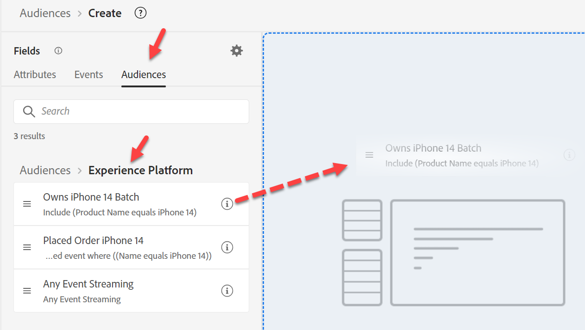
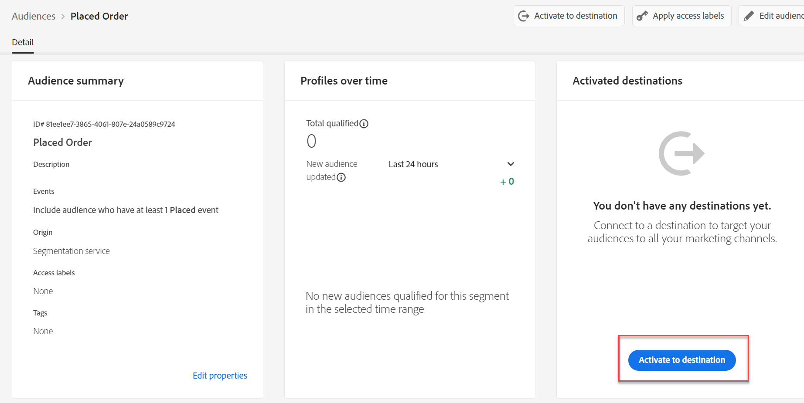

# Creare #2 di pubblico

## Obiettivo del laboratorio

Crea un pubblico che trovi tutti i profili che non hanno una linea attiva che sia un iPhone 14

## Attività di analisi

Questo pubblico è &quot;Coloro che non hanno un iPhone 14 attivo&quot;

- Come facciamo a sapere che qualcuno non &quot;ha un iPhone 14 attivo&quot;?  Idee:
  - Includi coloro che hanno acquistato un iPhone 14
  - Includi coloro che hanno dati di fatturazione per un iPhone 14
  - Includi coloro che dispongono di dati web provenienti da un iPhone 14
  - Altri?

Alla fine, questo si riduce a una scelta aziendale su chi vogliono commercializzare. Nel nostro caso, l’azienda ha ritenuto questo importante perché abbiamo creato uno schema che definisce le linee attive, quindi utilizzalo.

>[!NOTE]
>
>Poiché Active Lines è un array memorizzato in un profilo, questo selezionerà il proprietario dell&#39;account rispetto a ogni singolo proprietario del dispositivo. Assicurati che il team Marketing ne sia a conoscenza e lo desideri. In caso contrario, potrebbe essere necessario un approccio diverso.

## Creazione di un nuovo pubblico (proprietario di iPhone 14)

1. Nella scheda Attributi nella barra a sinistra, passa a Nome prodotto (o cercalo).
   - Profilo individuale XDM —> \&lt;nome tenant> —> Prodotti attivi —> Proprietà ID prodotto —> Nome prodotto
1. Trascina nome prodotto nell’area di lavoro

## Salvare il pubblico

1. Tipo iPhone 14 (mantieni come valutazione batch)
1. Fornisci una descrizione
1. Salva pubblico come &quot;*Proprietario di iPhone 14*&quot;
   - Seguire gli stessi passaggi indicati sopra per il Pixel 7 (se si dispone di tempo).

>[!TIP]
>
>**Tendenza laterale: &quot;non potremmo filtrare semplicemente gli eventi, invece di avere un altro campo nell&#39;archivio profili la stessa cosa&quot;?**
>
>Sì, ma dobbiamo entrare in alcune sfaccettature tecniche e di business che rendono il pubblico complesso e introducono alcune sfide:
>
>1. Se utilizziamo l’evento di acquisto:
>   1. E se non avessero comprato da noi, ma avessero una linea attiva?
>   1. E se avessero acquistato 2 anni fa, la mia regola deve riguardare un numero N di anni e abbiamo tenuto solo 1 anno di Eventi sul Profilo?
>1. L’evento fatturazione sembra essere una combinazione migliore:
>   1. Ma ora i dati risalgono a un mese fa.
>   1. Cosa succede se l’ultimo evento di fatturazione è stato 2 anni fa, potrebbe includere persone che non sono clienti
>   1. Cosa succede se il caricamento dei dati non riesce, il conteggio potrebbe azzerarsi se guardo indietro di un mese per escludere i dati obsoleti?
>   1. Acquisiamo anche il dispositivo per un evento di fatturazione? No, quindi dovremmo cambiare il nostro feed di dati
>
>Alla fine, dovremo fare qualche compromesso per questo pubblico. Se hai ancora a cuore l’utilizzo degli Eventi per questa regola, leggi questo Blog su di essa: https\://experienceleaguecommunities.adobe.com/t5/adobe-experience-platform-blogs/how-to-capture-latest-experience-event-in-adobe-experience/ba-p/430941

>[!NOTE]
>
>**Abilitazione di un criterio di unione per Edge**
>
>Assicurati che il criterio di unione sia configurato per i tipi di pubblico di Edge. Vai a Criteri di unione e modifica il criterio di unione predefinito per \_xdm.context.profile.  Attiva il criterio di unione Attivo su Edge e salva.
>
>
>
>
>
>

## Ricostruire il pubblico

Il marketing è entrato oggi e ci ha dato un requisito per avere questo Streaming e sfortunatamente il modo in cui abbiamo questo costruito è Batch. Correggi:

1. Apri il pubblico &quot;*Owns iPhone 14*&quot; e cambia il nome in &quot;*Owns iPhone 14 Batch*&quot;.

   >[!WARNING]
   >
   >Oggi non è possibile modificare il metodo di valutazione nell’interfaccia utente. Devono essere eliminati anche tutti i tipi di pubblico che fanno riferimento a questo pubblico. Tieni presente questo aspetto durante la decisione sulla strategia di creazione di per l’utilizzo di segmenti all’interno di segmenti.

2. Crea un nuovo pubblico. Aggiungi il pubblico &quot;Possiede iPhone 14 Audience Batch&quot; all’area di lavoro e fai clic su Converti in regole.

   

   

3. Aggiorna Descrizione, nome e metodo di valutazione in streaming nell’angolo in basso a destra, quindi fai clic sull’icona della cartella accanto al metodo di valutazione. Dovresti visualizzare:

   

   Anche se non ovvio, il motivo è che utilizziamo Nome prodotto in uno schema di ricerca

   >[!NOTE]
   >
   >Ogni volta che utilizziamo una ricerca, il nostro metodo di valutazione è costretto a batch.
   >
   >Puoi dirlo, se guardi il percorso e ha &quot;proprietà&quot; in esso ovunque
   >
   >

4. Sostituisci il valore esistente per il nome del prodotto in modo che ora provenga dallo schema Profilo individuale XDM

   Sostituisci il seguente percorso:

   - Profilo individuale XDM > Dep > Prodotti attivi > Proprietà ID prodotto > Nome prodotto

   Aggiungi il nuovo percorso:

   - Profilo individuale XDM > Dep > Prodotti attivi > Modello

   

   

5. Modifica il metodo di valutazione in Streaming e fai clic sull’icona della cartella

   

6. Per il nuovo pubblico idoneo per lo streaming, fornisci una descrizione.

   - Salva il pubblico come &quot;*Proprietario del pubblico iPhone 14*&quot;.
   - Fai clic sul pulsante blu **Attiva pubblico** nella destinazione

   

7. Seleziona la destinazione del webhook **Protezione esecuzione programmi in streaming** e fai clic su **Avanti**

8. Fai clic su **Avanti** e **Fine**

>[!NOTE]
>
>Considerazioni sul perché scegliere Batch vs Streaming o Edge:
>
>Guardrail più recenti: [https://experienceleague.adobe.com/docs/experience-platform/profile/guardrails.html?lang=en](https://experienceleague.adobe.com/docs/experience-platform/profile/guardrails.html?lang=it)

>[!TIP]
>
>**Laboratorio di verifica facoltativo**
>
>Finito presto?
>
>Creare un pubblico di &quot;Fedeltà ai dispositivi Apple&quot; in una famiglia.  Tutte le persone coinvolte nel piano hanno lo stesso tipo di dispositivo (Apple).
