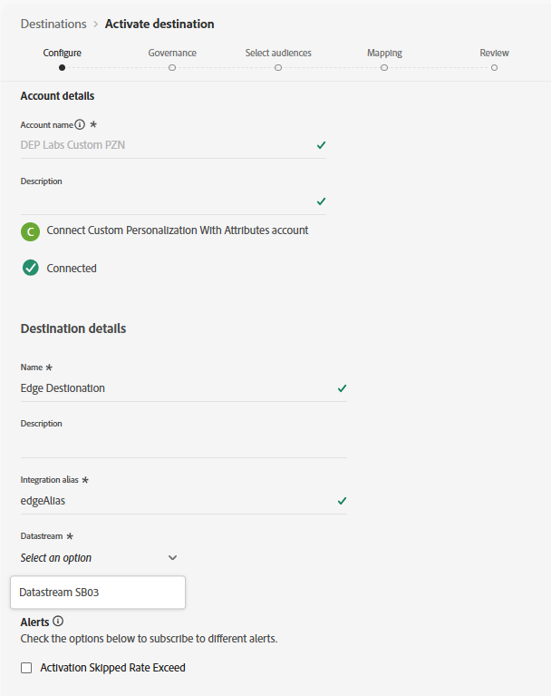
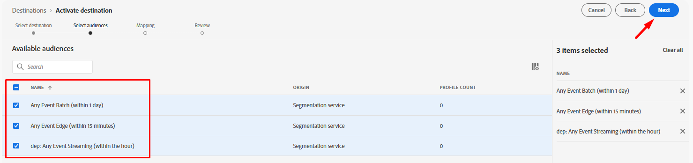
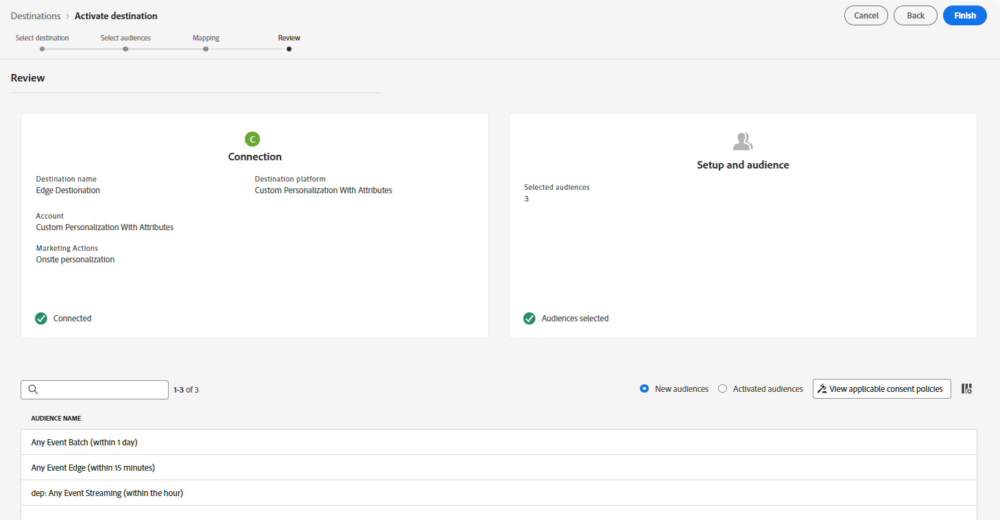

# Impostare una destinazione Personalization personalizzata

L&#39;utilizzo di una [destinazione Personalization personalizzata](https://experienceleague.adobe.com/it/docs/experience-platform/destinations/catalog/personalization/custom-personalization) consente di rendere disponibili i tipi di pubblico in Edge per l&#39;utilizzo da parte di terzi, in genere tramite l&#39;API server di rete, da utilizzare per la personalizzazione.

Questa esercitazione configura la destinazione Personalization personalizzata in modo da poter inviare gli attributi del profilo ad Edge.

## Sfoglia catalogo di destinazione

>[!NOTE]
>
>Per la personalizzazione tramite Adobe Target, si utilizzerebbe la [destinazione Adobe Target.](https://experienceleague.adobe.com/it/docs/experience-platform/destinations/catalog/personalization/adobe-target-v2) Il comportamento è identico a Personalization personalizzato.

1. Nella barra a sinistra, fai clic su **Destinazioni**
1. Nella barra superiore, fai clic su **Catalogo**
1. Selezionare la categoria di **Personalization**
1. Al centro della schermata dovrebbe essere visualizzata la destinazione con titolo **Personalization personalizzato con attributi.** Fare clic sul pulsante **Configura** sulla scheda.

## Configurare la destinazione

### Configura account

Assegna un nome all&#39;account `DEP Labs Custom PZN`, quindi fai clic sul pulsante **Connetti alla destinazione**

### Aggiungi dettagli destinazione

Compila i seguenti dettagli sulla destinazione:

1. Nome -> **Destinazione Edge**
1. Alias integrazione -> **edgeAlias**
1. ID dello stream di dati -> *seleziona il nome dello stream di dati creato in precedenza*
1. Al termine, fai clic sul pulsante **Avanti**

>[!CAUTION]
>
>Dopo aver fatto clic su Avanti non sarà possibile modificare **Name** o **Integration alias**.  Questi elementi verranno visualizzati più avanti nelle risposte di Edge Network

### Seleziona criterio di governance

Seleziona **Personalization in loco**, quindi fai clic sul pulsante **Crea**

>[!NOTE]
>
>Anche se questo passaggio è facoltativo, è consigliabile che a qualsiasi destinazione creata sia assegnato un criterio di governance per evitare di attivare erroneamente i profili

Al termine, dovresti vedere questa schermata che mostra il tuo successo.

## Attiva destinazione

### Seleziona tipi di pubblico

Seleziona la destinazione appena creata facendo clic sulla riga per evidenziarla, quindi fai clic sul pulsante **Successivo**

Seleziona **Tutti i tipi di pubblico** e fai clic su **Avanti**

### Mappatura

Aggiungi un **nuovo mapping** come segue:

| Campo Source | Campo di destinazione |
| ---------------------- | ------------ |
| \_tenantName.plan.name | Nome piano |

&#x200B;> [!NOTE]
>
>Ricorda di sostituire **\_tenantName** con il nome tenant

>[!NOTE]
>
>Il campo di destinazione consente di fornire un nome descrittivo che può essere diverso dal nome XDM

Al termine della procedura, lo schermo dovrebbe essere simile all&#39;immagine seguente.  Puoi quindi fare clic sul pulsante **Avanti**

>[!NOTE]
>
>Poiché gli attributi del profilo possono contenere dati sensibili, tutte le [chiamate API server Edge Network](https://experienceleague.adobe.com/it/docs/experience-platform/edge-network-server-api/overview)devono essere effettuate in un contesto autenticato per recuperare l&#39;attributo una volta inserito in Edge.

### Revisione

Nella schermata finale è possibile esaminare i dettagli della configurazione e quindi fare clic sul pulsante Fine.

>[!NOTE]
>
>Questo è il punto in cui [Imposizione automatica](https://experienceleague.adobe.com/it/docs/experience-platform/data-governance/enforcement/auto-enforcement) controllerà in base ai tuoi [Criteri di utilizzo dati](https://experienceleague.adobe.com/it/docs/experience-platform/data-governance/policies/overview). Verifica le azioni di marketing con le regole create e genera eventuali errori.
