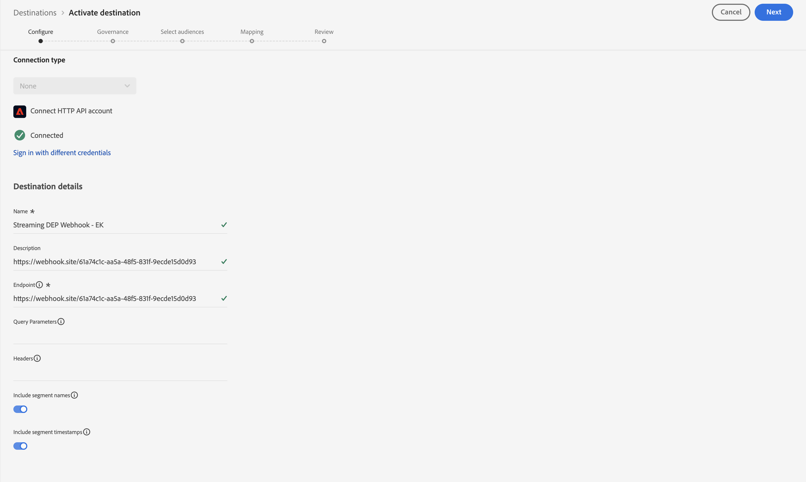

# Configurare la destinazione di streaming

>[!NOTE]
>
>Passa al passaggio successivo se hai già configurato la destinazione di streaming.

## Ottieni URL webhook

>[!NOTE]
>
>Utilizzeremo un webhook qui per vedere se i dati sono arrivati alla destinazione a cui stiamo inviando. In uno scenario reale, invece, accedevamo a quella destinazione e usavamo i loro strumenti per vedere cosa fosse arrivato.

1. Apri il seguente collegamento in una nuova scheda nel browser -> [https://webhook.site](https://webhook.site/)
1. Copia l’URL univoco visualizzato e salvalo in un luogo sicuro

## Configurare la destinazione API HTTP

>[!NOTE]
>
>Utilizziamo una destinazione di streaming come proxy per l’invio di questi dati a terze parti (ad esempio, Facebook). In uno scenario reale, puoi utilizzare una destinazione Facebook invece di una destinazione API HTTP per inviare dati a Facebook.

Nell’interfaccia utente di Experience Platform, passa al catalogo delle destinazioni facendo quanto segue

1. Fai clic su **Destinazioni** nella barra a sinistra
1. Fai clic su **Catalogo** nella barra superiore
1. Nella casella di ricerca immetti **http**
1. Fai clic sul pulsante **Configura** per configurare la destinazione API HTTP

>[!NOTE]
>
>Stai utilizzando la destinazione di streaming API HTTP per i laboratori per dimostrare come funzionerebbe un connettore di streaming nel mondo reale.

## Configurare

1. Tipo di connessione **Nessuno**
1. Fai clic su **Connetti alla destinazione**

   

   >[!NOTE]
   >
   >In genere, in questa fase vengono aggiunte credenziali di autenticazione, ma per questo webhook non ne è richiesta alcuna.

3. Compila i dettagli di configurazione della destinazione come segue:

- **Nome** -> `Streaming DEP Webhook - [Your Initials]`
- **Descrizione** -> `[your webhook endpoint you copied above]`
- **Endpoint** -> ` [your webhook endpoint you copied above]`
- **Parametri query** -> `leave blank`
- **Intestazioni** -> `leave blank`
- Includi nomi segmento -> attiva
- Includi marche temporali segmento -> attiva

Al termine, assicurati che la configurazione corrisponda a quella visualizzata di seguito.  Se l&#39;aspetto è buono, fare clic sul pulsante **Avanti** in alto a destra per continuare con il passaggio successivo

>[!CAUTION]
>
>Una volta salvati, i parametri endpoint, intestazione e query non possono essere modificati nell’interfaccia utente

## Definire la governance

1. Seleziona **Targeting tra siti** dalle azioni di marketing
1. Al termine, fai clic sul pulsante **Avanti** per continuare con il passaggio successivo

>[!NOTE]
>
>Ulteriori informazioni sui criteri di governance in Experience League
>
>[https://experienceleague.adobe.com/docs/experience-platform/data-governance/policies/overview.html?lang=en#core-actions](https://experienceleague.adobe.com/docs/experience-platform/data-governance/policies/overview.html?lang=en#core-actions)

## Seleziona tipi di pubblico

1. Seleziona tutti i tipi di pubblico
1. Al termine, fai clic sul pulsante **Avanti** per continuare con il passaggio successivo

## Aggiungi mappature

>[!NOTE]
>
>Stiamo aggiungendo un campo dal profilo. Se quel campo non contiene dati, potremmo non vedere nulla trasmesso alla Destinazione. A volte, se si verificano più aggiornamenti nel tempo in Profilo ed Eventi, la Destinazione può essere attivata più volte e inviare più payload.

1. Fai clic su **Aggiungi nuovo campo** per aggiungere un campo allo schema
1. Digita **model** nella casella di input del campo schema e seleziona il campo **\_dep.activeProducts\[0].model** dall&#39;elenco dei campi visualizzati
1. Cambia **\[0]** in **\[\*]** nel nome del campo.  Il campo finale deve ora essere visualizzato come **\_dep.activeProducts\[\*].model**
1. Al termine, fai clic sul pulsante **Avanti** per continuare con il passaggio successivo

>[!NOTE]
>
>Si tratta della mappatura di un campo su Profilo, non su Evento esperienza. Anche se inviamo profili a una destinazione basata sulla qualificazione del pubblico, dobbiamo tenere presente ciò che sta accadendo.
>
>1. Arriva un evento
>2. Il pubblico qualifica il profilo in base a regole
>3. La qualifica viene memorizzata nel profilo
>4. Alla destinazione viene inviata una notifica per indicare che il profilo è idoneo
>5. La destinazione invia il profilo. Ciò significa che quando la Destinazione va a inviare il profilo, non è più a conoscenza dell’evento che ha attivato la valutazione del pubblico.

## Passaggio di revisione

Convalida la destinazione finale e fai clic sul pulsante **Fine**

>[!NOTE]
>
>La destinazione è ora configurata e in attesa di qualifiche di segmenti da tutti i segmenti aggiunti in base alle rispettive velocità di valutazione:
>
>- Edge
>- Flusso
>- Batch

>[!NOTE]
>
>Durante la configurazione iniziale di una destinazione, è importante tenere presente quanto segue:
>
>- Sono necessarie fino a 2 ore per ogni backfill (profilo qualificato esistente) per iniziare l’attivazione
>- Ci vogliono fino a 20 minuti perché un pubblico appena aggiunto inizi ad attivarsi
