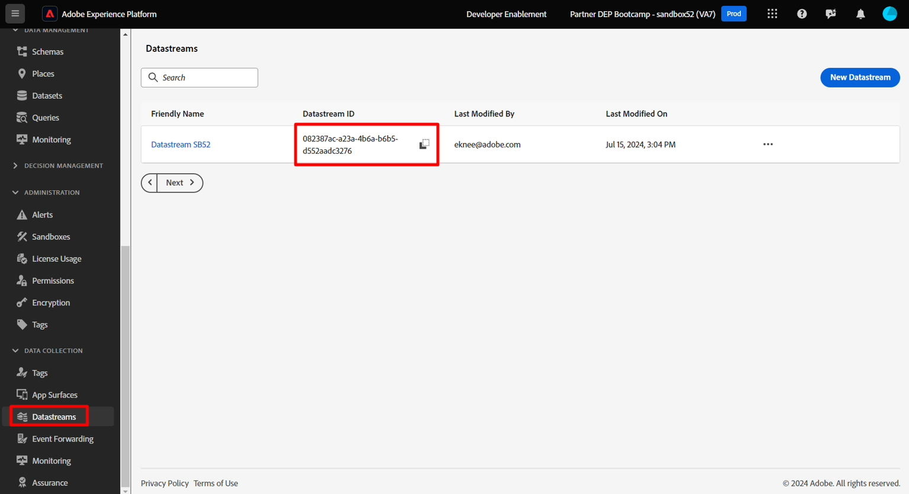
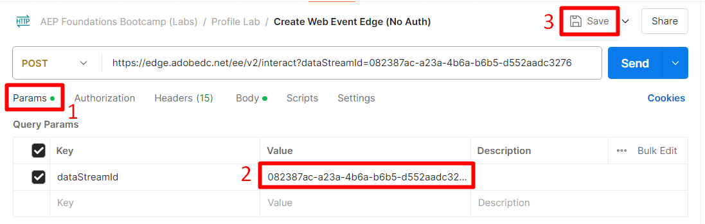
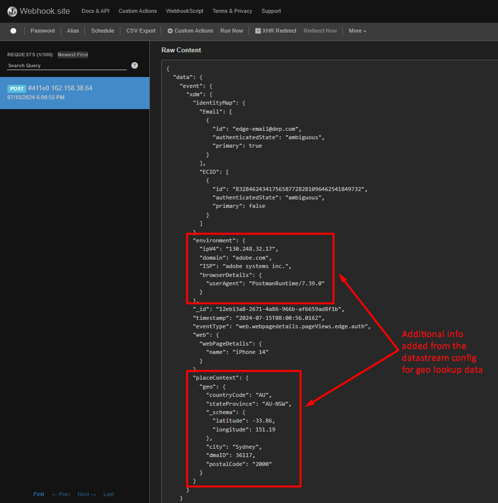

# Inviare un evento Edge

Ora che tutto è configurato, invia un evento all’Edge per vedere come funziona. A questo scopo, utilizza Postman per inviare un evento Web allo stream di dati creato. Questo invia un evento **senza token OAuth** per simulare una visualizzazione di pagina proveniente dal web e inviata ad Edge.  Assicurati di avere Postman aperto sul computer per eseguire questo laboratorio.

>[!NOTE]
>
>Poiché non trasmetti un token autenticato, non recupererai alcun attributo.

## Aspettative del laboratorio

1. Evento esperienza per accedere a Edge
1. Configurazione dello stream di dati per utilizzare il servizio di inoltro eventi
1. Inoltro eventi per inviare l’evento al webhook
1. Configurazione dello stream di dati per utilizzare il servizio AEP
   1. Pubblico Edge da eseguire
   2. Invia evento all&#39;hub
1. Risposta di Postman per includere il pubblico di Edge (ma nessun attributo)
1. Archivio profili per ricevere un evento e aggiungere un frammento di profilo di evento
1. Archivio identità per aggiungere una relazione
1. Set di dati da ricevere e archiviare nel Data Lake
1. Tipi di pubblico in streaming per valutare e archiviare i risultati sul profilo sull’hub
1. Destinazioni Personalization personalizzate per inviare le &quot;voci&quot; dei tipi di pubblico di streaming ad Edge
1. Destinazioni API HTTP per inviare qualsiasi &quot;voce&quot; di pubblico in streaming al webhook
1. Alla fine, le destinazioni API HTTP inviano al webhook eventuali &quot;uscite&quot; di pubblico in streaming
1. Infine, personalizza le destinazioni Personalization per inviare eventuali uscite di pubblico in streaming ad Edge


## Passa alla chiamata

1. **Barra laterale sinistra di Postman** -> Raccolte
1. **Raccolta** -> Campi di avvio dei fondamenti di AEP (Labs)
1. **Cartella** -> Laboratorio profili
1. **Richiesta API** -> Crea evento Web Edge (nessuna autenticazione)


## Modifica richiesta API

Se hai già eseguito questa operazione, puoi passare all’esecuzione dell’API.

Prima di poter eseguire la richiesta API, devi aggiungere alcune informazioni aggiuntive alla richiesta. Inizia raccogliendo i seguenti valori:

## Raccogliere l’ID dello stream di dati

1. Nella barra a sinistra, fai clic su **Flussi di dati** (sotto l&#39;intestazione Raccolta dati)
1. Seleziona lo stream di dati e copia il valore **ID dello stream di dati**



## Aggiorna parametro di query Postman

1. Nella richiesta stessa fai clic su **Parametri**
1. Aggiorna **Valore** con l&#39;ID dello stream di dati del passaggio precedente
1. Fai clic sul pulsante **Salva** per salvare l&#39;aggiornamento
1. Cambia l’e-mail nell’e-mail




## Eseguire l’API

Eseguire la richiesta facendo clic sul pulsante **Invia**.


Nella risposta, dovresti notare che i seguenti aspetti sono fondamentali:

- Una risposta 200 OK indica che i dati sono stati inviati e accettati correttamente da Edge Network
- Nella risposta del payload dovresti vedere anche quanto segue:
  - destinationId della destinazione Personalization personalizzata configurata
  - il nome alias della destinazione (il tuo era denominato customPersonalization)
  - uno qualsiasi dei segmenti per i quali il profilo è qualificato che esistono sul bordo

>[!NOTE]
>
>Eventuali segmenti in streaming e batch non vengono visualizzati finché non vengono valutati prima nell’hub

>[!NOTE]
>
>Se invii a server.adobedc.net utilizzando un token Bearer, visualizzerai anche l’attributo configurato nella destinazione Personalization personalizzata

## Errori che potresti incontrare

Di seguito è riportato un esempio di errore che potresti riscontrare. Ciò significa che la valutazione della segmentazione Edge non è ancora disponibile per valutare i dati inviati alla rete Edge.

```none
"errors": [
        {
            "type": "https://ns.adobe.com/aep/errors/EXEG-0203-502",
            "status": 502,
            "title": "The service call has failed.",
            "detail": "An error occurred while calling the 'com.adobe.experience_platform.edge_segmentation' service for this request. Try again.",
            "report": {
                "eventIndex": 0
            }
        }
    ]
```

## Convalidare l’inoltro degli eventi

Su webhook.site dovresti visualizzare immediatamente lo stesso corpo del payload inviato tramite la richiesta Postman.



>[!NOTE]
>
>Osserva che il payload ha aggiunto le informazioni di ricerca geografica richieste durante la configurazione dello stream di dati utilizzato nella configurazione Edge

## Cercare il profilo

In Adobe Experience Platform, cerca il profilo appena inviato dall’evento appena inviato all’Edge Network.  Passa a Profili -> Sfoglia per eseguire la ricerca utilizzando le seguenti informazioni:

- Criterio di unione -> Basato su tempo predefinito
- Spazio dei nomi identità -> E-mail
- Valore identità -> edge-email\@dep.com


1. Fai clic su **Visualizza** per cercare il profilo
1. Fai clic sul **ID profilo** per aprire il profilo

   


3. Fai clic su **Eventi** nella barra di navigazione superiore per visualizzare l&#39;evento appena inviato

   


4. Verifica che il profilo sia idoneo per i tipi di pubblico esaminando la scheda Appartenenza al pubblico nella navigazione superiore.  Dovresti visualizzare quanto segue:

- Qualsiasi evento Edge (negli ultimi 15 minuti)
- Qualsiasi streaming di eventi (nell’ultima ora)
- Dal #1 del caso d’uso dovresti visualizzare anche i tipi di pubblico di:
  - Ha visitato la pagina iPhone 14 ma non ne è il proprietario o l&#39;ha ordinata
  - Pagina visitata di iPhone 14


## Convalidare l’attivazione della destinazione di streaming

Controlla il tuo webhook per vedere se la destinazione di streaming configurata ha attivato segmenti.  Devono essere visualizzati in \~5 minuti.


>[!NOTE]
>
>Le destinazioni di streaming possono inviare un altro payload di qualificazione dei segmenti se le due identità non sono ancora collegate.

Se ECID ed e-mail non sono ancora collegati, pochi minuti dopo potrebbe essere visualizzato un altro payload con gli stessi valori, ad eccezione di identityMap che ora avrà due identità (e-mail e ecid)

Nel tempo dovresti iniziare a ricevere più payload dal webhook per lo stato &quot;exited&quot;.


## Come interpretare tutti i controlli

1. Verifica la risposta 200 in Postman (payload formattato correttamente)
1. Verifica se il webhook dispone dell’evento (Inoltro eventi configurato correttamente)
1. Verifica se il profilo dispone degli eventi (servizio AEP configurato correttamente, evento ricevuto ed elaborato sull’hub)
1. Verifica se il profilo ha due identità (il grafico delle identità è collegato all’hub)
1. Verifica se il profilo è idoneo per i tipi di pubblico (pubblico definito correttamente)
1. Verifica se il webhook ha ricevuto lo Streaming Audiences (destinazione API HTTP configurata correttamente)
1. Controlla se la risposta di Postman include segmenti (destinazione Personalization personalizzata configurata correttamente)
1. Controlla se Data Lake ha un registro di invio (configurato correttamente e inviato Audience Qualification e Streaming Destination). Vedi Di Seguito.

## &quot;Registro&quot; del data lake di destinazioni

Dopo almeno 60 minuti puoi anche verificare che il set di dati contenga l’evento inviato. A tale scopo, esegui la seguente query utilizzando Query Service.

Modifica il nome della tabella seguente con quello della sandbox. Per trovarlo, vai all&#39;elenco dei set di dati e filtra su &quot;`dest`&quot;, apri il set di dati e copia il nome della tabella nella barra a destra.

```sql
SELECT * FROM profile_export_for_destination_merge_policy_xxx
WHERE extSourceSystemAudit.LASTREFERENCEDDATE >= CURRENT_DATE
AND identitymap['email'][0].ID in ('edge-email@dep.com')
ORDER BY extSourceSystemAudit.LASTREFERENCEDDATE DESC
LIMIT 10
```
