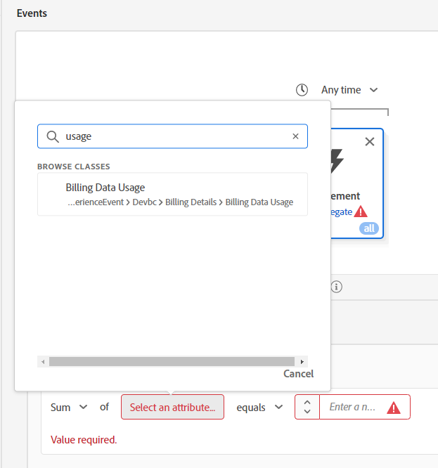

# Opzione #1: utilizzo dei tipi di pubblico per l’aggregazione

Gli aggregati in Audiences ci consentono di aggregare gli eventi nella regola Audience. Ma poiché possiamo fare solo un aggregato alla volta, dobbiamo dividerli dal nostro caso d’uso.

## #1 del pubblico - utilizzo dei dati di fatturazione negli ultimi 6 mesi > 140 GB

In questa build di pubblico, puoi determinare l’utilizzo totale dei dati di fatturazione negli ultimi 6 mesi > 140 gb. A tale scopo, effettuare le seguenti operazioni:

1. Crea un nuovo pubblico.  Utilizzare la scheda evento rendiconto fatturazione.

   

   >[!NOTE]
   >
   >Una buona struttura del Tipo di evento consente agli utenti di utilizzarlo e comprenderlo facilmente.  Prendi del tempo per sviluppare un approccio standardizzato nei tuoi schemi.
   >
   >Aiuta con gli errori ortografici.
   >
   >Puoi sempre ricorrere al fallback nel campo Tipo evento e digitare manualmente gli elementi in.

2. Fai clic sull’ellisse nelle regole in basso a destra e scegli Aggrega. Fai clic su Seleziona un attributo e digita Utilizzo. Seleziona il campo Uso dati fatturazione.

   

   

3. Cambia il valore È uguale a maggiore di e il valore a 140.

4. Modifica l’ora sopra la scheda Evento da Qualsiasi ora a In ultimo e il valore a 6 e i giorni a mesi

   

5. Fornisci una descrizione e salva.

6. Assegna al pubblico il nome &quot;*Somma utilizzo fatturazione > 140 GB (ultimi 6 mesi)*&quot;

>[!NOTE]
>
>I tipi di pubblico aggregati possono essere salvati solo come batch

>[!NOTE]
>
>Esistono due modi per utilizzare gli aggregati in Audiences.
>
>- Sum/Count/Min/Max/Average (come abbiamo fatto sopra)
>- Conta solo (conta ogni evento come 1)
>
>
>
>Entrambi possono essere utilizzati insieme, se necessario
>
>

## Audience #2: continui 6 mesi in media utilizzo mensile dei dati >= 20 GB

1. Non fare clic sul collegamento ipertestuale, ma selezionare la riga nell’interfaccia utente Elenco tipi di pubblico in modo che stia evidenziando quella appena creata. Una volta evidenziata, fai clic su Copia.

   

2. Fai clic sulla copia e modificala.  Fai clic sulla scheda Evento e modifica il campo Somma in Media. Modifica il maggiore di o uguale a e il valore a 20. Copia lo pseudo codice nella descrizione.

   

3. Assegna al pubblico il nome &quot;*Media utilizzo fatturazione > 20 GB (ultimi 6 mesi)*&quot;

## Audience #3: non dispone di un piano telefonico definitivo

1. Crea un nuovo pubblico
1. In Attributi, cerca nome piano
1. Aggiungi nome piano (nome piano)
1. Seleziona &quot;Ultimate&quot;.  Cambia in Does Not Equal

   >[!NOTE]
   >
   >Ricordi il nostro pre-lavoro? Questo utilizza un campo nella dimensione di ricerca:
   >
   >Profilo individuale XDM > Devbc > Dettagli piano > Proprietà ID piano > **Nome piano (Nome piano)**

   

5. Fai clic su Audiences —> Experience Platform. Trascina Somma utilizzo fatturazione > 140 GB e Media utilizzo fatturazione >= 20 GB accanto a Nome piano.

   

6. Copiare lo pseudo codice nella descrizione

7. Seleziona questa opzione per Streaming. **Non può essere in streaming**. Apporta alcune modifiche:

   >[!NOTE]
   >
   >Qualsiasi utilizzo di un set di dati di ricerca crea un pubblico con più entità che viene valutato in batch.  Abbiamo utilizzato un campo nel nostro pubblico:
   >
   >XDM Profilo individuale > Devbc > Dettagli piano > Proprietà ID piano > Nome piano (Nome piano)

8. Sostituisci **Nome piano (Nome piano)** con: Profilo individuale XDM > Devbc > Dettagli piano > **Nome piano**

   

   >[!NOTE]
   >
   >Ricordare che il passo di denormalizzazione del LID aggiunge il nome del piano al profilo. Questo ti consente di farvi riferimento in un pubblico. Di conseguenza, questo rimuove un join alla ricerca e consente di effettuare il metodo di valutazione Streaming.
   >
   >In questo caso, lo svantaggio è che abbiamo spostato questa logica a monte per l’acquisizione pre-dati invece che durante la valutazione del pubblico.
   >
   >Inoltre, se il nome del piano cambia, ora è necessario aggiornare qualsiasi profilo.
   >
   >Il vantaggio è che ora possiamo reagire in tempo reale.

9. Verifica di poter salvare l’elemento come Streaming. Salva pubblico come &quot;*Utilizzo dati fatturazione elevato ma nessun piano Ultimate*&quot;

>[!NOTE]
>
>Anche se questo metodo di valutazione è Streaming, basa la qualificazione del pubblico su due tipi di pubblico in batch.

>[!NOTE]
>
>Questo approccio funzionerà, ma ora disponiamo di un pubblico in streaming (in tempo reale), che utilizza tipi di pubblico in batch (che verrà eseguito una volta ogni 24 ore). Se questo funziona per i nostri casi d’uso e caricamenti di dati, allora questa è una buona scelta (ad esempio, forse i nostri dati di fatturazione vengono caricati quotidianamente o mensilmente, il che è altamente probabile, ma non tutti i casi d’uso saranno così). In caso contrario, un approccio comune consiste nell’aggregare i dati prima di inviarli ad AEP. Considera un’altra opzione se hai bisogno di un approccio più in tempo reale.
