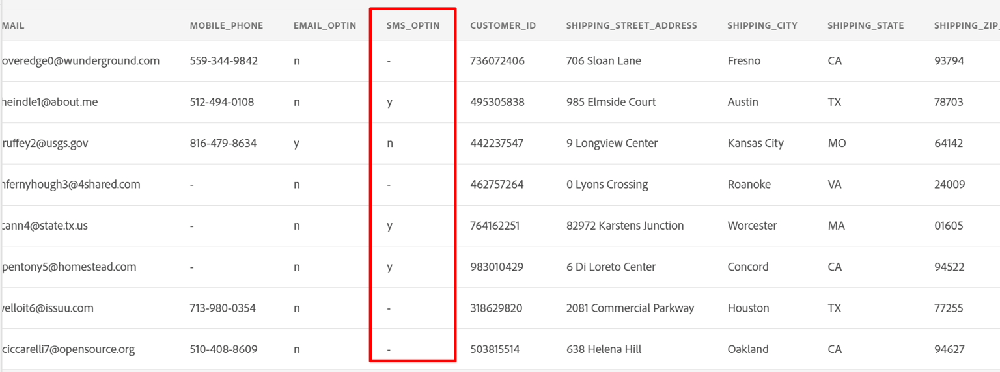

# Crea flusso di dati

## Passa a Origini

1. Nell’interfaccia utente di Adobe Experience Platform, passa alla seguente posizione:\
   **Origini** -> **Catalogo** -> **Sistema locale**
1. Fai clic sul pulsante **Aggiungi dati** per la scheda **Caricamento file locale**

## Impostare il flusso di dati

1. Nella schermata dei dettagli del flusso di dati, scegli **Nuovo set di dati**.
1. Denomina il set di dati di output come **Account cliente - \&lt;Iniziali>**
1. Selezionare lo schema **dep: Account cliente** dall&#39;elenco a discesa.
1. Attiva la casella di selezione **Set di dati profilo**.
Se non lo attivi, l’archivio profili non è in grado di monitorare i nuovi dati che entrano in questo set di dati e quindi non acquisisce questi dati nel profilo.
1. Attiva **Abilita acquisizione parziale**.
Se non lo attivi, l’intera acquisizione potrebbe non riuscire se solo uno dei record presenta un errore.
1. Imposta il nome del flusso di dati come **Batch account cliente - \&lt;Iniziali>**
1. Attiva tutti gli avvisi **Avvio/completamento/errore flusso di dati origini**

>[!NOTE]
>
>**L&#39;abilitazione dell&#39;acquisizione parziale** specifica il numero di errori (**INGEST** e **DCVS**) come percentuale del numero totale di record che possono avere esito negativo prima che l&#39;intero flusso di dati venga dichiarato un errore.

>[!CAUTION]
>
>Prima di procedere, assicurati di aver **abilitato il set di dati** sia per il profilo che per l&#39;acquisizione parziale.

1. Se tutto sembra a posto, fai clic sul pulsante **Successivo** nell&#39;angolo superiore destro dello schermo per continuare con il passaggio successivo.

## Carica file di esempio

1. Scarica i file di esempio da [File di esempio](../sample-files.md) da utilizzare con questa esercitazione
1. Trascina e/o carica il file **Lab\_Customer\_Account.csv** nell&#39;interfaccia utente.  Al termine, lo schermo dovrebbe essere simile al seguente.

1. Nel riquadro di anteprima, esaminare i seguenti attributi e prendere nota degli elementi riportati di seguito.

- **sms\_optIn** è un campo di consenso con diversi valori mancanti (mostrati in anteprima come - )
- **account\_create\_date** non ha il formato di data corretto. Contiene valori stringa insieme a valori di data e ora in una stringa.
- **account\_end\_date** ha il formato data corretto.

>[!NOTE]
>
>Dovrai occuparti dei valori mancanti, delle date e dei campi formattati in modo errato nei passaggi di mappatura successivi in questa esercitazione

1. Fai clic sul pulsante **Avanti** nell&#39;angolo superiore destro dello schermo per continuare con il passaggio successivo
