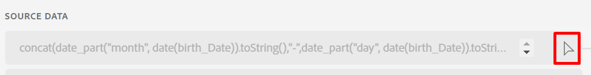
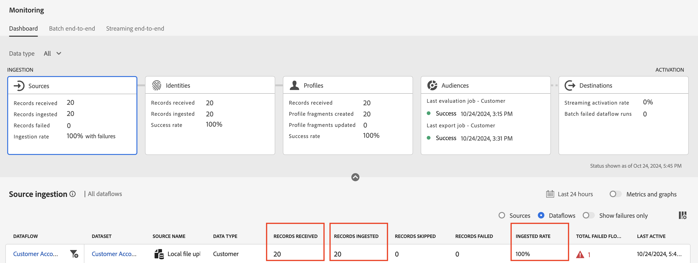

# Correzione di errori

## Fissare il giorno e il mese di nascita

1. Fai clic sull&#39;icona a forma di freccia accanto al campo calcolato che popola il campo XDM **person.bornDayAndMonth**

   

1. Aggiorna l&#39;espressione utilizzando il codice di campo calcolato seguente e fai clic su **Anteprima**

   ```none
   concat(date_part("mm", date(birth_Date, "M/d/yyyy")).toString(),"-", date_part("dd", date(birth_Date, "M/d/yyyy")).toString())
   ```

   >[!NOTE]
   >
   >I dati devono essere visualizzati come mese a 2 cifre e giorno a 2 cifre (ovvero il 27 aprile è indicato come 04-27). I parametri `mm` e `dd` aggiungono 0 spaziatura.

1. Se tutto sembra buono **Salva** il campo calcolato

1. Quindi fai clic su **Fine** per eseguire l&#39;acquisizione del flusso di dati.


## Convalidare l’acquisizione

Dopo alcuni minuti dovrebbe essere eseguito il flusso di dati e dovresti vedere il successo.


## Schermata di monitoraggio

1. Passa alla schermata di monitoraggio facendo clic sulla barra a sinistra dell&#39;icona **Monitoraggio** nella sezione **Gestione dati**.
1. Fai clic sulla scheda **Origini**, quindi scorri sulla barra inferiore per visualizzare i dettagli dell&#39;esecuzione del flusso di dati. Tieni presente quanto segue:
   - **Record ricevuti:** 20 record ricevuti dall&#39;origine per l&#39;elaborazione
   - **Record acquisiti:** 20 record acquisiti nel Data Lake dopo la mappatura e l&#39;elaborazione dei dati.
   - **Record non riusciti:** Dovresti visualizzare qui uno 0. Rappresenta il numero totale di errori INGEST e DCVS. Sono esclusi gli avvisi MAPPER.
   - **Tasso di acquisizione:** rapporto tra i record acquisiti e quelli ricevuti. Il 100% dei record ricevuti è stato elaborato correttamente



>[!NOTE]
>
>Se l&#39;acquisizione parziale dei dati è abilitata, il **tasso acquisito** per un&#39;esecuzione specifica del flusso di dati può essere \&lt;100% fino alla soglia impostata come parte dei dettagli del flusso di dati. Inoltre, tieni presente che il 100% di successo verrà segnalato per le esecuzioni di flussi di dati in cui non sono stati acquisiti dati.

>[!NOTE]
>
>Tieni presente che i record non possono essere persi.
>
>**Record ricevuti** = **Record acquisiti** + **Record non riusciti**
>
>**Frequenza di acquisizione = Record acquisiti / Record ricevuti**
>
>**Soglia di acquisizione parziale = record non riusciti / record ricevuti**


## Identità

Fai clic sulla scheda **Identità**, quindi scorri la barra inferiore per visualizzare i dettagli granulari dell&#39;esecuzione del flusso di dati. Nota quanto segue sul servizio Identity

- **Record ricevuti:** 20 record ricevuti da *Archivio identità* poiché monitorava nuovi batch, ovvero il set di dati è stato contrassegnato per il profilo.
- **Record acquisiti:** sono stati acquisiti 20 record (ovvero elaborati per le informazioni di identità)
- **Record ignorati:** Nessuno perché non disponevamo di record di identità singoli o record con nuove relazioni di identità.
- **Percentuale di successo (disponibile solo nella scheda):** Questa è la proporzione dei record ricevuti rispetto ai record acquisiti.
- **Identità aggiunte:** 40 identità (20 ciascuna per CustomerID e 20 per l&#39;indirizzo e-mail) sono state aggiunte al grafico delle identità complessive per Real-Time Customer Profile
- **Grafici creati:** sono stati creati 20 grafici univoci in base ai record elaborati (ovvero relazioni trovate in ogni riga di dati)
- **Grafici aggiornati:** Questo indica se le identità sono state aggiunte a un grafico.


## Profili

Fai clic sulla scheda **Profili**, quindi scorri sulla barra inferiore per visualizzare i dettagli dell&#39;esecuzione del flusso di dati. Nel servizio Profilo, tieni presente quanto segue:

- **Record ricevuti:** 20 record ricevuti dall&#39;archivio profili per l&#39;elaborazione
- **Record non riusciti:** Nessun record non riuscito. Ma se avessero fallito, allora sai che si è trattato di un’acquisizione nel problema del profilo.
- **Frammenti di profilo creati:** Sono stati creati 20 frammenti di profilo
- **Frammenti di profilo aggiornati:** sono stati toccati complessivamente 20 frammenti di profilo
- **Percentuale di successo:** 100%. Rapporto tra record non riusciti e record ricevuti.

>[!NOTE]
>
>Osserva che la metrica **Record ignorati** non è disponibile per il profilo.


>[!NOTE]
>
>Tieni presente che la scheda Destinazione contiene metriche simili a quelle visualizzate in questo laboratorio. Queste metriche avranno senso solo dopo aver attivato un pubblico o un set di dati.
