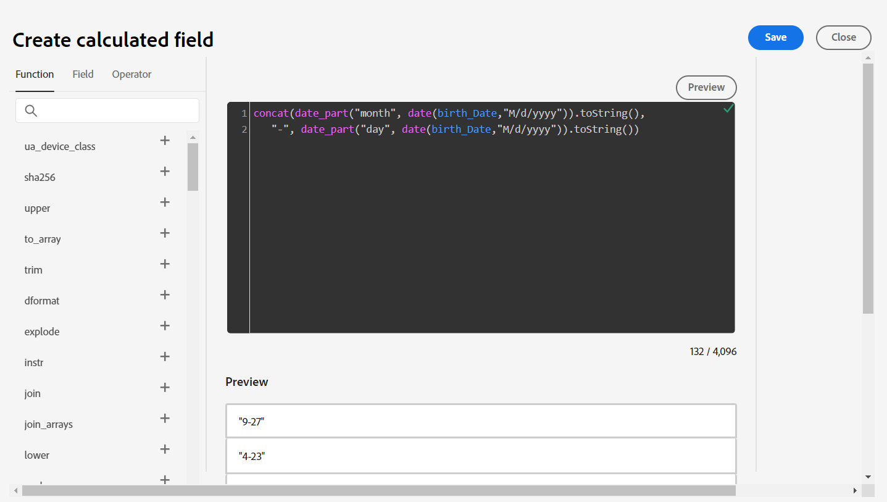

# Campi calcolati

## Panoramica

Il campo sms\_optIn è un campo obbligatorio nello schema Account cliente. Il problema è che il campo sms\_optIn nella nostra origine di streaming può inviare valori *null*, pertanto è necessario un campo calcolato per risolvere questo problema; altrimenti questi record vengono ignorati dall&#39;acquisizione, il che rappresenta una perdita.


## Crea campo calcolato

1. Creare un campo calcolato facendo clic sull&#39;icona **Nuovo tipo di campo**, quindi selezionare **Aggiungi campo calcolato**. Per tutti i valori mancanti, si presume che il consenso non sia stato fornito ed è contrassegnato come **&quot;n&quot;**. Tieni presente che i campi calcolati vengono visualizzati nella colonna di sinistra, poiché la trasformazione tramite il campo calcolato è l’input per questa nuova mappatura.

   


1. Nella finestra di dialogo Crea campo calcolato aggiungere la seguente espressione e quindi fare clic su **Anteprima**

   ```none
   iif(sms_optIn == null or sms_optIn == "", 'n', sms_optIn)
   ```

   


1. Dovresti vedere un segno di spunta verde nell&#39;angolo in alto a destra della casella nera che indica la validità dell&#39;espressione e l&#39;anteprima dei dati dovrebbe mostrare solo **&quot;n&quot;** o **&quot;y&quot;** come valori. Se tutto sembra corretto, fai clic su **Salva**.


## Mappa su destinazione

Un nuovo campo viene aggiunto alla schermata di mappatura ma con un percorso del campo di destinazione non mappato.


1. Fai clic sul **Mappa campo di destinazione** per il nuovo campo calcolato creato
1. Nel riquadro a destra viene ora visualizzato il pannello schema di destinazione aperto. Digita **sms** nella casella di ricerca
1. Seleziona il campo **val**

   


   La mappatura finale sarà simile alla seguente:

   


1. Convalida la mappatura per assicurarti che sia corretta


>[!NOTE]
>
>Tutte le righe senza un valore SMS valido vengono rifiutate durante l’acquisizione. Se l’acquisizione parziale non è abilitata, l’errore di acquisizione con questa riga non riesce a eseguire l’acquisizione dell’intero batch o file, nel nostro caso. Con l’acquisizione parziale abilitata, le righe con campi obbligatori con valori mancanti vengono rifiutate ma vengono acquisite altre righe.


## Gestione dei compleanni

È necessario separare il giorno di nascita, il mese e l’anno in campi separati, in modo che alcuni di essi non possano essere utilizzati nelle attività a valle. Per risolvere il problema è necessario creare due campi calcolati.

### Creare una mappatura per il giorno e il mese di nascita

1. Aggiungi un nuovo campo calcolato per acquisire i profili giorno di nascita e mese
1. Utilizza il seguente codice per il campo calcolato:

   >[!NOTE]
   >
   >Invece di copiare semplicemente il codice qui sopra, prova a capire cosa sta succedendo eseguendo le parti di codice separatamente per vedere come è stato composto per creare campi calcolati più complessi in una singola riga, in quanto non è consentito usare più righe. Provare a eseguire le operazioni seguenti:
   >
   >1. `date(birth_Date,"M/d/yyyy")`
   >2. `date_part("day", date(birth_Date,"M/d/yyyy")).toString()`
   >3. `date_part("month", date(birth_Date,"M/d/yyyy")).toString()`
   >4. `concat(date_part("month", date(birth_Date,"M/d/yyyy")).toString(),`
   >   `"-", date_part("day", date(birth_Date,"M/d/yyyy")).toString())`


1. Fai clic su Anteprima per visualizzare il seguente risultato. Se tutto sembra corretto, fai clic su **Salva**

   


1. Mappa il campo calcolato su **person.bornDayAndMonth**

1. Convalidare la mappatura


### Creare una mappatura per l’anno di nascita

1. Crea un nuovo campo calcolato per acquisire l’anno di nascita del profilo utilizzando il codice seguente

   ```none
   date_part("yyyy",date(birth_Date,"M/d/yyyy"))
   ```

1. Mappa il campo calcolato alla posizione di destinazione di **person.bornYear**

1. Convalidare la mappatura

>[!NOTE]
>
>Osserva che le date sono in formato **MM/GG/AAAA** ma i dati del **nascita\_Data** nel campione sono a una o due cifre per il giorno e il mese. Affinché la funzione **data** funzioni, è necessario specificare il formato di input dei dati, ad esempio **M/g/aaaa**, in modo da poter contare su un numero di cifre compreso tra 1 e 2 per il mese e il giorno. Senza questa specifica del formato di input della data, la convalida di queste mappature non riesce.
