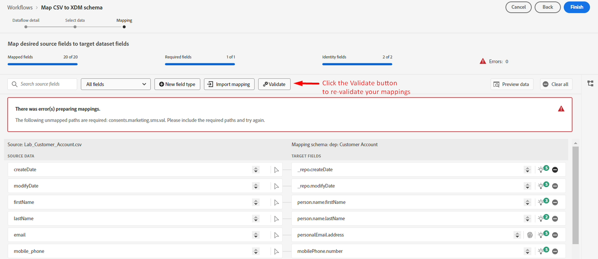
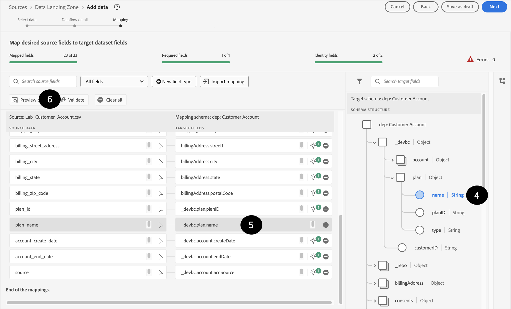

# Correggere le mappature passthrough

## Elimina mappature specifiche

Alcuni dei dati di origine devono essere gestiti utilizzando campi calcolati.  Per risolvere questi problemi, eliminali dalle mappature e riconvalida le mappature.

1. Rilascia i seguenti dati di origine dalle mappature:
   - nascita\_data
   - sorgente
   - sms\_optIn
1. Riconvalida le mappature facendo clic sul pulsante di convalida

>[!NOTE]
>
>Dopo aver fatto clic su Convalida, potrebbero comunque verificarsi degli errori

## Esempi di mappatura errati

Anche se i consigli su IA/ML sono utili, a volte sono errati.  Se analizzi i consigli, potresti trovare questi tipi di errori che è necessario correggere

>[!NOTE]
>
>Di seguito sono riportati alcuni esempi di mappature non valide che potrebbero essere presenti nella tua sandbox. È possibile che vengano visualizzati anche errori di altri utenti.

## Mappature duplicate

In questo scenario, il consigliere AI/ML ha mappato due diversi campi di origine allo stesso campo di destinazione **person.name.lastName**

## Mappature non valide

Il mapping è corretto, ma dopo un&#39;ispezione più dettagliata **email** non è uguale a **emailFormat**

E questo in cui **email\_optIn** non esegue correttamente il mapping all&#39;oggetto di consenso errato

## Correzione delle mappature passthrough

Per correggere le mappature passthrough che puntano erroneamente al campo di destinazione errato, effettuare le seguenti operazioni.

### Esempio

1. Inizia con una mappatura non valida e fai clic sulla casella del campo di destinazione. Ad esempio, nel mapping seguente, il campo **person.name.lastName** non è mappato correttamente ed è mappato a **planName**
1. Nel pannello schema di destinazione visualizzato a destra, scegliere il campo di destinazione appropriato e selezionare **\_devbc.plan.name**
1. Il campo di destinazione ora deve essere aggiornato nella casella campo di destinazione
1. Dopo aver corretto tutti gli errori, premere il pulsante **Convalida** per assicurarsi di ridurre questo tipo di errori e di non introdurne di nuovi.

>[!WARNING]
>
>Non procedere al passaggio successivo finché non sono stati risolti tutti gli errori di mappatura
