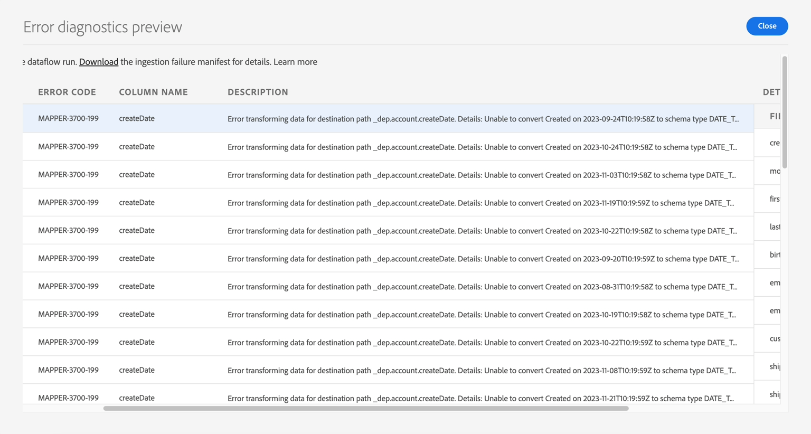

# Correzione degli errori MAPPER per CreateDate

In questo esercizio, dovrai capire come rimuovere l’errore MAPPER visualizzato nel laboratorio di acquisizione batch. È necessario correggere l’errore perché anche se createDate non è un campo obbligatorio, i record vengono comunque acquisiti perché la data con formato non valido viene trasformata in un campo vuoto.

