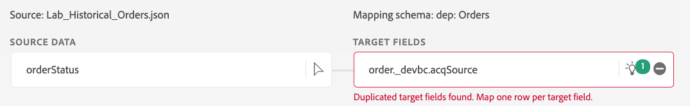

# Mappature iniziali

Come nell’esercizio precedente, dovrai verificare la mappatura e, in alcuni casi, modificarla.

## Verifica consigli ML

1. Nel passaggio di mappatura, ML Recommendations mappano automaticamente la maggior parte degli attributi. Tuttavia, si verificano anche diversi errori. La schermata iniziale potrebbe essere simile alla seguente.


>[!NOTE]
>
>Poiché è in corso la mappatura di un set di dati di Experience Event per la prima volta, tieni presente che **\_id** e **timestamp** non sono mai consigliati o mappati per impostazione predefinita per gli eventi di Experience. Devi accertarti manualmente che siano mappate correttamente.

## Mappa i campi \_id, timestamp e order.\_devbc.acqSource

1. Per mappare **\_id,** scrivi la seguente espressione di campo calcolato e fai clic su anteprima

```none
concat(orderID, "-", lastOrderStatusUpdate)
```


1. Assicurati che il campo **timestamp** nello schema di destinazione sia mappato al seguente campo calcolato:

```none
lastOrderStatusUpdate
```


1. Mappa l&#39;espressione del campo calcolato **&quot;inStore&quot;** su **order.\_devbc.acqSource**


## Gestione delle mappature duplicate

Se la schermata di mappatura ora lamenta la presenza di una mappatura duplicata come **orderStatus** mappata a **order.\_devbc.acqSource,** fai clic sull&#39;icona &quot;-&quot; per rimuovere la mappatura.

&#x200B;> [!NOTE]
>
>Tieni presente che più campi di input non possono essere mappati sullo stesso campo di output, in quanto questo rende ambigua la mappatura. Tuttavia, un singolo campo di input può essere mappato su più campi di output nello schema XDM.



