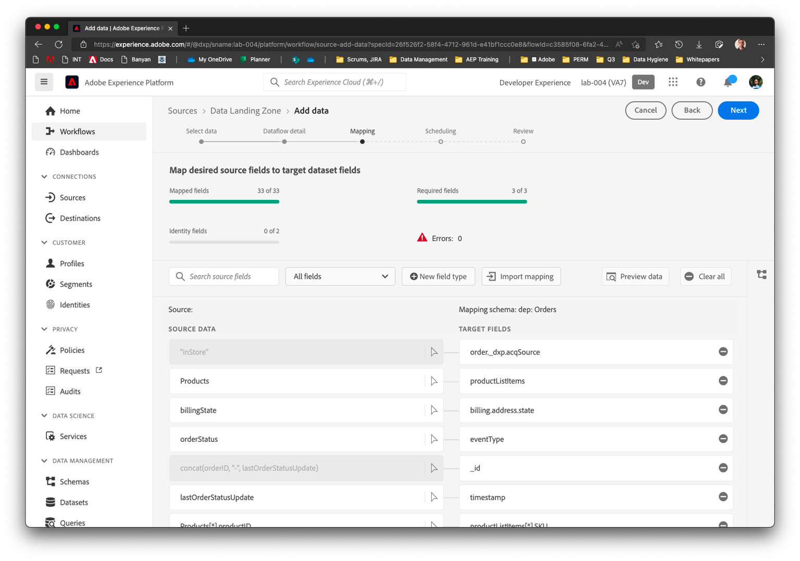

# Verifica e pianifica il flusso di dati

## Verifica doppio set di mappatura

| # | Colonna Source | Colonna XDM |
| -- | ------------------------------------------- | -------------------------------------------------------- |
| 1 | orderStatus | eventType |
| 2 | lastOrderStatusUpdate | timestamp |
| 3 | orderID | order.orderID |
| 4 | orderDate | order.orderDate |
| 5 | orderTotal | order.priceTotal |
| 6 | paymentType | order.payment.paymentType |
| 7 | paymentAmount | order.payment.paymentAmount |
| 8 | paymentCurrencyCode | order.payment.currencyCode |
| 9 | paymentTransactionID | order.payment.transactionID |
| 10 | plan.ID | order.\_devbc.plan.planID |
| 11 | customerID | \_devbc.customerID |
| 12 | personalEmail | \_devbc.personalEmail |
| 13 | storeID | store.storeID |
| 14 | shippingStreetAddress | shipping.address.street1 |
| 15 | shippingCity | shipping.address.city |
| 16 | shippingState | shipping.address.state |
| 17 | shippingZip | shipping.address.postalCode |
| 18 | shippingMethod | shipping.shippingMethod |
| 19 | shippingAmount | shipping.shippingAmount |
| 20 | shippingDestination | shipping.shippingDestination |
| 21 | billingStreetAddress | billing.address.street1 |
| 22 | billingCity | billing.address.city |
| 23 | billingState | billing.address.state |
| 24 | billingZIP | billing.address.postalCode |
| 25 | products\[\*] | productListItems\[\*] |
| 26 | products\[\*].productID | - productListItems\[\*].\_id - productListItems\[\*].SKU |
| 27 | products\[\*].make | productListItems\[\*].\_devbc.make |
| 28 | products\[\*].model | productListItems\[\*].\_devbc.model |
| 29 | products\[\*].price | productListItems\[\*].priceTotal |
| 30 | concat(orderID, &quot;-&quot;, lastOrderStatusUpdate) | \_id |
| 31 | &quot;inStore&quot; | order.\_devbc.acqSource |

## Anteprima dell’output di mappatura

1. Visualizzate l&#39;anteprima dell&#39;output di mappatura. Scorri tra tutti gli attributi per verificare che non sia presente alcuna esclamazione rossa accanto a nessuno degli attributi sul lato destro.

1. Nel menu di navigazione a sinistra dell&#39;anteprima, selezionare l&#39;array di oggetti **productListItems**. Il lato destro viene aggiornato in modo da visualizzare solo gli attributi nell’array di oggetti.

>[!NOTE]
>
>Tieni presente che **productListItems.currencyCode** e **productListItems.quantity** vengono popolati automaticamente (anche dopo aver rimosso i mapping). Ciò si verifica perché **productListItems** come oggetto padre è mappato.

## Pianificare l’esecuzione

1. Impostare la pianificazione per l&#39;esecuzione di **ogni 15 minuti** impostando Frequenza come Minuti e Intervallo come 15. Rivedere il flusso e fare clic su Fine.

>[!CAUTION]
>
>Verificare che la pianificazione sia impostata su 15 minuti. Se si pianifica l&#39;esecuzione come **Esegui una volta**, non sarà possibile eseguirla nuovamente anche se si apportano modifiche alla mappatura in un secondo momento.

1. L’esecuzione del flusso di dati non si avvia immediatamente e richiede alcuni minuti. Lo stato dell&#39;ultima esecuzione del flusso di dati è impostato su &quot;*Nessuna esecuzione*&quot;.

1. Dopo alcuni minuti, il flusso di dati ha esito positivo. Osserva lo **Stato ultima esecuzione flusso di dati** e la **Data ultima esecuzione flusso di dati**.

1. Fai clic sul nome del flusso di dati per ottenere un elenco di esecuzioni del flusso di dati. Devono essere acquisiti 10 record.

1. Fai clic sull’ora di inizio dell’esecuzione del flusso di dati per visualizzare i dettagli della diagnostica degli errori.

1. Nella barra di navigazione a sinistra, vai ai set di dati in Platform e fai clic su **Ordini - NomeQui**

1. Fai clic sul **Set di dati di anteprima.**
