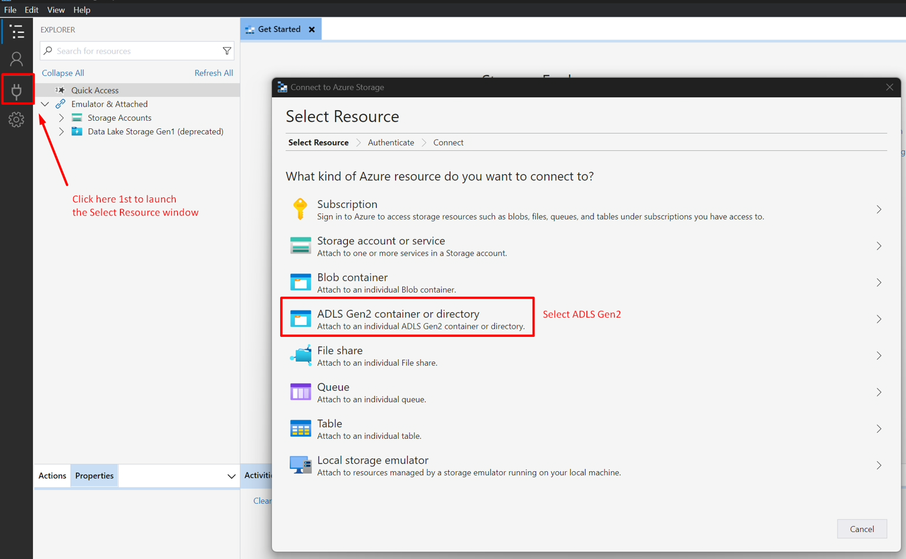
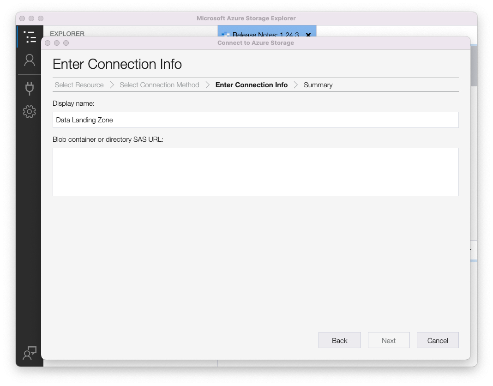
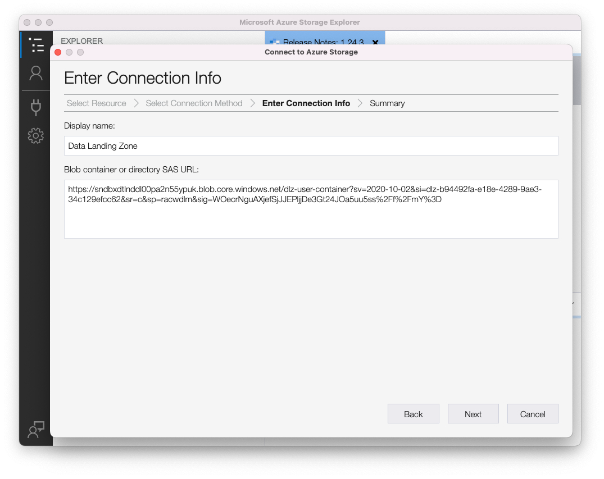

# Utilizzo della Data Landing Zone

## Prerequisiti

Se non hai scaricato Azure Storage Explorer, fallo adesso, in quanto è un requisito per questo laboratorio.  Il download è disponibile al seguente link:

[Scarica Azure Storage Explorer](https://azure.microsoft.com/en-us/blog/microsoft-azure-data-lake-storage-adls-in-storage-explorer-public-preview/)

1. Installare l’applicazione
1. Al primo avvio accettare il contratto di licenza con l&#39;utente finale

## Configurare Azure Storage Explorer con Experience Platform

1. Apri Azure Storage Explorer e fai clic sull&#39;icona **Seleziona risorsa**, quindi seleziona **ADLS Gen 2 Container o directory**

   

1. Seleziona **URL firma di accesso condiviso (SAS)** e fai clic su **Avanti**

   

1. Immetti il nome visualizzato come **Area di destinazione dati**

   >[!NOTE]
   >
   >Non è possibile continuare in questo passaggio finché non si specifica l&#39;URL SAS.  Ottieni questo da Experience Platform, che vedi nel passaggio successivo.

   

1. Vai a Adobe Experience Platform ed esegui il passaggio alla Data Landing zone effettuando le seguenti operazioni:

   - Passa a **Origini -> Catalogo**
   - Seleziona **Archiviazione cloud** nelle origini
   - Individua la scheda **Data Landing Zone**
   - Fai clic sulla scheda Data Landing Zone, quindi fai clic su **Visualizza credenziali** nella barra a destra

   

1. Copia **SASUri** dal modale visualizzato.

   Torna a Azure Storage Explorer e incolla il **valore SASUri** nell&#39;**contenitore Blob o URL SAS di directory** lasciato vuoto dal passaggio precedente

   

1. Fai clic su **Avanti** per continuare

   

1. Nella schermata Riepilogo fare clic su **Connetti**

Ora dovresti vedere una schermata simile a quella riportata di seguito

>[!TIP]
>
>Congratulazioni!  Configurazione di Azure Storage Explorer completata
