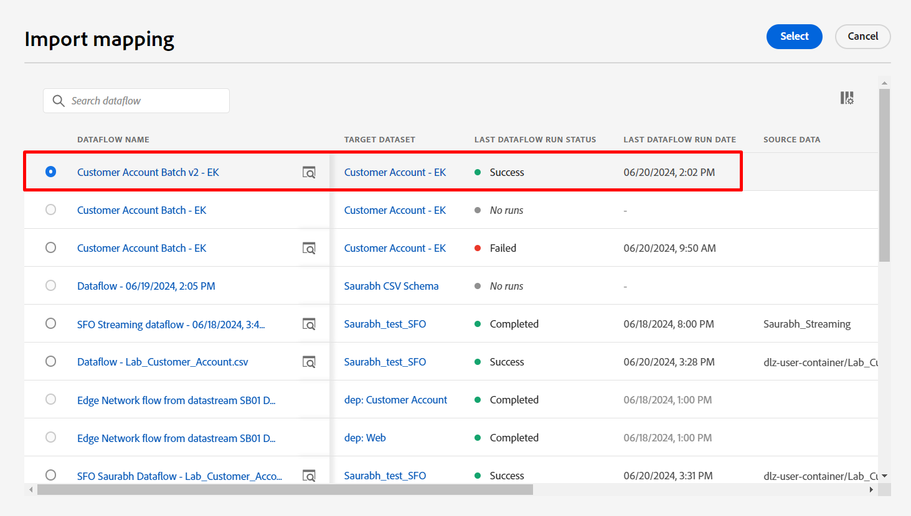

# Configurare la mappatura

&#x200B;> [!NOTE]
>
>Segui questa sezione solo se hai completato correttamente l’esercitazione di acquisizione in batch.  In caso contrario, segui i [passaggi di mappatura dei dati](../batch-ingestion/mapping-data/overview.md) trovati nella esercitazione di acquisizione in batch.

## Import mapping set

Se hai completato l&#39;esercitazione di acquisizione batch, puoi riutilizzare il set di mappatura creato 😄🎉

Effettua le seguenti operazioni:

1. Fai clic sul pulsante **Importa mapping** nella schermata di mappatura

1. Scegli il flusso di dati creato nella sezione Acquisizione in batch e selezionalo.  Deve essere denominato nel modo seguente: **Batch account cliente v2 - \&lt;iniziali>.**

Dopo l’importazione vedrai gli errori.  Questo perché il formato della data utilizzato per il campo nascita\_data nel file di esempio è stato modificato.

- File di esempio batch utilizzato -> mm/gg/aaaa
- File di esempio del flusso utilizzato -> aaaa-mm-gg

I campi calcolati che utilizzano le funzioni **date** dovranno essere aggiornati per tenere conto della modifica nel formato data utilizzato.

## Aggiorna campi calcolati

Aggiorna ciascun campo calcolato facendo clic sull&#39;icona a forma di freccia accanto a ciascun campo calcolato e quindi convalida le mappature

| Campo di destinazione | Nuovo campo calcolato |
| ----------------------- | ----------------------------------------------------------------------------------------------------------------------------------- |
| person.bornYear | date\_part(&quot;aaaa&quot;,date(nascita\_Date,&quot;aaaa-M-g&quot;)) |
| person.bornDayAndMonth | concat(date\_part(&quot;mm&quot;, date(nascita\_Date, &quot;aaaa-M-g&quot;)).toString(), &quot;-&quot;, date\_part(&quot;gg&quot;, date(nascita\_Date, &quot;aaaa-M-g&quot;)).toString()) |
