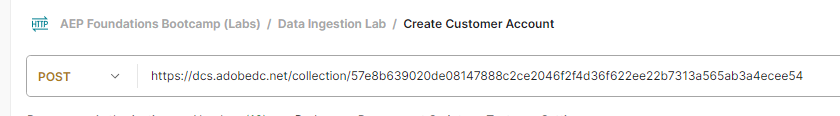

# Trasmetti un profilo

## Panoramica API

È importante comprendere la struttura dell’API durante lo streaming dei dati in Adobe Experience Platform in formato non elaborato, in modo da poterla ricreare facilmente indipendentemente dal flusso di dati creato.  Di seguito è riportato un esempio della struttura di base della chiamata utilizzando cURL

**Richiesta di esempio (dati non elaborati)**

```curl
curl --location '' \
--header 'Content-Type: application/json' \
--header 'x-adobe-flow-id:  <dataflow-id>;' \
--header 'Authorization: Bearer XXX;' \
--data '{
    "customer_id": "202208240125",
    "firstName": "",
    "lastName": "",
    "email": "",
    "createDate": "1660096899",
    "modifyDate": "2022-08-09T22:01:40Z",
    "birth_Date": "1991-06-12",
    "mobile_phone": "888-888-8888",
    "email_optIn": "y",
    "sms_optIn": "n",
    "shipping_street_address": "1901 W Madison St",
    "shipping_city": "Chicago",
    "shipping_state": "IL",
    "shipping_zip_code": "60612",
    "billing_street_address": "1901 W Madison St",
    "billing_city": "Chicago",
    "billing_state": "IL",
    "billing_zip_code": "60612",
    "plan_id": "m1",
    "plan_name": "basic",
    "account_create_date": "Created on 2022-04-20T22:19:03Z",
    "account_end_date": "2022-01-20T13:15:32Z",
    "source": "inStore"
}'
```


Alcuni elementi importanti da notare nella richiesta precedente:

| Elementi chiave | Obbligatorio | Descrizione |
| --------------------------- | -------- | ------------------------------------------------------------------------------------------------------------------------------------------------------------------------------------------- |
| Richiedi URL (ad es. posizione) | - | Questo è l’URL dell’account sorgente API HTTP che hai creato a cui punteranno i dati di streaming. **È sempre di tipo POST** |
| Intestazione &quot;Content-Type&quot; | * | Sempre impostato su `application/json` poiché i dati che stai inviando sono in formato JSON |
| Intestazione &quot;x-adobe-flow-id&quot; | - | Imposta sull’ID del flusso di dati creato dal connettore di origine |
| Intestazione &quot;Authorization&quot; | * | Valore facoltativo ma fortemente consigliato per motivi di sicurezza. Si tratta dello stesso `access_token` generato durante i [laboratori di installazione di Postman](../../postman-setup/environment-file.md) |
| Contenuto corpo | - | Contiene i dati effettivi che desideri inviare al Adobe Experience Platform |

>[!NOTE]
>
>Il contenuto del corpo deve sempre essere in formato JSON e corrispondere al payload di esempio fornito durante la progettazione del flusso di dati


## Raccogli i valori richiesti

Prima di poter inviare in streaming i dati, è necessario raccogliere alcuni dei valori richiesti elencati in precedenza (ovvero, in particolare, i valori &quot;intestazione&quot; dell’URL dell’endpoint di streaming e del contenuto del corpo).

Effettua le seguenti operazioni:

1. Copia il valore dell&#39;**endpoint di streaming** e salvalo nel computer locale (supponendo che non sia stato eseguito il passaggio della sezione precedente). Se non sei andato via, puoi trovarlo in Origini->Account.

   >[!NOTE]
   >
   >Se non hai eseguito l&#39;accesso, puoi accedere a questa pagina effettuando le seguenti operazioni:
   >
   >- Fai clic su **Origini** nella barra a sinistra
   >- Verifica di essere nella scheda **Account** e fai clic sull&#39;account creato con titolo **Acquisizione in streaming - \&lt;Iniziali>**

   >[!NOTE]
   >
   >Se non visualizzi questo valore, accertati di non aver selezionato la riga del flusso di dati facendo clic su di essa.  NON FARE CLIC SUI COLLEGAMENTI BLU

   


1. Seleziona la riga del flusso di dati facendo clic in un punto qualsiasi della riga stessa, evitando i collegamenti blu. Copia il **ID flusso di dati** e salvalo in un luogo sicuro


## Aggiornare la richiesta API

Passa all’applicazione Postman e aggiorna la richiesta Crea account cliente con le informazioni appena raccolte.

1. Apri Postman e passa a **Data Ingestion Lab -> Crea richiesta API account cliente** e aprila

   


1. Copia e incolla il valore dell&#39;**endpoint di streaming** salvato in precedenza nell&#39;URL della richiesta

   


1. Copia e incolla il valore ID flusso di dati salvato in precedenza nel valore dell&#39;intestazione **x-adobe-flow-id**

   


1. Nel corpo della richiesta, aggiorna i seguenti attributi, come segue:

   - **firstName** -> Nome
   - **cognome** -> cognome
   - **email** -> Indirizzo e-mail
   - **data_nascita** -> AAAA-MM-GG

   **5. Salva** la tua richiesta

1. Fai clic sul pulsante **Invia** per eseguire la richiesta di streaming nel tuo profilo account cliente

   


1. Dovresti ricevere una risposta `200 OK` che indica che è stata ricevuta correttamente da Adobe Experience Platform

Esempio 200 Risposta OK

```none
{
    "inletId": "57e8b639020de08147888c2ce2046f2f4d36f622ee22b7313a565ab3a4ecee54",
    "xactionId": "1688068236344:7186:152",
    "flowId": "7d1d1a20-3df2-43fb-8bd8-2856bb3ea6a4",
    "receivedTimeMs": 1688068236344
}
```

>[!NOTE]
>
>Osserva **xactionId** nella risposta.  Se si verifica un errore in cui non viene visualizzato un record acquisito, questo deve sempre essere fornito come parte di un ticket di assistenza clienti, in quanto si tratta di un punto elenco di tracciamento utilizzato dai nostri team di supporto per eseguire il debug di eventuali problemi dell’ambiente

>[!TIP]
>
>Congratulazioni!  Hai inviato correttamente lo streaming di un record di profilo in Adobe Experience Platform
