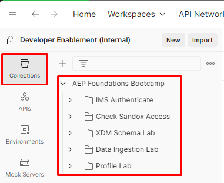

# Raccolta API

## File di raccolta API Postman

Scarica il file — [AEP Foundations Bootcamp (Labs).postman_collection.json](assets/aep-foundations-bootcamp-labs.postman_collection.json)

## Importa raccolta API

1. Apri `Postman API Collection File` dall&#39;alto nel browser facendo clic sul file
1. Copia l’URL del file negli Appunti
1. Avvia Postman nel computer locale e fai clic sul pulsante `Import` nell&#39;area di lavoro
1. Incollare l&#39;URL di `Postman API Collection File` nella casella di testo modale di importazione sulla sovrapposizione.  Questo dovrebbe attivare un’importazione automatica

Ora dovresti vedere una raccolta compilata nella scheda `Collections` della barra laterale a sinistra denominata `AEP Foundations Bootcamp`

## Panoramica sulla raccolta Bootcamp di AEP Foundations

La raccolta API importata contiene tutte le chiamate API necessarie per i laboratori in tutto il campo di avvio.  Ogni laboratorio è organizzato in una cartella specifica con il proprio set di API.  Tienilo presente mentre lavori nei laboratori questa settimana.

I dettagli di ciascuna cartella sono disponibili qui sotto:

- **Autenticazione IMS** - contiene una singola richiesta per generare un accesso\_token richiesto quando si lavora con una qualsiasi delle API di Adobe Experience Platform
- **XDM Schema Lab** - contiene un set di richieste per la creazione dei componenti XDM necessari per la creazione e la configurazione di uno schema per Real-Time Customer Profile
- **Data Ingestion Lab** - contiene un set di richieste per lo streaming di dati in Experience Platform
- **Profile Lab** - contiene un set di richieste per la visualizzazione delle caratteristiche e dei comportamenti del profilo cliente in tempo reale

>[!TIP]
>
>Congratulazioni!  Importazione della raccolta Postman del campo di avvio completata
