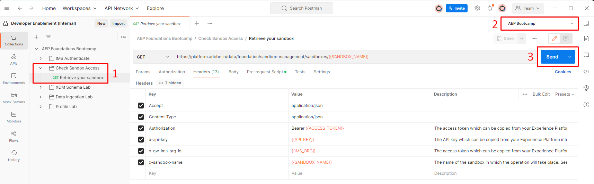

# Accesso alla sandbox

Prima di continuare, verifica che l’accesso sia valido. Effettua le seguenti operazioni:

1. Apri la cartella con titolo `Check Sandbox Access` e fai clic sulla chiamata con titolo `Retrieve Your Sandbox`
1. Nell’angolo in alto a destra di Postman viene visualizzata una casella a discesa Ambiente.  Assicurarsi di selezionare l&#39;ambiente `AEP Bootcamp`
1. Eseguire la chiamata facendo clic sul pulsante `Send`

Una risposta corretta è simile alla seguente:

>[!NOTE]
>
>Il valore **name** deve corrispondere alla variabile sandbox\_name nell&#39;ambiente postman

>[!TIP]
>
>Congratulazioni!  Sei pronto per iniziare a utilizzare le API di Experience Platform
