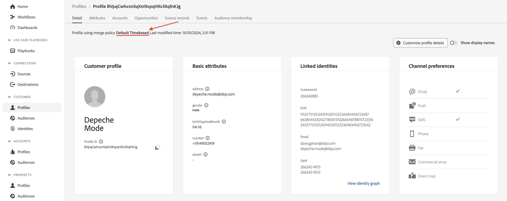

# Criteri di unione

## Che cos&#39;è?

Visualizzi i criteri di unione nel Visualizzatore profili ogni volta che cerchi un profilo (probabilmente non ti sei reso conto che aveva funzionato)

Un criterio di unione esegue due operazioni:

1. Fornisce istruzioni su come assemblare i frammenti all’interno dell’archivio profili (ovvero Unione identità). Sono disponibili due opzioni:
   - Utilizzare il grafico Identity (ovvero il servizio Identity)
   - Non utilizzare il grafico delle identità (ovvero, affidati solo all’identità fornita per trovare frammenti di profilo archiviati in modo simile)
1. Indica al servizio profilo come risolvere i conflitti di campo all’interno dei set di dati basati su singole classi di profilo XDM quando un campo può provenire da più set di dati (ad esempio, Metodo di unione). Sono disponibili due opzioni:
   - Precedenza timestamp: utilizza il record più recente di tutti i set di dati come set di verità e lascia che tutti gli altri record riempiano i vuoti in ordine da recente a meno recente
   - Precedenza set di dati: scegli quali set di dati profilo individuali XDM possono essere utilizzati per formare il profilo e in quale ordine assemblarli

&#x200B;> [!NOTE]
>
>Quando si sceglie il metodo di unione Precedenza set di dati, è possibile scegliere quali set di dati XDM Profilo individuale e XDM Experience Event possono essere utilizzati nella formazione del profilo.
>
>Il metodo di unione Precedenza marca temporale utilizza SEMPRE tutti i set di dati

>[!WARNING]
>
>Ogni sandbox richiede almeno un criterio di unione contrassegnato come **predefinito** per funzionare con segmentazione e profilo

>[!NOTE]
>
>Molte volte la progettazione viene eseguita in modo da non dover utilizzare un criterio di unione personalizzato che utilizza Precedenza set di dati.
>
>- Invece di avere più set di dati che registrano lo stesso campo, gli assegniamo nomi univoci, ad esempio:
>  - Nome - CRM
>  - Nome - Fedeltà
>  - Nome - Modulo web
>- Questo consente a un addetto marketing di scegliere l’origine dati+campo da utilizzare, anziché al sistema di sceglierne automaticamente una in base a un set di regole che potrebbe non comprendere, ed eventualmente di scegliere campi del profilo da un’origine e altri campi da un’altra senza capirlo.
>- Per il modello dati non è necessario risolvere alcun conflitto di campi, pertanto non è necessario alcun criterio di unione personalizzato

Per comprendere al meglio il funzionamento dei criteri di unione con il grafico delle identità, creane uno che non utilizza il grafico delle identità per l’unione degli ID.

## Creare un criterio di unione senza unione

Crea un criterio di unione che non utilizza il grafico ID per visualizzarne il comportamento nella formazione del profilo.

## Crea

1. Fai clic su **Profili** nella barra a sinistra
1. Fai clic su **Criteri di unione** nella navigazione superiore
1. Fai clic su **Crea criterio di unione** nell&#39;estrema destra dello schermo

## Configurare

È ora necessario configurare le impostazioni dei criteri di unione.  Immettere le seguenti informazioni:

| Impostazione | Valore |
| --------------------------- | --------------- |
| Nome | Nessuna unione ID |
| Unione ID | Nessuno |
| Criterio di unione predefinito | Disabilitato |
| Criterio di unione Attivo su Edge | Disabilitato |

Al termine, fai clic su **Avanti**

## Seleziona set di dati profilo

1. Per il metodo Merge, seleziona **Timestamp ordinato**
1. Fai clic su **Avanti**

## Seleziona i set di dati di Experience Event

Ricorda che se selezioni la marca temporale ordinata per il metodo di unione, stai dicendo al servizio profili che tutti i set di dati basati su classi XDM per profilo individuale e evento esperienza partecipano alla formazione del profilo.

Pertanto puoi fare clic su **Avanti** poiché non è necessario eseguire alcuna operazione in questo passaggio.

## Revisione

Nel passaggio finale viene visualizzata un’anteprima delle impostazioni selezionate e dei profili di esempio che mostrano il criterio di unione in azione.

Fai clic sul pulsante **Fine** per creare il criterio di unione

## Metodi di unione in azione

Ricorda il grafico delle identità del profilo, Modalità Depeche, che assomigliava alla schermata seguente. Per capire come funziona il servizio profilo, è meglio ignorare l’utilizzo di questo grafico delle identità durante il processo di assemblaggio.

## Confronta tramite e-mail

Procedi e apri il visualizzatore profili seguendo i passaggi seguenti:

1. Fai clic su **Profili** nella barra a sinistra, quindi nella navigazione superiore seleziona **Sfoglia**
1. Seleziona lo spazio dei nomi Identity di **E-mail**
1. Immetti il valore Identity di **depeche.mode\@dep.com**
1. Fai clic sul pulsante **Visualizza** per cercare il profilo
1. Fai clic sul **collegamento** al profilo per visualizzarne i dettagli

Eseguire un&#39;altra ricerca per il profilo Modalità Depeche, ma questa volta utilizzando il criterio di unione **Nessuna unione ID**.

1. Fai clic con il pulsante destro del mouse su **Profili** nella barra a sinistra, quindi seleziona **apri in una nuova scheda**
1. Nella navigazione superiore, seleziona **Sfoglia**
1. Seleziona il criterio di unione di **Nessuna unione ID**
1. Seleziona lo spazio dei nomi Identity di **E-mail**
1. Immetti il valore Identity di **depeche.mode\@dep.com**
1. Fai clic sul pulsante **Visualizza** per cercare il profilo
1. Fai clic sul **collegamento** al profilo per visualizzarne i dettagli

Confrontando entrambe le viste del profilo dovresti notare che sono molto diverse. Alcuni attributi e identità non sono presenti nella versione che utilizza il criterio di unione **Nessun ID**.

Se osservi gli eventi di ciascun profilo, noti che il profilo che utilizza il criterio di unione **Nessun unione ID** contiene un solo evento, mentre l&#39;altra versione contiene tutti gli eventi.

Il singolo evento nella versione No ID Stitching del profilo è perché tale evento è memorizzato utilizzando l’identità primaria di &quot;personalEmail.address&quot;.

>[!NOTE]
>
>Tieni presente che quando utilizzi un metodo di unione che non utilizza il profilo del grafico delle identità, per trovare frammenti di profilo memorizzati in modo simile ci si baserà solo sull’identità fornita.

## Confronta utilizzando customerID

Puoi esaminare i vari frammenti del profilo Modalità Depeche utilizzando alcune delle altre identità presenti nel grafico.  Prova a cercare di nuovo lo stesso profilo con il criterio di unione No ID Stitching, ma questa volta utilizzando lo spazio dei nomi e il valore customerID forniti di seguito:

| Spazio dei nomi identità | Valore |
| ------------------ | --------- |
| customerID | 266242885 |

**Domande da porsi**

Domanda: Notate qualcosa sugli attributi? Non ce ne sono, perché?

Risposta: hai caricato gli attributi utilizzando l’e-mail come identità principale

Domanda: Notate qualcosa sugli eventi?

Risposta: gli unici eventi che vengono visualizzati sono quelli che hanno customerID come identità principale

## Confronta utilizzando GAID

Prova a cercare di nuovo lo stesso profilo con il criterio di unione No ID Stitching, ma questa volta utilizzando lo spazio dei nomi e il valore GAID forniti di seguito:

| Spazio dei nomi | Valore |
| --------- | ----------- |
| GAID | 266242-9013 |

**Domanda da porsi**

Domanda: non è stato trovato alcun profilo. Cosa sta succedendo? Perché non è stato trovato alcun profilo? Risposta: non vi sono frammenti di profilo memorizzati utilizzando tale valore GAID come identità primaria

## Profilo + Identità

Sintesi rapida:

- L’archivio profili contiene frammenti di profilo memorizzati utilizzando l’identità primaria
- Il grafico delle identità contiene le relazioni tra due (2) o più identità basate su persona

Quando il grafo delle identità viene utilizzato con l’archivio dei profili, puoi immaginarlo come indicante come trovare i giusti frammenti di profilo che trattano ogni valore di identità nel grafo delle identità come identità primarie.

Senza il grafo delle identità, l’archivio profili può recuperare solo frammenti di profilo utilizzando un singolo identificatore (ad esempio, identità primaria)

&#x200B;> [!TIP]
>
>**Avere del tempo in più e provare...:**
>
>- Cerca altri profili nell’interfaccia utente che conosci e che hanno due identità
>- Scopri come alcuni eventi sono memorizzati su un frammento ma non sull’altro
>- Scopri come alcuni attributi di profilo vengono memorizzati su un frammento ma non sull’altro
>- Vai a un profilo che hai già cercato e ricercalo utilizzando il criterio di unione **Nessuna unione ID**.  Notate la differenza
