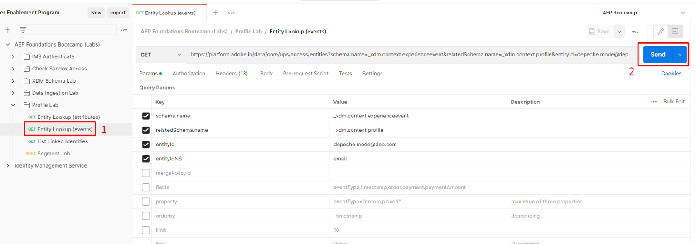

# API di profilo e identità

## API entità profilo

Sapere come utilizzare le API di profilo è fondamentale quando si tratta di lavorare con Real-Time Customer Profile. Offre la possibilità di eseguire rapidamente operazioni di triage ed debug, esponendo al contempo le aziende a infinite possibilità di integrazione di sistemi, dai call center ai chioschi.

Una delle API più importanti è l’API dell’entità profilo.  Questa API consente di cercare un singolo profilo (come hai visto nell’interfaccia utente), ma utilizza parametri per determinare se visualizzare gli attributi o gli eventi del profilo.

Di seguito sono riportate tutte le specifiche del metodo GET per l’API dell’entità profilo

## Panoramica API

Di seguito sono riportate le informazioni minime necessarie per chiamare l’API dell’entità profilo.

`GET https://platform.adobe.io/data/core/ups/access/entities`

### Parametro query obbligatorio

Invia questo parametro con ogni richiesta. Il suo valore dipende dalla ricerca degli attributi di un profilo o dei relativi eventi:

| Parametro | Tipo | Descrizione | Esempio |
| ------------- | ------ | ---------------------------------------------------------------------------------------------------------------------------------------------- | ------------------------------ |
| `schema.name` | stringa | Nome della classe dello schema XDM dell’entità che stai cercando. | `_xdm.context.profile` |
| `schema.name` | stringa | Utilizza questo valore invece di per cercare gli eventi di un profilo. Associalo a `relatedSchema.name=_xdm.context.profile` per eseguire l&#39;ambito degli eventi in un profilo. | `_xdm.context.experienceevent` |

### Identificazione dell’entità da cercare

La maggior parte delle richieste utilizza `entityId` e `entityIdNS` per identificare l&#39;entità in base a qualsiasi valore di identità noto, ad esempio un indirizzo e-mail, un ID CRM o un ID fedeltà, anziché richiedere di conoscere già il relativo XID. Un XID è un identificatore con codifica base64 generato e assegnato internamente da Identity Service per rappresentare un’identità, consolidando il relativo spazio dei nomi e valore ID in un singolo token compatto (per informazioni dettagliate, consulta [XID nativo](https://experienceleague.adobe.com/docs/experience-platform/identity/api/list-native-id.html?lang=it)):

| Parametro | Tipo | Descrizione | Esempio |
| ------------ | ------ | ---------------------------------------------------------------------------------------------------------------------------------------------- | ---------------------- |
| `entityId` | stringa | Valore dell’identificatore da cercare. Se conosci già l&#39;XID dell&#39;entità, usalo qui da solo e ometti `entityIdNS`. | `depeche.mode@dep.com` |
| `entityIdNS` | stringa | Codice dello spazio dei nomi dell&#39;identità a cui appartiene `entityId` (ad esempio, `email`, `crmid`, `ECID`). Obbligatorio se `entityId` non è già un XID. | `email` |

>[!NOTE]
>
>Le richieste Postman di questo laboratorio cercano il profilo Modalità Depeche in base al relativo indirizzo e-mail (`entityIdNS=email`, `entityId=depeche.mode@dep.com`) anziché al relativo XID.

### Intestazioni richieste

A ogni richiesta sono necessarie anche le seguenti intestazioni:

| Intestazione | Tipo | Descrizione | Esempio |
| ----------------- | ------ | ---------------------------------------------- | --------------------- |
| `x-gw-ims-org-id` | stringa | ID organizzazione IMS. | `<your IMS org>` |
| `x-api-key` | stringa | Chiave API del progetto o delle credenziali registrate. | `<your API key>` |
| `Authorization` | stringa | Token Bearer per la richiesta. | `Bearer <your token>` |

>[!NOTE]
>
>Vedere il riferimento API [Entità profilo](https://developer.adobe.com/experience-platform-apis/references/profile#tag/Entities) per l&#39;elenco completo dei parametri di query, incluse le opzioni aggiuntive di ricerca delle identità, il filtro degli eventi (`startTime`, `endTime`, `property`, `orderby`, `limit`), la selezione dei campi e le sostituzioni dei criteri di unione.

>[!WARNING]
>
>Ricorda che tutte le richieste API sono specifiche per sandbox, quindi è importante, quando si lavora con le API, che il parametro dell&#39;intestazione in ogni richiesta denominata `x-sandbox-name` sia impostato correttamente sulla sandbox appropriata.
>
>Per questa esercitazione hai già impostato `x-sandbox-name` nel file di ambiente

## Ricerca entità (attributi)

Per ottenere un’idea dell’API di ricerca entità, utilizza il profilo Modalità Depeche del laboratorio precedente.

1. Apri **Postman** e passa alla cartella **Profile Lab**
1. Fai clic sulla richiesta **Ricerca entità (attributi)** per aprirla
1. Eseguire la chiamata facendo clic sul pulsante **Invia**

")

Una richiesta corretta dovrebbe rispondere con un `200 OK` e si dovrebbe vedere un risultato che contiene tutti gli attributi per il profilo Modalità Depeche.

 riuscita")

>[!NOTE]
>
>Per impostazione predefinita, se non è specificato alcun criterio di unione in una richiesta di entità profilo, viene utilizzato il criterio di unione predefinito nella sandbox

Con l’API di entità è possibile utilizzare una serie di parametri di query per modificare ciò che viene restituito in risposta.

1. Nella richiesta di ricerca entità (attributi), fai clic sull&#39;opzione **Parametri** per la richiesta
1. Seleziona la casella accanto a **Chiave** denominata **campi**
1. Eseguire la richiesta facendo clic sul pulsante **Invia**

>[!NOTE]
>
>Si noti anche un parametro per specificare `mergePolicyId`.  Puoi trovare il valore per questo utilizzando altre API o cercando l’ID utilizzando l’interfaccia utente.

Una richiesta corretta dovrebbe rispondere con un `200 OK` e dovrebbero essere visualizzati solo i campi specificati nel filtro parametri appena abilitato: Nome, Cognome e un array di Prodotti attivi.

 riuscita con filtro abilitato")

> [!TIP]
>
>Congratulazioni!  Hai cercato correttamente gli attributi di un profilo utilizzando l’API di entità profilo

## Ricerca entità (eventi)

Per cercare gli eventi di un profilo si utilizza la stessa API di entità profilo.  L’unica differenza consiste nel fatto che devi comunicare al servizio profili che desideri modificare il tipo di classe da utilizzare nella risposta.

1. Fai clic sulla richiesta **Ricerca entità (eventi)** per aprirla
1. Eseguire la chiamata facendo clic sul pulsante **Invia**

Una richiesta corretta dovrebbe rispondere con un `200 OK` e si dovrebbe vedere un risultato che contiene tutti gli eventi per il profilo Modalità Depeche.

")

Proprio come per la ricerca degli attributi di profilo, l’API di entità dispone di più parametri di query che possono essere utilizzati per modificare ciò che viene restituito in risposta.

Per provarne alcuni, abilitali nella sezione Parametri ed esegui la richiesta.  Provatelo e vedete come funziona!

**Definizioni parametri query di esempio**

| Chiave | Valore | Descrizione |
| ------------- | ------------------------------- | --------------------------------------------------------------------------------------------------------------------------------------------------------- |
| mergePolicyId | \&lt;blank> | Se fornito, puoi cambiare il criterio di unione utilizzato per eseguire la ricerca. Se il lab viene lasciato vuoto, verrà utilizzato il criterio di unione predefinito delle sandbox |
| campi | eventType,timestamp,identityMap | Visualizza questi campi solo da ogni evento, indipendentemente dal fatto che il campo specificato abbia un valore |
| proprietà | eventType=&quot;order.placed&quot; | Filtra gli eventi del profilo in base a quelli di tipo &quot;order.placed&quot; |
| orderby | +timestamp | Ordina gli eventi in ordine decrescente |
| limit | 5 | Mostra solo 5 eventi nella risposta |

>[!NOTE]
>
>Ulteriori informazioni su tutte le opzioni dei parametri di query qui -> [https://developer.adobe.com/experience-platform-apis/references/profile/#tag/Entities/operation/retrieveEntity](https://developer.adobe.com/experience-platform-apis/references/profile/#tag/Entities/operation/retrieveEntity)

## API cluster di Identity Service

A un certo punto potresti avere una domanda su quali identità fanno parte di un cluster di identità di un profilo specifico all’interno del grafico delle identità.  Questa API ti consente di passare un singolo spazio dei nomi/valore di identità e in risposta ricevi il cluster di identità completo per quel profilo.

Prova tu stesso:

1. Fai clic sulla richiesta **Elenca identità collegate** per aprirla
1. Eseguire la chiamata facendo clic sul pulsante **Invia**

>[!NOTE]
>
>Nota: i parametri nella richiesta sono lo spazio dei nomi e l’ID dell’identità (ovvero il valore)

Una risposta corretta dovrebbe essere simile alla schermata seguente

>[!NOTE]
>
>Noterai che la risposta contiene tutte le identità del profilo Depeche Mode
