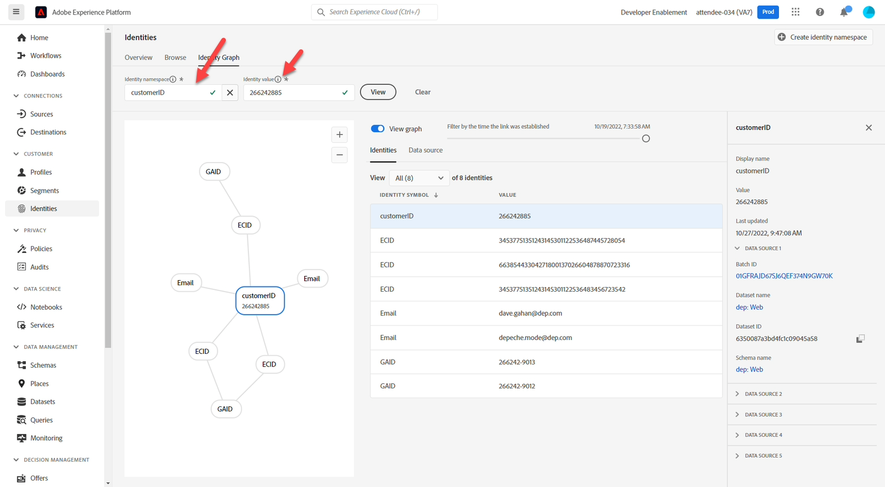
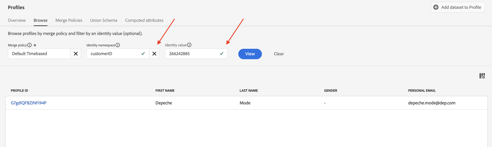

# Nozioni di base sui profili

## Schema di unione profili

Ricorda che la visualizzazione di qualsiasi profilo cliente in tempo reale viene creata utilizzando gli schemi definiti e abilitati per il profilo. Questo è ciò che Adobe si riferisce come schema di unione del profilo.

Per visualizzare lo schema di unione del profilo, effettua le seguenti operazioni:

1. Fai clic su **Profili** nella barra a sinistra
1. Fai clic su **Schema unione** nella navigazione superiore


>[!NOTE]
>
>Ricorda che il profilo crea una vista unione per ogni classe XDM. Utilizza questa visualizzazione per vedere quali schemi hanno contribuito a quale classe, le identità all’interno di ogni classe e qualsiasi relazione.

Esamina lo schema di unione per la classe Profilo individuale XDM ed espandi lo spazio dei nomi del tenant. Qui dovresti trovare un certo numero di elementi provenienti da vari schemi definiti in **LID Methodology** e **XDM Modeling Labs.**


Fai clic sull&#39;oggetto **account** e osserva cosa appare nella barra a destra dello schermo. Ora puoi visualizzare i dettagli sull’oggetto, quali schemi e set di dati hanno contribuito alla sua formazione e altre informazioni rilevanti.


>[!NOTE]
>
>Lo schema di unione è un ottimo strumento per comprendere perché alcuni elementi esistono all’interno di un profilo e da dove provengono.
>
>Tieni presente che lo schema di unione è osservabile, il che significa che il profilo mostrerà solo campi che contengono dati durante la visualizzazione di un profilo cliente in tempo reale.


## Ricerca profilo

1. Fai clic su **Profili** nella barra a sinistra, quindi nella navigazione superiore seleziona **Sfoglia**
1. Seleziona lo spazio dei nomi Identity di **E-mail**
1. Immetti il valore Identity di **depeche.mode\@dep.com**
1. Fai clic sul pulsante **Visualizza** per cercare il profilo
1. Fai clic sul **collegamento** al profilo per visualizzarne i dettagli

")


Dovresti vederlo ora!


Dedica un minuto all’esplorazione del profilo, Modalità Depeche, osservando ogni scheda nella navigazione superiore. Queste sono le schede che userai:

- Dettaglio: visualizza schede personalizzate che mostrano vari aspetti per il profilo specificato
- Attributi: visualizza tutti gli attributi associati per il profilo specificato provenienti dallo schema di unione
- Eventi: visualizza tutti gli eventi associati al profilo specificato provenienti dallo schema di unione
- Appartenenza al pubblico: visualizza i tipi di pubblico di cui il profilo è attualmente membro

## Visualizza attributi

Passa alla scheda **Attributi** e fai clic su **Visualizza JSON**


Scopri come vengono visualizzati i campi provenienti dai gruppi di campi aggiunti allo schema Account cliente.

- Cerca il nodo padre con titolo **entity**
- Nota l&#39;oggetto figlio **billingAddress** (proveniente dal gruppo di campi Dettagli contatto personali)

```json
"billingAddress": {
  "postalCode": "11355",
  "city": "New York City",
  "state": "NY",
  "street1": "108 Ruskin Terrace"
}
```

Confronta con quello che ha lo schema Unione profili e dovresti accendere la lampadina sul significato osservabile 😄

```json
"billingAddress": {
    "_repo": {
        "createDate": "datetime",
        "modifyDate": "datetime",
    },
    "_schema": {
        "description": "string",
        "elevation": "double",
        "latitude": "double",
        "longitude": "double"
    },
    "_id": "string",
    "city": "string",
    "country": "string",
    "countryCode": "string",
    "createdByBatchID": "string",
    "dmaID": "integer",
    "label": "string",
    "lastVerifiedDate": "date",
    "modifiedByBatchID": "string",
    "msaID": "string",
    "postOfficeBox": "string",
    "postalCode": "string",
    "primary": "boolean"
    "region": "string",
    "repositoryCreatedBy": "string",
    "repositoryLastModifiedBy": "string",
    "state": "string",
    "stateProvince": "string",
    "status": "string",
    "statusReason": "string"
    "street1": "string",
    "street2": "string",
    "street3": "string",
    "street4": "string"
}
```

>[!NOTE]
>
>Per schema osservabile si intende letteralmente mostrare solo i campi in cui esistono dati e nascondere i campi che non contengono dati.  Molto diverso rispetto al tradizionale database relazionale!


Ricerca successiva per l&#39;oggetto **consensi** (proveniente dal gruppo di campi Dettagli consenso e preferenze)

```json
"consents":{
   "marketing":{
      "sms":{
         "val":"y"
      },
      "email":{
         "val":"y"
      }
   }
}
```


Scorri verso il basso fino allo spazio dei nomi del tenant, **\_devbc**, e cerca l&#39;oggetto **plan** (proviene da un gruppo di campi personalizzato denominato &#39;dep: Dettagli piano&#39;)

```json
"plan": {
    "planID": "m3",
    "type": "mobile",
    "name": "pro"
}
```


Osserva l&#39;oggetto **aggregates** definito per il caso di utilizzo della vendita in upselling. Questi campi si trovano anche nello spazio dei nomi del tenant \_devbc. Provengono da uno schema diverso (dep: Aggregati cliente) e da un gruppo di campi personalizzato (dep: Aggregates)

```json
"aggregates":{
   "rollingSixMonthAvgMonthlyDataUsage":30,
   "rollingSixMonthTotalDataUsage":200
}
```

## Visualizza mappa identità

È inoltre possibile visualizzare le identità associate a un profilo memorizzate all&#39;interno di un oggetto basato su mappa denominato **identityMap.** Cerca **identityMap** nella parte inferiore del documento JSON.

Questa è una rappresentazione di tutte le identità passate indipendentemente dal fatto che sia stato utilizzato il campo identityMap o sia stato contrassegnato un campo con un descrittore di identità.

```json
"identityMap": {
  "ecid": [{
          "id": "34537751351243145301122536487445728054"
      },
      {
          "id": "66385443304271800137026604878870723316"
      },
      {
          "id": "34537751351243145301122536483456723542"
      }
  ],
  "email": [{
          "id": "dave.gahan@dep.com"
      },
      {
          "id": "depeche.mode@dep.com"
      }
  ],
  "customerid": [{
      "id": "266242885"
  }],
  "gaid": [{
          "id": "266242-9013"
      },
      {
          "id": "266242-9012"
      }
  ]
}
```

>[!NOTE]
>
>Nota che non esiste alcun riferimento al concetto di &quot;identità primaria&quot; all’interno di identityMap. Il motivo è duplice:
>
>1. Identity Map visualizzato negli attributi del profilo viene creato per ogni profilo utilizzando il grafico del servizio Identity\*
>2. Il grafo delle identità si occupa solo delle relazioni tra identità. Ogni identità è trattata allo stesso modo. A è correlato a B e non importa se è stato tramite un’identità primaria, identità della persona, ecc.
>
>*\* Se non viene utilizzato alcun grafo di identità, identityMap è composto solo dall&#39;identità richiesta nella ricerca*

>[!NOTE]
>
>Quando hai creato lo schema dell’account cliente, hai contrassegnato un solo campo e-mail come identità (ad esempio, personalEmail.address). Hai notato se identityMap ha due indirizzi e-mail!
>
>Cosa sta succedendo?
>
>- Identity Graph registra costantemente nuove relazioni e i relativi valori, man mano che i dati entrano nel suo servizio
>- Il comportamento del profilo consiste nel sovrascrivere i valori dei campi esistenti con nuovi valori quando i dati vengono acquisiti nel relativo servizio
>- Quando contrassegni un campo con un descrittore di identità, questo rimane un campo per Profilo


## Grafico delle identità

Torna alla scheda **Dettagli** nel menu di navigazione superiore e fai clic sul collegamento **Visualizza grafico identità** nella parte inferiore della scheda **Identità collegate**


A questo punto dovrebbe essere visualizzata questa schermata.


La vista qui sopra è il grafico delle identità del profilo Modalità Depeche, suddiviso in tre (3) aree chiave:

**Visualizzatore grafico identità**: mostra le identità e le relazioni associate nel cluster di identità dei profili

**Dettagli grafico identità**: fornisce dettagli specifici sugli spazi dei nomi, i valori e le origini dati del grafico identità complessivo che hanno creato tutte le relazioni visualizzate nel visualizzatore grafico identità

**Dettagli identità selezionata**: visualizza informazioni dettagliate sull&#39;identità selezionata insieme agli ultimi cinque (5) batch in cui tale identità è stata elaborata in una relazione

>[!NOTE]
>
>Il visualizzatore del grafico delle identità visualizza sia le relazioni tra tutte le identità sia le informazioni relative all’ultima visualizzazione della relazione di identità e al set di dati


Visualizza il grafico delle identità della modalità Depeche utilizzando l’identità customerID.  Effettua le seguenti azioni:

1. Copia e salva **customerID** da qualche parte.
1. Modifica il valore dello spazio dei nomi nella casella Spazio dei nomi identità in **customerID**
1. Incolla il valore **customerID** salvato dal passaggio precedente
1. Fai clic sul pulsante **Visualizza** per visualizzare il grafico delle identità che contiene questa identità utilizzando il nuovo valore di identità



>[!NOTE]
>
>Nota come visualizzi lo stesso identico grafico delle identità. Qualsiasi identità utilizzata da questo grafico produrrà sempre lo stesso risultato


## Modifica delle identità

Torna al Visualizzatore profili e cerca in modalità Depeche utilizzando ora l’ID cliente

1. Modifica lo spazio dei nomi Identity in **customerID**
1. Aggiorna il valore Identity utilizzando il valore customerID salvato nell’ultima sezione
1. Fai clic sul pulsante **Visualizza**




Dovresti visualizzare lo stesso profilo che hai visualizzato in precedenza.


>[!NOTE]
>
>Il grafo delle identità assicura che qualsiasi identità utilizzata risulti nello stesso profilo durante l’assemblaggio dei vari frammenti di profilo
