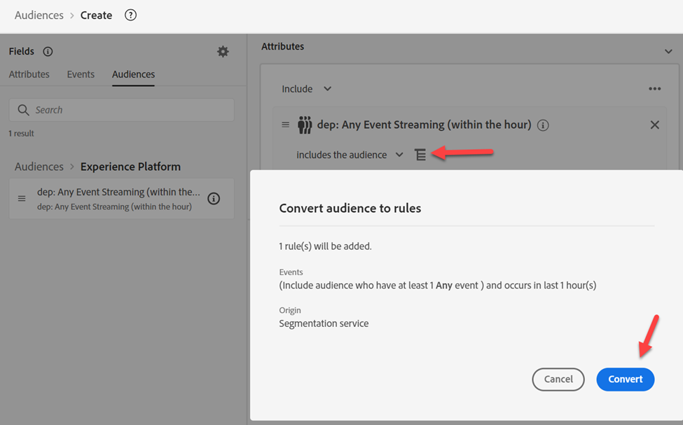

# Creare un pubblico Edge

Questo pubblico verrà utilizzato per qualificare un utente quando un payload (ad esempio, visualizzazione pagina) proviene dal client (ad esempio, Web SDK) per Edge.

>[!NOTE]
>
>Valutiamo un pubblico su Edge di solito in modo da poterlo utilizzare in Personalization. Se non utilizziamo Personalization su Edge, possiamo semplicemente far sì che il pubblico valuti come Streaming sull’hub.

## Creare un pubblico

1. Nella barra a sinistra, fai clic su Audiences.
1. Quindi fai clic su Crea pubblico nell’angolo superiore destro dello schermo
1. Quindi fai clic su Genera regola

## Convertire il pubblico in regole

1. Vai a **Tipi di pubblico** e fai clic nella cartella **Experience Platform**
1. Trascina &#39;n rilasciare il pubblico denominato **dep: qualsiasi streaming di eventi (entro un&#39;ora)** nell&#39;area di lavoro

   

1. Converti il pubblico in un set di regole nell&#39;area di lavoro facendo clic sull&#39;**icona** mostrata di seguito e quindi su **Converti**

## Aggiorna regole evento

Apporta le seguenti modifiche alle regole dell’evento (potrebbe essere necessario espandere l’evento per visualizzarlo)

1. In Ultimo
1. 15
1. Minutes

## Pubblica segmento

1. Aggiorna il nome del segmento in **Qualsiasi Edge evento (entro 15 minuti)**
1. Aggiornare il metodo di valutazione ad Edge
1. Pubblicare il segmento

## Crea segmento valutato in batch

Ripetete le stesse operazioni eseguite per il segmento di spigolo creato, ma utilizzate le seguenti informazioni:

>[!NOTE]
>
>Creeremo un pubblico batch in modo da poter vedere che, anche se un evento viene passato in Edge, tutti i tipi di pubblico salvati come valutazione batch non vengono valutati in streaming.

Regole evento:

- In Ultimo
- 1
- Giorno

Dettagli segmento:

- Nome -> **Qualsiasi batch di eventi (entro 1 giorno)**
- Metodo di valutazione -> Batch
