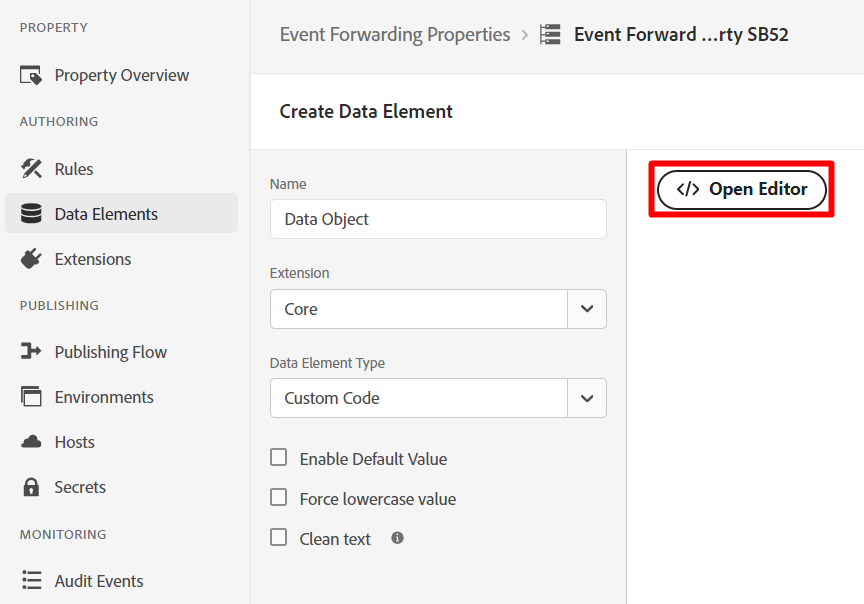
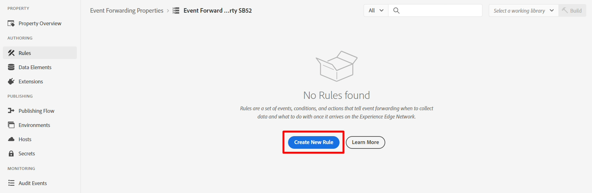

# Crea proprietà

In genere si desidera inoltrare un evento esperienza a una terza parte (anche se non deve esserlo). Questa opzione viene in genere utilizzata quando è necessaria una copia di un evento in tempo reale per notificare a una terza parte in circostanze specifiche (ad esempio, per notificare a Google, Meta o TikTok un acquisto).

>[!NOTE]
>
>Promemoria: una proprietà contiene tutte le estensioni, gli elementi di dati e le regole necessari per decidere cosa inoltrare e dove

1. Nella barra a sinistra, fai clic su Inoltro eventi
2. Quindi fai clic su Nuova proprietà


3. Aggiornare il nome della proprietà utilizzando la formula seguente: `Event Forward Property SB + [sandbox number]`. Il nome finale sarà simile al seguente: **Proprietà inoltro eventi SB01**

4. Al termine, fai clic su **Salva**


## Installa estensione

1. Fai clic sulla proprietà di inoltro eventi appena creata


2. Dovresti vedere una schermata come quella di seguito.  Fai clic su **Estensioni**.


3. Installa l’estensione Adobe Cloud Connector effettuando le seguenti operazioni:

4. Fai clic su **Catalogo** nel menu di navigazione superiore
5. Fai clic sulla scheda **Adobe Cloud Connector**
6. Nella barra a destra, fai clic sul pulsante **Installa**


Dopo aver fatto clic su Installa, l’estensione viene visualizzata in Estensioni installate per la proprietà, come illustrato di seguito.


## Creare un elemento dati

>[!NOTE]
>
>Un elemento dati fa riferimento all’evento in ingresso e, se necessario, può analizzarlo in più componenti singoli

1. Nella barra a sinistra, fai clic su **Elementi dati**


2. Fai clic sul pulsante **Crea nuovo elemento dati**


3. Configura il nuovo elemento dati con le seguenti informazioni:

| Tipo di elemento | Valore da configurare |
| ----------------- | ------------------ |
| Nome | Oggetto dati |
| Estensione | Core |
| Tipo di elemento dati | Codice personalizzato |


4. Fai clic sul pulsante **Apri editor** per aggiungere il seguente codice personalizzato:




5. Aggiungi all’editor il codice personalizzato e salvalo

```none
var xdm = arc?.event || '';
return xdm;
```


>[!NOTE]
>
>Questo consiste nell’acquisire l’intero oggetto xdm senza eseguire alcuna traduzione nel payload.  Se necessario, è possibile analizzare ogni singolo elemento all’interno dell’oggetto XDM (ad esempio nome della pagina, importo dell’acquisto) in un unico elemento dati per campo.  Ciò potrebbe essere dovuto alla trasformazione della struttura in una struttura diversa


6. Fai clic sul pulsante **Salva** per salvare l&#39;elemento dati.


Al termine della procedura, dovresti vedere la seguente schermata che conferma l’aggiunta dell’elemento dati:


## Creare le regole

>[!NOTE]
>
>Una regola contiene:
>
>1. Condizioni su cosa inoltrare
>2. Azioni che possono trasformare il payload e definire dove inviarlo


1. Nella barra a sinistra fai clic su **Regole**


2. Quindi fai clic su **Crea nuova regola**




3. Aggiornare il nome della regola utilizzando la formula seguente: `"EF Rule SB" + [your sandbox number]` (ad esempio, regola EF SB01). Puoi trovare il numero della sandbox in alto a destra nella finestra del browser, come mostrato di seguito\...


4. Al termine, fai clic su **Salva**

>[!NOTE]
>
>Assicurarsi che il nome della regola segua il pattern di formula di `"EF Rule SB" + [sandbox number]`


5. Aggiungi un&#39;azione alla regola facendo clic sul segno (+) per aggiungere una nuova azione


## Ottieni URL webhook (da utilizzare in azione)

>[!NOTE]
>
>In questo laboratorio viene utilizzato un webhook per verificare se i dati sono arrivati alla destinazione a cui si sta inviando. In uno scenario reale, invece, accedi a quella destinazione e utilizza i suoi strumenti per vedere cosa è arrivato.


1. Apri il seguente collegamento in una nuova scheda nel browser -> [https://webhook.site](https://webhook.site/)
2. Copia l’URL univoco visualizzato e salvalo in un luogo sicuro


3. Configura l’azione con le seguenti informazioni:

| Impostazione | Valore |
| ----------- | ------------------------------------------------------------------------------------------------------------------------------------------------------------------- |
| Estensione | Connettore cloud Adobe |
| Tipo di azione | Effettua chiamata di recupero |
| Metodo | Pubblica |
| URL | Utilizza lo stesso URL del webhook utilizzato durante la configurazione della destinazione di streaming. Per trovarla, apri una nuova scheda nel browser e passa a Destinazioni -> Sfoglia |
| Corpo | Raw |
| Dati corpo | \{ &quot;data&quot;: \{ &quot;event&quot;: &quot;\{\{Data Object\}\}&quot; } } |

>[!NOTE]
>
>Il \{\{Data Object\}\} a cui si fa riferimento qui è l’elemento dati creato in precedenza. In questo caso, il requisito del sistema a valle era quello di racchiudere l’evento in un oggetto dati con un oggetto evento. Puoi inserire qui qualsiasi formattazione.
>
>Se avessimo diviso \{\{Data Object\}\} in più campi (ad esempio nome della pagina, acquisto, ecc.), potremmo trasformare la struttura JSON posizionando ogni campo nel punto desiderato, dandoci più controllo sulla corrispondenza con la destinazione.


Dopo aver verificato che la schermata sia simile a quella riportata di seguito, fai clic su **Mantieni modifiche**


4. Al termine dell’operazione, dovresti vedere che l’azione è stata aggiunta alla regola. Fai clic su **Salva** per continuare.


>[!WARNING]
>
>Quando invii un evento esperienza, stai inviando l’evento, non il profilo, né uno dei suoi attributi, comprese le qualifiche del pubblico (anche se è un pubblico di Edge).
>
>Questo avviene per motivi di velocità.


## Pubblicare le modifiche

1. Nella barra a sinistra, fai clic su **Flusso di pubblicazione**


2. Fai clic sul pulsante **Aggiungi libreria**


3. Configura la libreria con le seguenti informazioni:

- Nome -> **Libreria EF**
- Ambiente -> **Sviluppo**
- Fai clic su **Aggiungi tutte le risorse modificate**


Al termine, lo schermo dovrebbe essere simile a quello riportato di seguito.  Se tutto sembra a posto, fai clic sul pulsante **Salva e genera in sviluppo**


4. Dovresti vedere la build di sviluppo diventare verde e dichiarare che è pronta per l’uso


