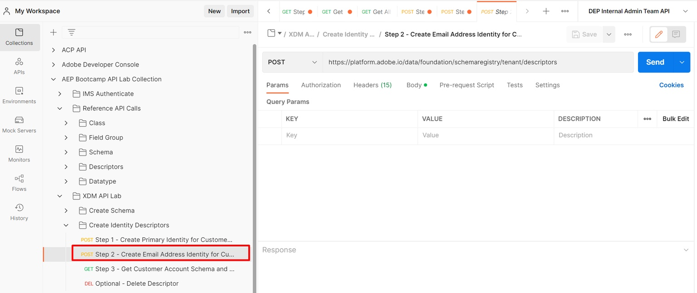

# Creare altre identità

1. Fai clic sulla chiamata API `Step 2 - Create Email Address Identity for Customer Account Schema` nella cartella `XDM Schema Lab -> Create Identity Descriptors`

   >[!CAUTION]
   >
   >Non eseguire ancora la richiesta

   


1. Aggiorna il valore `xdm:sourceSchema` nel corpo della richiesta utilizzando `$id` salvato dal passaggio lab [Crea schema](../build-schema/create-schema.md)

1. Aggiorna il valore `xdm:isPrimary` nel corpo della richiesta a `false`

   SOLO ESEMPIO

   ```json
   {
     "@type": "xdm:descriptorIdentity",
     "xdm:sourceSchema": "https://ns.adobe.com/devbc/schemas/8415ac18dd8943e35d12caf0c24b57b4a5a9ab7fd637245e",
     "xdm:sourceVersion": 1,
     "xdm:sourceProperty": "/personalEmail/address",
     "xdm:namespace": "Email",
     "xdm:property": "xdm:code",
     "xdm:isPrimary": false
   }
   ```

   >[!NOTE]
   >
   >Ricorda di aggiornare il nome tenant precedente (\_devbc) con il tuo


1. Salva la richiesta prima di continuare a utilizzare il pulsante `Save`

1. Eseguire l&#39;API facendo clic sul pulsante `Send`. Dovresti ora visualizzare una risposta `201 Created` come segue


