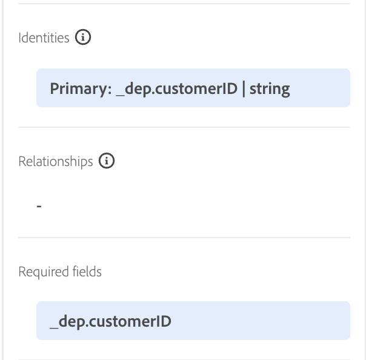

# Configura per profilo

## Panoramica

Per utilizzare uno schema per Real-Time Customer Profile, devi prima assicurarti che sia configurato correttamente. Ciò significa prendere ciò che hai identificato durante il laboratorio LID come identità primarie/di persona, identità di relazione, ecc. e garantire che tali configurazioni vengano effettuate in ogni schema. Al termine di tutto, puoi &quot;capovolgere lo switch&quot; e abilitare uno schema da utilizzare con il profilo.

Osservando l&#39;XDM su carta Connection 5G ERD, vengono visualizzate le seguenti informazioni sullo schema dell&#39;account cliente.  Questo è il lavoro che rimane da svolgere per utilizzare lo schema all’interno di Real-Time Customer Profile.

## Contrassegna il campo di identità principale

Ogni schema richiede un campo di identità principale se deve essere utilizzato con Real-Time Customer Profile. Segui i passaggi seguenti per contrassegnare un campo come identità primaria.

1. Apri lo schema **Account cliente** creato
1. Seleziona il campo **\_\&lt;nome-tenant>.customerID** facendo clic sul campo nello schema
1. Nella barra a destra, seleziona entrambe le caselle di controllo **Identità** e **Identità primaria**
1. Seleziona lo spazio dei nomi **customerID** dal menu a discesa
1. Al termine, fai clic sul pulsante **Applica** nella barra a destra, quindi **Salva** le modifiche.

>[!NOTE]
>
>Dopo aver fatto clic su Applica, verifica che nel campo sia visualizzata un&#39;identificazione personale come indicato di seguito
>
>
>
>

>[!NOTE]
>
>Inoltre, nella barra a sinistra dovresti vedere i seguenti elementi. Le identità (primarie o non primarie) vengono visualizzate qui e anche le **identità primarie** sono contrassegnate come campi obbligatori.
>
>
>
>

## Contrassegna i campi di identità della persona

Ricorda che ogni schema da utilizzare con il profilo cliente in tempo reale **può facoltativamente contenere** campi di identità di altre persone. Per contrassegnare un campo come identità di persona, esegui le seguenti azioni sullo schema Account cliente creato in precedenza.

1. Seleziona il campo **personalEmail.address**
1. Controlla la casella di controllo **Identità** trovata nella barra a destra
1. Seleziona lo spazio dei nomi dell&#39;identità **E-mail** dal menu a discesa
1. **Applica e salva** le modifiche

>[!NOTE]
>
>Dopo aver fatto clic su Applica, verifica che nel campo sia visualizzata un&#39;identificazione personale

## Creare la relazione tra schemi

Per correlare lo schema del piano allo schema dell’account cliente come descritto nell’ERD, è necessario definire una relazione. Per creare una relazione di schema tra gli schemi Account cliente e Piano (ricerca), segui i passaggi seguenti.

### Aggiungi relazione

1. Selezionare il campo **planID** all&#39;interno dell&#39;oggetto Plan come illustrato di seguito
1. Nella barra a destra, fai clic sull&#39;icona **Aggiungi relazione**

### Definisci relazione

1. Nella casella di selezione Tipo selezionare l&#39;opzione **Uno a uno**
1. Nella casella di selezione Schema di riferimento scegliere lo schema denominato **dep: Plan \[Lookup]** (creato in precedenza)
1. Fai clic su **Applica** e **Salva**

![Definizione di una relazione uno-a-uno con dep: piano [ricerca] schema](assets/configure-for-profile-define-one-to-one-relationship.png)

### Conferma relazione

Al termine della procedura, dovresti vedere la visualizzazione della relazione creata, come illustrato nella schermata seguente.

## Configurare lo schema per il profilo

Real-time Customer Profile unisce dati provenienti da origini diverse per creare una visualizzazione completa di ogni singolo cliente. Se desideri che i dati acquisiti da uno schema partecipino a questo processo, devi configurare lo schema da utilizzare nel profilo. A questo scopo, devi effettuare le seguenti operazioni:

1. Apri lo schema **Account cliente - \[le iniziali]** appena creato
1. Fai clic sul titolo dello schema dalla barra a sinistra
1. Configura lo schema per il profilo attivando **ON** il profilo nella barra a destra
1. Nel modale visualizzato fare clic sul pulsante **Abilita**
1. Al termine, non dimenticare di **salvare** lo schema.

>[!TIP]
>
>Congratulazioni!  Hai appena creato uno schema da utilizzare con Real-Time Customer Profile.

## Rivedi lo schema di unione profili

Come accennato in precedenza, la potenza di XDM + Real-Time Customer Profile è la capacità di assemblare una varietà di frammenti di un individuo e i loro comportamenti insieme.  Questa viene definita &quot;visualizzazione unione&quot; del cliente.  Nei passaggi seguenti, puoi visualizzare in anteprima come si presenta questa unione per ogni classe XDM configurata per Real-Time Customer Profile

1. Passa a **Profili** nella barra a sinistra
1. Seleziona la scheda **Schema unione** nel menu principale
1. Seleziona la classe **Profilo individuale XDM** dal menu a discesa

Sfoglia la classe Profilo individuale XDM e quindi impiega qualche istante per rivedere altre classi come ExperienceEvent XDM o le classi Plan.

>[!NOTE]
>
>Osserva che lo schema mostrato è una visualizzazione combinata aggregata di tutti gli schemi abilitati per il profilo nella sandbox. Campi simili all’interno della struttura XDM gerarchica si uniscono, mentre campi con nomi e/o gerarchie diversi vengono aggiunti alla visualizzazione complessiva.
> [!NOTE]
>
>Solo la classe basata su Profilo individuale XDM esegue unioni tra campi con nomi simili.
