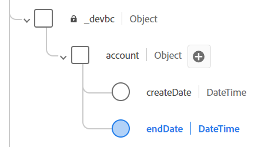

# Oggetti personalizzati del modello

## Aggiunta di campi personalizzati

Come descritto nella lezione, non esistono gruppi di campi o tipi di dati standard predefiniti che modellino i campi personalizzati dell’account cliente.  I campi seguenti sono attualmente considerati personalizzati e devono essere modellati all’interno dello schema XDM.

- \_\&lt;nome-tenant>.account.createDate
- \_\&lt;nome-tenant>.account.endDate
- \_\&lt;nome-tenant>.account.acqSource
- \_\&lt;nome-tenant>.plan.planID
- \_\&lt;nome-tenant>.plan.name
- \_\&lt;nome-tenant>.customerID

>[!NOTE]
>
>Nota che \&lt;tenant-name> è specifico per l’ambiente in cui si sta lavorando

## Creazione oggetto account

1. Aggiungi un nuovo campo facendo clic sul pulsante **+ (aggiungi)** nella parte superiore dello schema

   

   >[!NOTE]
   >
   >Osserva che la barra a destra si apre con alcuni campi da compilare

1. Crea l’oggetto account utilizzando i dettagli seguenti. Al termine, fai clic sul pulsante **Applica** nella barra a destra per visualizzare la modifica nell&#39;area di lavoro dello schema

| Nome campo | Nome visualizzato | Tipo | Assegna a un nuovo gruppo di campi |
| ---------- | ------------ | -------- | ----------------------------------------------------------------------------------------------------------------------------- |
| *account* | *Account* | *Oggetto* | *Dettagli account cliente - \[Iniziali]* *(digitarlo e selezionare il menu a discesa o premere Invio)* |

>[!WARNING]
>
>I nomi dei campi devono seguire un maiuscolo specifico. Il motivo è che lo stesso schema che stai creando è già stato creato in precedenza. Se il case è spento, si verifica un conflitto con i percorsi dei campi dello schema preesistente nella sandbox

>[!NOTE]
>
>Osserva che il campo personalizzato creato automaticamente si trova sotto uno spazio dei nomi tenant, indicato da `_devbc` nella schermata. Lo spazio dei nomi del tenant potrebbe essere diverso. Gli spazi dei nomi dei tenant vengono utilizzati per distinguere gli oggetti personalizzati da quelli standard di Adobe e garantire che le aggiunte e gli aggiornamenti futuri degli standard di Adobe non entrino in conflitto con quelli personalizzati.

>[!NOTE]
>
>Il nuovo gruppo di campi personalizzato viene visualizzato nella barra a sinistra sotto `Field groups` senza l&#39;icona del lucchetto.  Questa icona di blocco mancante indica che si tratta di un gruppo di campi personalizzato.

>[!WARNING]
>
>A questo punto non è possibile salvare lo schema. In tal caso, si verifica un errore perché non è possibile creare un oggetto vuoto nello schema JSON in quanto non descrive il contenuto

1. Aggiungi i campi seguenti sotto l’oggetto Account appena creato.

   | Nome campo | Nome visualizzato | Tipo |
   | ------------ | ------------- | ---------- |
   | *createDate* | *Crea data* | *DataOra* |
   | *endDate* | *Data di fine* | *DataOra* |

   >[!NOTE]
   >
   >Durante l&#39;aggiunta dei nuovi campi, l&#39;opzione **Assegna a** è già stata compilata e fa riferimento al gruppo di campi utilizzato per l&#39;oggetto account.

1. Al termine, l’oggetto account dello schema si presenta come segue. **Salva** lo schema.

   

1. Aggiungi un altro campo personalizzato all’oggetto account. Fare clic sul pulsante **+ (add)** accanto all&#39;oggetto account.  Crea il seguente campo:

   | Nome campo | Nome visualizzato | Tipo | Enumerazioni |
   | ----------- | ----------------- | -------- | --------------------------------------- |
   | *acqSource* | *Source acquisito* | *Stringa* | *web :: Web * *inStore :: nello Store* |

   Questo campo richiede valori standardizzati, quindi utilizza l&#39;opzione **Enum &amp; Valori suggeriti** nelle proprietà del campo. Seleziona il pulsante di scelta **Enum** per aggiungere la convalida per questo campo al momento dell&#39;acquisizione, nonché etichette intuitive. Aggiungete i valori enum come mostrato di seguito:

   - *web :: Web*
   - *inStore :: nello Store*

   

   >[!NOTE]
   >
   >L’obiettivo dei valori Enum e Suggested è facilitare la segmentazione per l’utente finale. Le enumerazioni impongono la convalida al momento dell’acquisizione dei dati, mentre i valori consigliati no. Per ulteriori informazioni su questa funzione, consulta la documentazione qui -> [https://experienceleague.adobe.com/docs/experience-platform/xdm/ui/fields/enum.html?lang=en#enums-and-suggested-values](https://experienceleague.adobe.com/docs/experience-platform/xdm/ui/fields/enum.html?lang=en#enums-and-suggested-values)

1. Al termine, fare clic sul pulsante **Applica** per aggiungere il nuovo campo allo schema.

1. **Salva** lo schema

>[!SUCCESS]
>
>Il primo oggetto personalizzato e i primi campi sono stati creati correttamente nel registro dello schema XDM.

## Creazione di oggetti del piano

Ripeti i passaggi eseguiti in precedenza e aggiungi l&#39;oggetto **Plan** e i campi associati. Tutti i nuovi campi devono essere aggiunti nel gruppo di campi Dettagli account cliente - \[iniziali].

Utilizzare i metadati nella tabella seguente per creare l&#39;oggetto del piano e i campi associati.

| Nome campo | Nome visualizzato | Tipo | Enum e valori suggeriti |
| ---------- | -------------- | -------- | ------------------------------------------------------------------------------------- |
| *piano* | *Dettagli piano* | *Oggetto* | - |
| *planID* | *ID piano* | *Stringa* | - |
| *nome* | *Nome piano* | *Stringa* | Enum  *base :: Base * *finale :: Ultimate * *pro :: Pro* |
| *tipo* | *Tipo* | *Stringa* | - |

>[!WARNING]
>
>Assicurarsi di aggiungere i nuovi campi creati al gruppo di campi Dettagli account cliente - \[iniziali].  Un modo rapido per garantire che vengano aggiunte automaticamente a quel gruppo di campi consiste nel selezionare il gruppo di campi nella barra a sinistra prima di aggiungere un campo personalizzato.
>
>
>
>
>
>

Al termine, verifica che lo schema corrisponda alla schermata seguente. Se sembra buono **Salva** il tuo schema

>[!TIP]
>
>Bello!  Hai aggiunto il tuo oggetto personalizzato e i tuoi campi senza aiuto.

## Creazione campo ID cliente

L&#39;aggiunta del campo **customerID** come campo è critica perché funge da identità primaria per lo schema e da campo generale in cui conservare i dati.

Effettua gli stessi passaggi eseguiti in precedenza e utilizza la tabella seguente per fare riferimento ai metadati del campo.

| Nome campo | Nome visualizzato | Tipo | Gruppo di campi |
| ------------ | ------------- | -------- | --------------------------------------------- |
| *customerID* | *ID cliente* | *Stringa* | *Dettagli account cliente - \[Iniziali]* |

>[!NOTE]
>
>`customerID` può essere posizionato ovunque nello schema da una prospettiva gerarchica. In questa esercitazione, il campo customerID rimane nella radice e non è nidificato all&#39;interno di uno degli oggetti personalizzati creati in precedenza.  Questo posizionamento è il luogo in cui l’architettura dei dati ha opinioni
>
>😄

Al termine dell’operazione, il risultato finale sarà simile alla schermata seguente

## Risultato schema finale

>[!SUCCESS]
>
>Hai creato il tuo primo schema XDM. Nella sezione successiva, configura lo schema da utilizzare con Real-Time Customer Profile.
