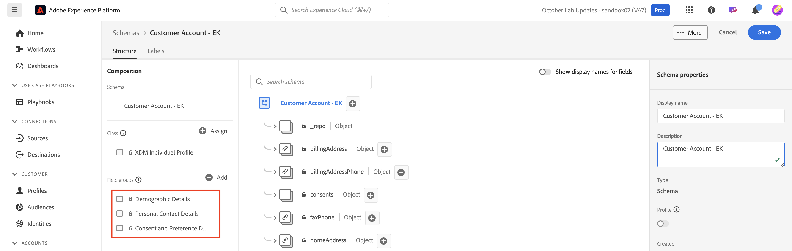

# Oggetti standard del modello

## Passare agli schemi

1. Fai clic sulla scheda **Schemi** nella barra a sinistra

   

1. Nella navigazione in alto sono disponibili opzioni per sfogliare gli schemi esistenti e visualizzare i gruppi di campi e i tipi di dati attualmente presenti nel registro XDM.

>[!NOTE]
>
>Nella sandbox sono già presenti schemi precreati. Questi includono schemi precreati come parte di questo campo di avvio (con prefisso `dep`), nonché schemi generati dal sistema per Adobe Real-Time CDP e Adobe Journey Optimizer.

## Creare uno schema di profilo individuale

1. Per iniziare, fai clic su **Crea schema**

   

1. Seleziona **Manuale**

   

1. Seleziona **Profilo individuale**

## Denomina lo schema

Gli schemi basati su classi di profili individuali XDM consentono di raccogliere gli attributi di un individuo che verrà unito al profilo. La classe stessa contiene campi non modificabili, ad esempio *modifiedByBatchID*, *PersonID* e così via.

1. Assegna un nome e una descrizione allo schema.
   - **Nome visualizzato schema** —> *Account cliente - \[Iniziali]*
   - **Descrizione** —> Questo schema raccoglie le identità, le informazioni sul piano, i dettagli demografici e i dettagli di contatto di un individuo.
1. Salva lo schema con il pulsante **Fine** in alto a destra.

## Aggiungi gruppo di campi Dettagli demografici

In Adobe Experience Platform esistono molti gruppi di campi XDM standard da aggiungere allo schema e personalizzare.

1. Fai clic su **+ (aggiungi)** nella barra a sinistra nella sezione del gruppo di campi.

   

1. Cercare **Dettagli demografici** o trovarli sfogliando l&#39;elenco.

   - Quando si trova il gruppo di campi, fare clic sulla lente di ingrandimento a destra del gruppo di campi per visualizzarne la struttura.  Si tratta di un modo utile per visualizzare in anteprima ciò che stai per aggiungere allo schema senza aggiungerlo effettivamente.
   - Al termine della revisione, chiudi l’anteprima

   

   

&#x200B;3. **Selezionare** la casella di controllo accanto al gruppo di campi, quindi fare clic sul pulsante **Aggiungi gruppi di campi**

## Aggiungi altri gruppi di campi standard

È necessario aggiungere ulteriori gruppi di campi standard allo schema. Ripeti i passaggi precedenti per aggiungere i due gruppi di campi aggiuntivi allo schema:

- Dettagli di contatto personali
- Dettagli su consenso e preferenze

Al termine, lo schema dovrebbe essere simile a quello riportato di seguito. Fai clic sul pulsante **Salva** e salva il tuo lavoro.

>[!NOTE]
>
>I gruppi di campi selezionati e aggiunti ora vengono visualizzati nello schema e nella barra a sinistra. Non tutti i campi in ciascun gruppo di campi aggiunto sono necessariamente necessari.  Il passaggio successivo rimuove i campi estranei.

>[!WARNING]
>
>Prima di continuare, assicurati di salvare lo schema.

## Personalizza gruppi di campi standard

### Gruppo di campi Dettagli demografici

Il gruppo di campi Dettagli demografici ha incluso molti campi, ma in base alla progettazione dello schema dalla metodologia LID, sono necessari solo i campi seguenti:

- person.name.firstName
- person.name.lastName
- person.bornDayAndMonth
- person.bornYear

Per rimuovere campi da qualsiasi gruppo di campi standard di Adobe puoi utilizzare l&#39;opzione **Gestisci campi correlati**. Gestisci campi correlati consente di rimuovere i campi standard dallo schema, in modo da disporre solo dei campi necessari.

1. Seleziona l&#39;oggetto **person** nello schema
1. Fai clic su **Gestisci campi correlati** nella barra a destra

   

1. Espandere l&#39;oggetto person facendo clic sulla freccia a sinistra dell&#39;oggetto person ed espandere l&#39;oggetto full name facendo clic sulla freccia a sinistra dell&#39;oggetto name. Mantieni solo i campi seguenti:

   - person.name.firstName
   - person.name.lastName
   - person.bornDayAndMonth
   - person.bornYear

   Al termine, fai clic sul pulsante **Conferma** nell&#39;angolo superiore destro.

   

   >[!NOTE]
   >
   >È possibile selezionare la casella di controllo superiore per **Dettagli demografici** per deselezionare automaticamente tutti gli oggetti figlio e quindi riselezionare solo quelli necessari.

1. Al termine, dovresti visualizzare l’oggetto persona nello schema, come illustrato di seguito. Se tutto si presenta correttamente, fai clic sul pulsante **Salva** per salvare lo schema.

### Gruppo di campi Consenso e preferenze

Effettua la stessa serie di passaggi eseguita in precedenza ma questa volta per il gruppo di campi Consenso e preferenze.

1. Fai clic sul nome del gruppo di campi **Consenso e preferenze** nella barra a sinistra per evidenziarne i campi nello schema.
1. Seleziona l&#39;oggetto **consents**, quindi utilizza il processo **Manage related fields** per rimuovere i campi non necessari dall&#39;oggetto di consenso. Mantieni solo i campi seguenti:

- consents.marketing.email.val
- consents.marketing.sms.val

>[!NOTE]
>
>Verifica che l&#39;interruttore sia disattivato per **Mostra nomi visualizzati per i campi** nell&#39;angolo superiore destro dell&#39;area di lavoro dello schema
>
>

Al termine, lo schema finale dovrebbe essere simile a questo.  Assicurarsi di fare clic su **Salva** prima di continuare.

>[!TIP]
>
>Ora hai completato l’aggiunta di componenti standard allo schema. Ottimo lavoro! Passa alla creazione di alcuni attributi personalizzati per lo schema.
