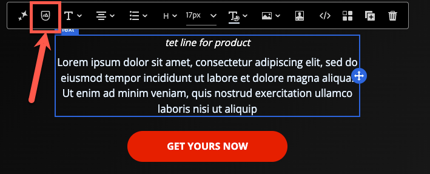
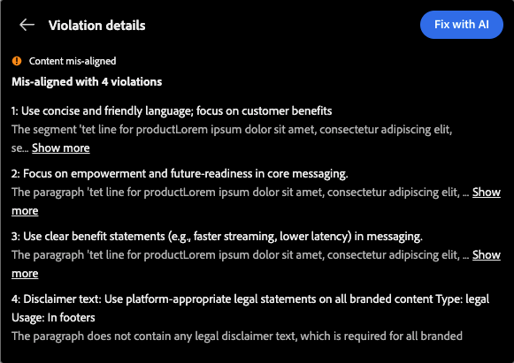
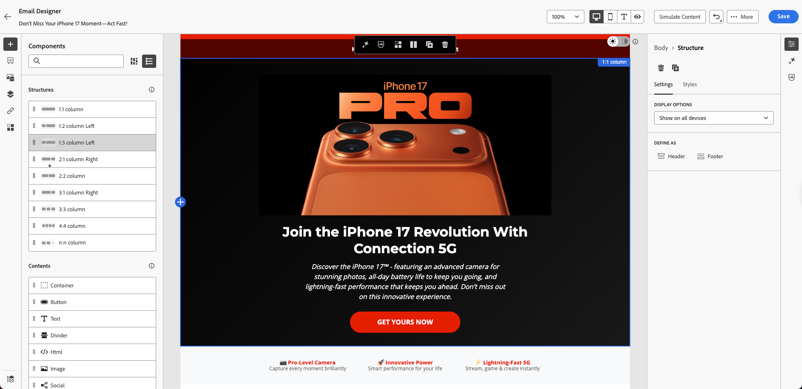
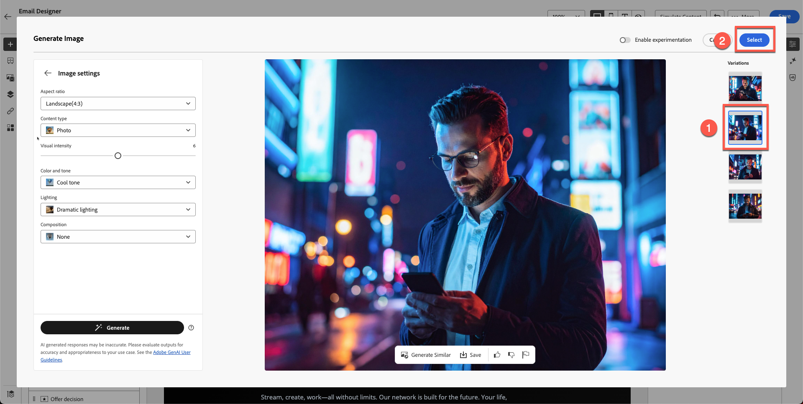

# Assistente AI e personalizzazione dei contenuti

**Scopo:** scopri come utilizzare l&#39;Assistente all&#39;intelligenza artificiale di Adobe Journey Optimizer per generare gli oggetti, perfezionare il testo delle e-mail, regolare il tono e creare immagini Firefly direttamente all&#39;interno della finestra di progettazione e-mail.

## Obiettivi di apprendimento

Al termine di questo modulo, sarai in grado di:

1. Utilizza l’Assistente AI per generare gli oggetti e le intestazioni preliminari.
1. Perfeziona testo, descrizioni, tono e messaggi dell’eroe.
1. Applicare riformulazioni, riepiloghi e regolazioni dei toni basate sull’intelligenza artificiale.
1. Genera immagini utilizzando Adobe Firefly con stile di riferimento e impostazioni del brand.
1. Sostituisci i segnaposto con le immagini generate all’interno della progettazione delle e-mail.

## Introduzione

L’Assistente per l’intelligenza artificiale in AJO consente di creare contenuti più intelligenti per il brand.
Può:

- Genera righe oggetto
- Migliorare il testo esistente
- Regolare tono e chiarezza
- Creazione di immagini con marchio tramite Firefly
- Assicurati che tutto sia allineato alle linee guida per la connessione 5G

Per questo esercizio, puoi migliorare l’e-mail creata utilizzando l’Assistente AI.

>[!NOTE]
>
>L&#39;Assistente IA è **non deterministico**, ovvero può generare contenuto leggermente diverso ogni volta che viene utilizzato. Le informazioni visualizzate durante l&#39;esercitazione potrebbero non corrispondere esattamente alle schermate o agli esempi contenuti in questa guida. Va bene, concentrati sull’apprendimento del processo e dei concetti anziché aspettarti risultati identici.

## Creare la riga dell’oggetto e-mail tramite l’Assistente AI

1. Torna alla campagna facendo clic sul pulsante Indietro o modifica l’e-mail creata nel modulo precedente. Dal passaggio precedente, puoi fare clic sulla scheda **Impostazioni** a destra.
2. Fai clic sul Contenitore e-mail > sul pulsante Modifica e-mail.
3. Fai clic sulla scheda del contenuto e quindi sul corpo dell’e-mail
4. Selezionare il campo **Oggetto**.
5. Fare clic sull&#39;icona **Assistente AI**. (vedi sotto)

   

6. Per impostazione predefinita, è selezionata l’opzione Linee guida per i marchi.
7. Immetti il prompt:

   >Stiamo lanciando iPhone 17 e vogliamo che l’oggetto sia accattivante

8. Premere **Genera**.
9. Esamina le quattro varianti generate.
10. Scegli la variante con il miglior punteggio di allineamento e fai clic su **Seleziona**.

>[!NOTE]
>
>I risultati potrebbero essere completamente diversi dalla guida di laboratorio, quindi non è necessario preoccuparsi. Seleziona quello che pensi sia un titolo corretto e continua con il laboratorio.

## Migliora titolo e descrizione protagonista

1. Apri l’e-mail facendo clic sul pulsante &quot;Modifica corpo dell’e-mail&quot;.

   

2. Fai clic sull&#39;intestazione **Product Catchy line**.
3. Apri Assistente IA facendo clic su **Genera e seleziona un testo**

   

4. Seleziona **Linee guida per il marchio Connection 5G** dal menu a discesa.

   

5. Prompt:

   >*Scrivi un titolo in grassetto per il lancio di iPhone 17. Mantieni il testo sotto le 10 parole*

6. Fare clic su Impostazioni testo per modificare il tono e la strategia di comunicazione. Cambia la strategia di comunicazione in **FOMO (Paura di perdere)**, Lingua in **Inglese** e Tonalità in **Eccitante**. Utilizza una versione più breve riducendo la composizione.

   

7. Fai clic sul pulsante **Genera**
8. Rivedi e seleziona la versione migliore,
9. Se il testo è lungo, utilizzare il dispositivo di scorrimento per **&quot;testo più breve&quot;** e rigenerare il testo.

   

10. Quando sei soddisfatto del testo fai clic su **Seleziona**

## Prompt descrizione

Questa volta, verifichi come l’intelligenza artificiale può aiutare a individuare i problemi.

1. Seleziona il testo sottostante che è testo con modelli e non ha alcun significato.

   

2. Fai clic sul pulsante Valuta come mostrato di seguito.

   

3. Il contenuto originale viene selezionato automaticamente con il marchio, come illustrato nei passaggi 1 e 2. Fare clic sul pulsante **Valuta** per continuare.

   

4. Come previsto, puoi notare molti errori che violano le linee guida del brand. Anche se questi possono essere corretti utilizzando l&#39;intelligenza artificiale, in questo caso non si rivedono i materiali esistenti. Invece, puoi lasciarli così come sono e creare nuovi contenuti da zero che siano completamente allineati agli standard del marchio.

   

5. Utilizza il nuovo paragrafo generato automaticamente utilizzando l’intelligenza artificiale con il prompt seguente. È possibile utilizzare lo stesso approccio per il testo della descrizione utilizzando il prompt riportato di seguito.

Prompt:

>*Scrivi una descrizione convincente del prodotto per il nuovo iPhone 17. Evidenzia le sue caratteristiche più straordinarie, come la fotocamera avanzata, la durata della batteria e le prestazioni. Il tono dovrebbe essere premium, emozionante, e facile da capire per un pubblico ampio. Mantieni il contenuto in 3 frasi.*

Per risparmiare tempo, il testo è già stato creato per te. Copiare e incollare di seguito per ottenere il testo.

>Scopri iPhone 17™, con una fotocamera avanzata per foto straordinarie, durata della batteria per tutto il giorno e prestazioni incredibilmente veloci che ti mantengono in testa. Non perdere questa esperienza innovativa.

L’e-mail ha un aspetto simile all’esempio mostrato di seguito.

## Aggiungere un’immagine generata da Firefly

Finora, abbiamo testato l’Assistente AI sulla riga dell’oggetto e sul testo. E le immagini?

Prima di immergerti nella generazione di immagini AI, osserva quali tipi di esperienze puoi creare.

Sappiamo che abbiamo l&#39;anno di nascita del profilo. Una delle esperienze che possiamo fare è creare un blocco con diverse varianti. Con Adobe Journey Optimizer, questo è possibile e uno dei maggiori vantaggi di avere Adobe Experience Platform come base. La sperimentazione verrà illustrata nel modulo successivo, ma prima prepareremo il blocco seguente.

1. Trascina un componente **Immagine** nella colonna di sinistra sotto il blocco famiglia iphone 17.

   

2. Fai clic all’esterno, quindi seleziona il segnaposto dell’immagine. Assicurati di fare clic sull’immagine, altrimenti non visualizzerai l’opzione Firefly.

   

3. In **Firefly**, fare clic su **Genera e selezionare l&#39;immagine**.

## Carica immagine di riferimento

1. Attiva **Stile riferimento**.
2. Seleziona **Connection 5G Brand Guideline** per la selezione del brand

   

3. Fai clic su Carica immagine

   

4. Selezionate reference.jpg dalla cartella toolkit

   

5. Prompt Aggiungi immagine
   `Portrait-oriented image of a confident man in his early to mid-40s, standing alone at night in a neon-lit urban street, focused on his smartphone. Cinematic cyberpunk-inspired city atmosphere with colorful LED signs, cool blue and warm orange lighting, shallow depth of field, soft bokeh lights in the background. Modern lifestyle, tech-savvy mood, realistic skin tones, high contrast, photorealistic, professional lighting, ultra-detailed`.

## Scegli impostazioni immagine

Scegli le **impostazioni immagine**:

1. Scegliere le impostazioni seguenti:
   - **Rapporto:** Orizzontale (4:3)
   - **Tipo di contenuto:** foto
   - **Colore e tonalità:** Tono fresco
   - **Illuminazione:** Illuminazione Drammatica
1. Premi il pulsante **Genera**

## Seleziona e inserisci l&#39;immagine generata

1. Rivedi i risultati di Firefly controllando tutte le immagini generate.

   

2. Fai clic su **Seleziona** per l&#39;immagine scelta desiderata.

   

3. Se viene richiesto un modale di caricamento, fare clic su **Avanti**.

   

4. Quindi fare clic su **Importa**.

## Finalizzare la progettazione dei blocchi

Applicate un raggio di bordo arrotondato pari a 10 per renderlo moderno, se avete tempo.

Dopo alcune iterazioni e varianti, viene creata la progettazione finale. Il layout finale è simile all&#39;esempio.

A questo punto, dovresti aver acquisito sicurezza nell’utilizzo dell’intelligenza artificiale per accelerare e migliorare la creazione dei contenuti.

## Riassunto

L&#39;Assistente IA è stato utilizzato correttamente per:

- Genera righe oggetto
- Ridefinisci testo principale
- Riformulare i paragrafi
- Cambia il tono dei messaggi
- Creazione di immagini Firefly con marchio utilizzando lo stile di riferimento
- Inserire le immagini generate nell’e-mail

Ora sei pronto per il modulo successivo - **Personalization e sperimentazione dei contenuti**, in cui verranno create varianti e test basati sul profilo.
