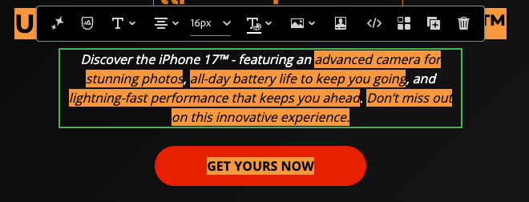
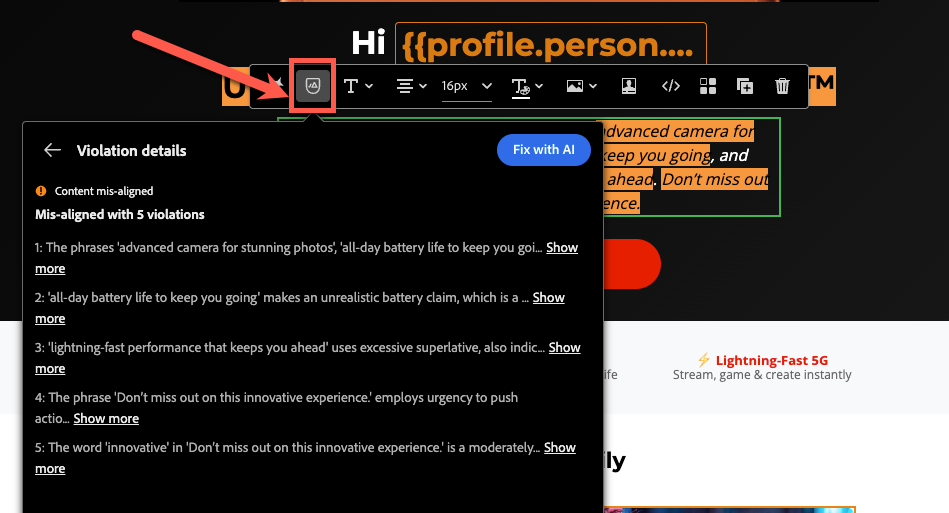
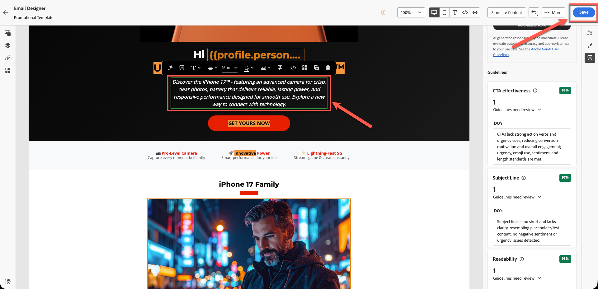

# Allineamento del brand

**Scopo:** scopri come utilizzare la funzione di allineamento del brand di Adobe Journey Optimizer per valutare il contenuto delle e-mail, identificare le violazioni delle linee guida e applicare raccomandazioni basate sull’intelligenza artificiale per migliorare la conformità al brand.

## Obiettivi di apprendimento

Al termine di questo modulo, sarai in grado di:

1. Accedi al pannello Allineamento brand e interpretarlo.
1. Valuta il contenuto delle e-mail in base alle linee guida del brand.
1. Identifica i problemi segnalati dall’intelligenza artificiale.
1. Applica suggerimenti per migliorare l’allineamento del brand.
1. Rivaluta i punteggi per tenere traccia dei miglioramenti.

## Introduzione

Adobe Journey Optimizer include un **Punteggio di allineamento marchio basato sull&#39;intelligenza artificiale** che confronta il contenuto con le linee guida pubblicate per il marchio per **Connessione 5G**.

In questo modo:

- Il tono, lo stile e la messaggistica si adattano al tuo marchio
- I requisiti legali sono soddisfatti
- Le immagini seguono le regole visive
- I creatori di contenuti rimangono coerenti su larga scala

Questo modulo ti insegna a eseguire la valutazione, interpretare i risultati e migliorare il contenuto utilizzando l’intelligenza artificiale.

## Apri il pannello di allineamento del brand

1. Apri l’e-mail creata nei moduli precedenti.
2. Individua la scheda **Allineamento marchio** nella barra laterale a destra o l&#39;icona **%** nella barra laterale.
3. Fai clic su per aprire il pannello.

4. Assicurati che venga applicato il marchio corretto:
   - **Connessione 5G** (impostazione predefinita).
5. Fare clic su **Valutazione punteggio**.

**Interpreta il punteggio del marchio e il feedback:** Dopo alcuni istanti verrà visualizzato il punteggio di conformità al marchio per il contenuto. Questo punteggio può essere presentato sotto forma di valutazione (ad es. Alta, Medium o Bassa) o di percentuale, insieme a un indicatore di colore (verde, giallo, rosso) e al momento della valutazione. Un punteggio alto indica che il contenuto è in linea con le linee guida del brand, mentre un punteggio medio o basso indica un allineamento moderato o insufficiente.

Rivedi il feedback dettagliato fornito nel pannello per ogni categoria di linee guida.

Il feedback è tipicamente organizzato per categorie di linee guida (come tono, stile, immagini, ecc.), che mostrano quali regole sono state trasmesse e quali potrebbero richiedere attenzione.

Prendi nota di eventuali messaggi o luci specifici: ad esempio, il pannello potrebbe dire che determinate parole o frasi non corrispondono al tono prescritto, o che un’immagine non soddisfa uno standard visivo. Questo è il tuo suggerimento su cosa migliorare.

>[!NOTE]
>
>Tieni presente che il tuo punteggio è diverso dalla schermata seguente. Il tuo obiettivo è migliorare il punteggio utilizzando le linee guida del brand e l’intelligenza artificiale.

## Rivedi il punteggio di allineamento

Dopo la valutazione, AJO visualizza:

- Punteggio Allineamento Marchio
- Valutazione (alta/Medium/bassa)
- Indicatore colore (verde/giallo/rosso)
- Timestamp
- Categorie di linee guida (Tono, Stile, Immagini, ecc.)

Interpreta i risultati per comprendere quanto strettamente l’e-mail corrisponde alle linee guida di Connection 5G.

## Esamina feedback dettagliato

1. Scorri tra le categorie di linee guida.
1. Cerca avvertenze o indicatori rossi.
1. Fai clic su ciascuna linea guida contrassegnata per aprire un feedback di IA dettagliato.
1. Rivedi i suggerimenti, ad esempio:
   - Mancata corrispondenza toni
   - Frase errata
   - Parole proibite
   - Utilizzo marchio mancante
   - Violazioni stile immagine

## Applicare i consigli di IA

1. Fai clic su blocchi di testo o immagini contrassegnati all’interno dell’e-mail.
2. Utilizzare il paragrafo incollato nell&#39;esercizio precedente, come illustrato di seguito.

3. Utilizza le modifiche suggerite fornite da AI. Fai clic sull’icona come mostrato di seguito.

4. Fare clic sul pulsante **Correggi con IA** come illustrato di seguito.

5. Le modifiche suggerite sono evidenziate in verde e il testo rimosso è evidenziato in rosso barrato, come illustrato di seguito. Inoltre, il punteggio è stato aggiornato (in questo caso, è dell’80%). Fare clic sul pulsante **Applica** per rendere effettive le modifiche.

6. Le modifiche vengono applicate con il nuovo testo.
7. Rivedi tutte le aree evidenziate e apporta gli aggiornamenti necessari per correggere il contenuto, utilizzando l’intelligenza artificiale o modificando manualmente. Prima di procedere, assicurati che tutte le modifiche necessarie siano state completate.
8. Salva le modifiche.

## Rivaluta il punteggio del brand

1. Apporta modifiche a tutte le posizioni per correggere il contenuto utilizzando AI o manualmente.
2. Torna al pannello Allineamento marchio.
3. Fare clic su **Rivaluta punteggio**.
4. Confronta il nuovo punteggio con quello precedente.

Ad esempio:

- Punteggio originale: **56%**
- Punteggio aggiornato: **90%**

Ciò indica che gli aggiornamenti sono stati allineati correttamente all’e-mail con gli standard del brand.

5. Fai clic su **Salva** per finalizzare l&#39;e-mail.

## Riassunto

In questo modulo hai imparato a:

- Valutare un’e-mail tramite il punteggio di allineamento del marchio
- Interpretare il feedback a livello di categoria
- Identificare i problemi di scrittura, tono e layout
- Applicare le correzioni consigliate dall’intelligenza artificiale
- Migliorare la coerenza del brand nelle comunicazioni

Il contenuto è ora convalidato e pronto per il test nel modulo successivo - **Verifica l&#39;e-mail**.
