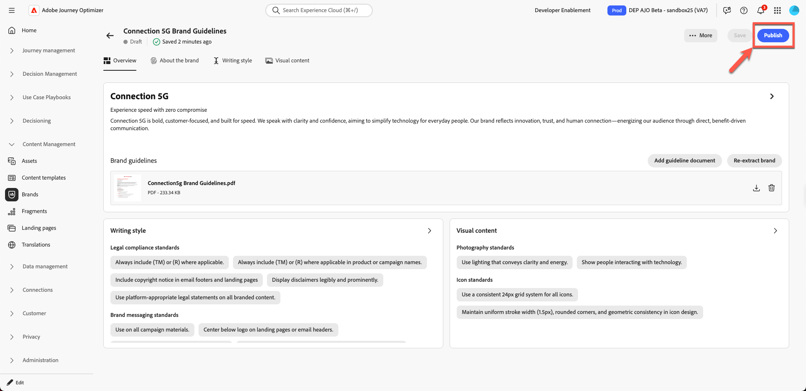
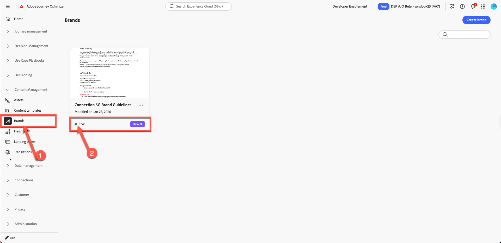

# Gestione del brand

**Scopo:** configurare, perfezionare e pubblicare le linee guida per il marchio Connection 5G in Adobe Journey Optimizer (AJO) in modo che tutti i contenuti e le funzioni di intelligenza artificiale rimangano allineati al brand.

## Obiettivi di apprendimento

Al termine di questo modulo, sarai in grado di:

- Crea un nuovo brand in Adobe Journey Optimizer.
- Carica ed estrai informazioni sulle linee guida del brand da un PDF.
- Rivedi e perfeziona i dettagli del brand nelle schede Marchio, Stile di scrittura e Contenuto visivo.
- Aggiungi una regola di esclusione per evitare la copia di pulsanti e-mail push.
- Pubblica il brand in modo che sia disponibile per modelli, frammenti, AI Assistant e Brand Alignment.

Scarica file - [toolkit.zip](assets/toolkit.zip)

>[!NOTE]
>
>Prima di iniziare i laboratori pratici, assicurati di scaricare il file toolkit (vedi sotto toolkit.zip). Decomprimi il file per accedere alle immagini e ai file di supporto necessari per gli esercizi. Conserva queste risorse in un luogo facile da trovare, poiché potrai utilizzarle come riferimento in tutto il laboratorio.

## Introduzione

In questo modulo verrà creato il marchio **Connection 5G** all&#39;interno di AJO utilizzando una linea guida del marchio preparata PDF.

La funzione **Marchi** di Adobe Journey Optimizer ti consente di definire e mantenere un&#39;identità coerente in tutte le attività di marketing. Da loghi e colori a toni di voce e stile di messaggistica, la creazione di un brand assicura che ogni e-mail, campagna e contenuto rispecchi una personalità unificata.

Per questo laboratorio verrà utilizzato il pattern 1 della lezione (solo AJO). Tieni presente che le risorse sono archiviate utilizzando **Assets Essentials**.

Inizierai con il documento Linee guida per il marchio Connection 5G, caricalo, lascia che AJO estragga le informazioni chiave, quindi perfeziona e pubblica il risultato.

## Preparare la linea guida del brand

1. Apri la **Linea guida per il marchio Connection 5G** PDF dalla cartella toolkit (assicurati di decomprimerla).

&#x200B;2. Consulta il documento per comprendere il contenuto utilizzato per Connection 5G:
   - Tono della voce
   - Colori e stile visivo
   - Stile di scrittura ed esempi di messaggistica
   - Indicazioni sulle immagini
   - Note legali e di conformità

## Creare un nuovo brand in AJO

1. In Adobe Journey Optimizer, vai alla navigazione a sinistra e fai clic su **Marchi**.
2. Fai clic su **Crea marchio**.

&#x200B;3. Nel campo **Name**, immetti `Connection 5G Brand Guidelines`
&#x200B;4. Nell&#39;area di caricamento trascinare e rilasciare il file **Linee guida per il marchio Connection5g.pdf** (oppure fare clic su **Seleziona file** e sceglierlo dal computer).

&#x200B;5. Fai clic su **Crea marchio** per iniziare l&#39;estrazione.

Viene visualizzata una schermata di avanzamento durante l’analisi del file da parte di AJO. Questa operazione può richiedere alcuni minuti a seconda delle dimensioni del documento.

&#x200B;6. Una volta completata l’estrazione:
   - Nella parte superiore viene visualizzata una barra di conferma verde.
   - Viene automaticamente reindirizzato alla schermata di configurazione del brand.
   - Gli standard per la creazione di contenuti e contenuti visivi vengono ora compilati automaticamente in base al file delle Linee guida per i marchi caricato.

&#x200B;7. Fai clic sul pulsante **Pubblica** per pubblicare le linee guida per il brand.

&#x200B;8. Conferma premendo il pulsante &quot;Publish&quot; (Pubblica).

Nella parte inferiore della pagina viene visualizzata una barra di conferma verde che indica che il brand è stato pubblicato correttamente.

&#x200B;9. Fai clic nuovamente sulla pagina principale del marchio e vedrai che il tuo marchio è ora live (dovrebbe essere visualizzato da un punto verde con l&#39;etichetta **&quot;Live&quot;**).

## Rivedi le schede marchio

Ora rivedi e comprendi le tre schede chiave che sono state compilate per Connection 5G.

### Informazioni sul brand

Questa scheda definisce l’identità del brand ad alto livello. In genere include:

- Marchio
- Valori core
- Principi guida
- Promesse e obiettivi del brand
- La sensazione che il brand vuole creare

Tutto il resto nel sistema si basa su questa base, quindi è importante che questa scheda rifletta il vero DNA della Connessione 5G.

Sfoglia i campi estratti e verifica che corrispondano al PDF originale.

### Stile di scrittura

La scheda **Stile scrittura** definisce la modalità di comunicazione del brand. Include:

- Linee guida sui toni
- Dos e Don’t
- Espressioni di esempio e messaggi chiave
- Tagline e slogan
- Norme legali come quando includere i marchi commerciali

Puoi aggiungere e perfezionare le regole in linguaggio naturale e anche applicarle solo a canali specifici, come e-mail o SMS. Questo offre un controllo flessibile ma preciso sul modo in cui l’Assistente AI e gli autori di contenuti devono scrivere.

### Contenuto visivo

La scheda **Contenuto visivo** illustra l&#39;aspetto del brand. Esso comprende:

- Standard per la fotografia
- Stile illustrazione
- Regole per le icone
- Programmi visivi e attività da non intraprendere

Questo assicura che tutto, dalle immagini alle icone, sia coerente e allineato con i valori di base della connessione 5G.

## Posizionamento di mercato e visione mancante

Nel contenuto estratto, alcuni principi guida potrebbero essere incompleti. Ora completali usando la dicitura ufficiale del PDF.

1. Fai clic sul marchio appena creato

&#x200B;2. Fai clic su **Modifica marchio**. Viene visualizzata una scheda di conferma; fare di nuovo clic su **Modifica marchio** per confermare.

&#x200B;3. Vai alla scheda **Informazioni sul marchio**.

&#x200B;4. Individua la sezione per **Principi guida**, **Visione** o una descrizione di alto livello simile.

&#x200B;5. Aggiungere il testo seguente:

**Visione:**

>Offrite a tutti gli utenti una connettività immediata e affidabile che migliora la vita, il lavoro e il gioco, ovunque si trovino.

**Posizionamento nel mercato:**

>Connection 5G offre un servizio mobile ad alta velocità progettato per gli stili di vita digitali, distinguendosi per affidabilità, semplicità e innovazione senza precedenti.

&#x200B;6. Fai clic su **Salva**. (Se non vedi il pulsante **Salva**, fai clic prima sulla scheda **Panoramica**, quindi fai clic su **Salva**.)

>[!TIP]
>
>Ora puoi assicurarti che lo scopo, la visione e il posizionamento del mercato del marchio siano chiaramente rappresentati in AJO.

## Aggiungi una regola di esclusione pulsante e-mail

Quindi, migliora il brand aggiungendo una regola che assicuri che i pulsanti e-mail non vengano mai scritti in modo push.

1. Passare alla scheda **Stile scrittura**.

&#x200B;2. Assicurati di essere nella sezione **Stile di comunicazione del marchio**.

&#x200B;3. Nell&#39;area **Non**, fai clic sull&#39;icona **più** per aggiungere una nuova regola.

Icona 

&#x200B;4. Configura la regola come segue:
   - **Esclusione:** `Be pushy`

>[!NOTE]
>
>Questo viene aggiunto come regola Do’t, il che significa che il brand non vuole CTA invadenti

**Canale:** e-mail

**Elemento:** Pulsante

&#x200B;5. Fare clic su **Aggiungi**.

&#x200B;6. Conferma che la nuova regola Do not venga visualizzata come `Be pushy` nell&#39;elenco.

&#x200B;7. Fai clic su **Salva**.

Questa regola si applica ogni volta che l’Assistente AI o gli autori lavorano sulla copia del pulsante e-mail, mantenendo i CTA allineati con il tono Connection 5G.

>[!NOTE]
>
>Potresti vedere altre regole &quot;do not&quot; elencate che non corrispondono esattamente alla schermata. Ignora il comportamento previsto.

## Pubblicare le linee guida per il brand

Una volta effettuata la configurazione desiderata:

1. Torna alla scheda **Panoramica**. Fai clic su **Salva**.
2. Nell&#39;angolo superiore destro fare clic su **Pubblica**.

&#x200B;3. Viene visualizzata una finestra di dialogo di conferma che spiega che stai per pubblicare le linee guida per i marchi aggiornate per la connessione 5G. Fai di nuovo clic su **Pubblica** per confermare.

&#x200B;4. Attendi che venga visualizzata la barra di conferma verde.
&#x200B;5. Fai clic su **Indietro** per tornare all&#39;elenco Marchi.
&#x200B;6. Verificare che venga visualizzata una nuova scheda per **Linee guida per il marchio Connection 5G** con uno stato che ne indichi la disponibilità e la disponibilità.

Il tuo marchio è ora live e pronto per essere utilizzato in tutta Adobe Journey Optimizer.

## Riassunto

In questo modulo:

- È stata rivista la linea guida per il marchio Connection 5G PDF.
- Creato un nuovo marchio per Connection 5G all&#39;interno di Adobe Journey Optimizer.
- È stato caricato il file delle linee guida per il brand e ad AJO è stato consentito di estrarre le informazioni chiave.
- Sono state esaminate e perfezionate le schede Informazioni sul marchio, Stile di scrittura e Contenuto visivo.
- È stata aggiunta una regola di esclusione specifica in modo che i pulsanti e-mail non vengano mai premuti.
- Pubblicato il brand in modo che possa alimentare Assistente AI, Allineamento brand, modelli e frammenti.

Ora disponi di un profilo di marchio **Connessione 5G** completamente configurato e pubblicato che verrà utilizzato in tutto il resto del laboratorio per mantenere tutti i contenuti nel marchio.
