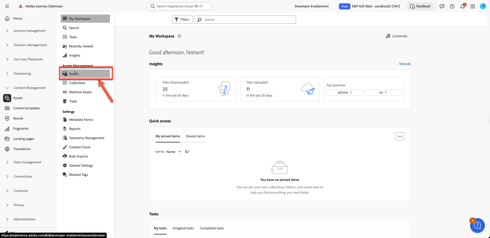
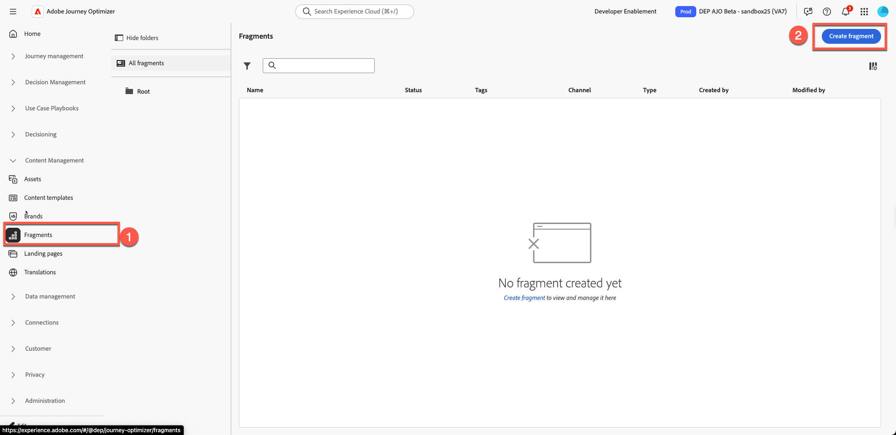
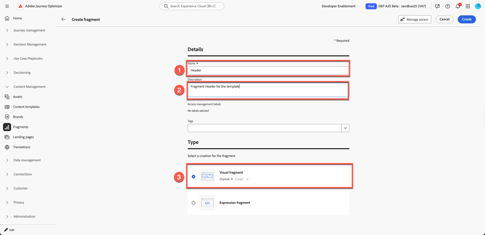
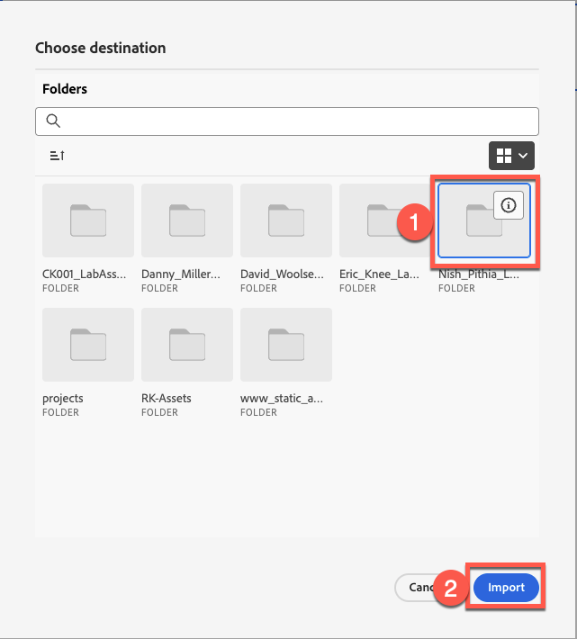

# Creazione di frammenti di contenuto

## Creazione di contenuti con modelli e frammenti

**Scopo:** scopri come creare frammenti riutilizzabili in Adobe Journey Optimizer, quindi applicarli all&#39;interno di un&#39;e-mail reale all&#39;interno di un percorso.

## Obiettivi di apprendimento

Al termine di questo modulo, sarai in grado di:

1. Suddividi una progettazione e-mail in frammenti riutilizzabili.
1. Crea frammenti di intestazione, piè di pagina, banner, corpo e CTA.

## Perché i frammenti contano

I frammenti consentono di creare contenuti coerenti e allineati al brand che possono essere riutilizzati in e-mail, campagne e percorsi.

### Frammenti

Blocchi predefiniti riutilizzabili come:

- Intestazioni
- Piè di pagina
- CTA
- Banner
- Esclusione di responsabilità legale

Ogni volta che un frammento viene aggiornato, tutte le e-mail che lo utilizzano vengono aggiornate automaticamente.

## Come si inserisce nella creazione di e-mail

- **Crea frammenti** per elementi che raramente cambiano.
- **Crea un modello** che utilizza tali frammenti.
- **Utilizza il modello** nell&#39;e-mail della campagna e personalizzane il contenuto.

Di seguito è riportato l’e-mail finale che creerai da questo laboratorio.

Tuttavia, il team di progettazione in genere fornisce modelli come questo:

## Passaggio 1: creare frammenti di contenuto

Il modello seguente è un modello di progettazione generico e il nostro obiettivo è quello di suddividerlo in blocchi di contenuto ripetibili. In Adobe percorsi Optimizer è denominato **Frammenti**.

Il primo passaggio consiste nell’identificare quanti frammenti è necessario creare. In questo modello ha senso utilizzare 5 frammenti come mostrato di seguito.

Abbiamo identificato che i modelli richiedono 5 frammenti come segue.

- Intestazione
- Banner
- CTA
- Corpo
- Piè di pagina

>[!NOTE]
>
>Per questo esercizio creerai un solo frammento di intestazione per risparmiare tempo.

Crea un frammento di intestazione con cui iniziare. Tuttavia, prima di creare il frammento, imposta una cartella di risorse poiché l’ambiente delle risorse è condiviso. A questo scopo, crea innanzitutto una cartella personalizzata.

1. Dalla navigazione a sinistra, individua la sezione **Gestione contenuto** e fai clic su **Assets**.

   

2. Fai clic su **Assets** nella sezione Gestione Assets.

   

3. Creare una cartella facendo clic sul pulsante **&quot;Crea cartella&quot;**.

   

4. Assegna un nome come nome e cognome. Esempio: Nish\_Pithia\_LabAssets (un ricordo)

   

5. **Crea un nuovo frammento:** In Gestione contenuto, fai clic su **Frammenti** e crea un nuovo frammento.

   

   Assegna un nome descrittivo come illustrato di seguito. Aggiungere tutti i dettagli come segue:

   **Nome:** Intestazione

   **Descrizione:** intestazione frammento per il modello

   **Tipo:** Seleziona frammento visivo

   

6. Fai clic sul **pulsante Crea** in alto a destra.

   

   Viene visualizzata una schermata di creazione del frammento vuota.

7. Fai clic su Colonne 1:1 in Strutture e trascina sull’area di lavoro come mostrato di seguito. (Cliccate sull&#39;immagine qui sotto per vedere l&#39;immagine animata)

   

8. Quindi, trascina &quot;**immagine**&quot; sulla riga 1:1 appena aggiunta

   

9. Carica l’immagine del logo fornita. Fare clic su **&quot;Pulsante Importa file multimediali&quot;**

   

10. **Carica il logo:** Carica il logo (*C5G-Logo.png*) dalla cartella delle immagini del toolkit e fai clic su Avanti.

&#x200B;11. Seleziona la **cartella risorse** creata, quindi fai clic su **Importa**. Il file viene salvato nella cartella.

&#x200B;12. Il logo è posizionato correttamente, ma è troppo grande e deve essere ridimensionato. Per ridimensionare il logo, aggiornarne le proprietà. Fare clic sulla **scheda Stile** e impostare la larghezza su 40% trascinando il dispositivo di scorrimento, come illustrato di seguito.

>[!NOTE]
>
>Quando il pulsante di attivazione è attivato, il numero 40 rappresenta % e non i pixel. Se desideri un valore assoluto di precisione pixel, imposta il pulsante su px.

&#x200B;13. Fare clic su **&quot;Salva&quot;** per salvare il frammento. Ricevi una notifica con barra verde alla conferma.

&#x200B;14. Il frammento salvato è in modalità bozza. Prima di utilizzarlo, è necessario pubblicarlo. Fai clic sul pulsante **indietro**.

&#x200B;15. Fare clic sul pulsante &quot;**Pubblica**&quot;. Viene visualizzato il messaggio &quot;Pubblicazione del frammento in corso. L’operazione potrebbe richiedere del tempo. Al termine riceverai una notifica.&quot; alla conferma. Il frammento è pronto per essere utilizzato per la creazione di modelli.

Lo stato verrà modificato in **&quot;Live&quot;**. A questo punto, hai completato la creazione di un frammento di intestazione, che verrà utilizzato nel passaggio successivo.

>[!NOTE]
>
>Tieni presente che in questo esercizio hai creato un solo frammento. In pratica, gli architetti possono scegliere di creare più frammenti, ad esempio intestazioni, piè di pagina o altri componenti riutilizzabili.

## Riassunto

In questo modulo, esegui correttamente le seguenti operazioni:

- Suddivisione di un’e-mail in un frammento di intestazione riutilizzabile
- Creazione di blocchi di contenuto di intestazione

Ora puoi passare al modulo successivo - **Creazione del modello di contenuto**, in cui utilizzerai il frammento creato per generare il nuovo modello.
