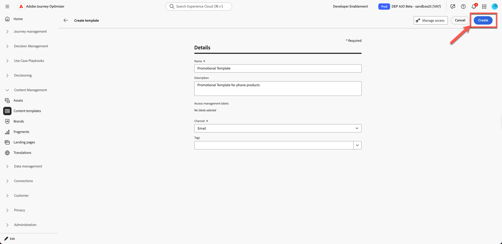
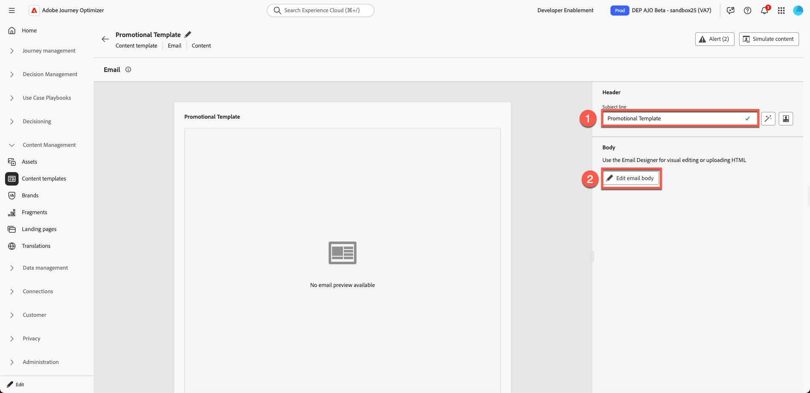
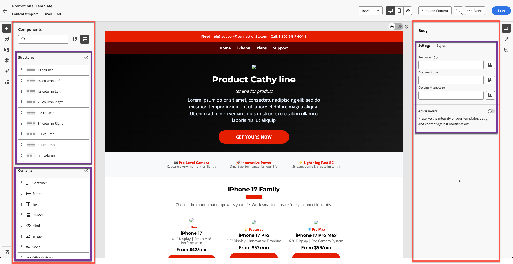

# Creazione di un modello di contenuto

## Creazione di contenuti con modelli e frammenti

**Scopo:** Scopri come creare modelli riutilizzabili in Adobe Journey Optimizer

## Obiettivi di apprendimento

Al termine di questo modulo, sarai in grado di:

1. Crea un modello e-mail completo utilizzando HTML e frammenti importati.

## Perché i modelli sono importanti

I modelli ti consentono di creare contenuti coerenti e allineati al brand che possono essere riutilizzati in e-mail, campagne e percorsi.

### Modelli

Blueprint con struttura:

- Posizionamento intestazione
- Area contenuto corpo
- Area piè di pagina
- Stile layout standard

I modelli garantiscono la coerenza del brand tra i team e consentono di risparmiare tempo prezioso per la creazione.

## Creare un nuovo modello utilizzando i frammenti

I modelli consentono agli utenti di riutilizzare i layout completi in più campagne. I modelli di contenuto in Adobe Journey Optimizer sono strumenti potenti progettati per semplificare e semplificare la creazione di contenuti riutilizzabili per campagne e percorsi. Per creare e-mail, SMS o notifiche push, i modelli ti aiutano a risparmiare tempo fornendo strutture preconfigurate che possono essere facilmente personalizzate e condivise tra i progetti.

Per accelerare e migliorare il processo di progettazione, crea modelli autonomi per riutilizzare facilmente i contenuti personalizzati nelle campagne e nei percorsi Journey Optimizer.

Questa funzionalità consente agli utenti orientati ai contenuti di lavorare su modelli al di fuori di campagne o percorsi. Gli utenti marketing possono quindi riutilizzare e adattare questi modelli di contenuto autonomo all’interno dei propri percorsi o campagne.

## Crea modello

1. Vai a **Gestione contenuto → Modelli di contenuto**.

&#x200B;2. Fai clic su **Crea modello** e quindi compila quanto segue:
   - **Nome:** `Promotional Template`
   - **Descrizione:** `Promotional Template for phone products`
   - **Canale:** `Email`

&#x200B;3. Fai clic su **Crea**.

## Aggiungi oggetto e apri e-mail designer

1. Aggiungi oggetto: `Promotional Template` e fai clic su **nel corpo dell&#39;e-mail** per aprirla e modificarla

&#x200B;2. Sono disponibili tre opzioni:
   1. Progettare da zero
   2. Crea il codice
   3. Importa HTML

Seleziona la terza opzione. Fai clic su **Importa HTML**

## Importa modello HTML fornito

1. Caricare il file HTML del modello dalla cartella toolkit `promotional-template-final.html`

&#x200B;2. Fai clic sul pulsante Importa per **importare** il modello.

&#x200B;3. Attendere il rendering del layout. Noterai problemi come l’interruzione dei collegamenti immagine e la mancanza di branding. (comportamento previsto, in quanto sono presenti risorse segnaposto)

## Esplora la struttura del modello

### Pannello sinistro

I componenti &quot;**Strutture**&quot; e &quot;**Contenuti**&quot; in Adobe Journey Optimizer (AJO) sono elementi essenziali utilizzati per la progettazione di e-mail, pagine di destinazione e frammenti di contenuto. Le strutture definiscono il framework di layout, mentre il contenuto fornisce i blocchi predefiniti effettivi posizionati all’interno di tali layout.

La sezione body in Adobe Journey Optimizer è il contenitore principale per l’e-mail o il contenuto della pagina. Funge da radice dello spazio di progettazione visiva, dove tutti i componenti struttura (colonne, layout) e contenuto (testo, immagini, pulsanti, ecc.) sono nidificati.

### Pannello a destra

Le opzioni &quot;**Settings**&quot; e &quot;**Style**&quot; nella sezione body di Adobe Journey Optimizer ti consentono di definire l&#39;aspetto e il layout fondamentali dell&#39;e-mail o della pagina. Questi controlli influiscono sull&#39;intero progetto poiché il corpo è l&#39;elemento padre di tutti i componenti.

Sulla barra della barra a sinistra sono presenti le sezioni relative a:

- Frammenti
- File
- Struttura del corpo
- URL tracciati

Il frammento di intestazione creato nell’esercizio precedente viene visualizzato qui come illustrato di seguito. Assicurati che il frammento di intestazione sia visualizzato in tempo reale con un punto blu e non in modalità bozza. Passate del tempo a controllare il resto delle sezioni.

&#x200B;> [!NOTE]
>
>Se il frammento non viene visualizzato qui, significa che non è stato salvato correttamente e deve essere ricaricato.

## Inserire frammenti di intestazione

Ora migliora il modello. Intestazione e piè di pagina già creati.

1. Trascina una **colonna 1:1** sopra il contenuto esistente.

Vedete qualcosa come questo.

&#x200B;2. Lo sfondo utilizza il colore di sfondo del modello, attualmente nero. Imposta il colore di sfondo **su bianco. Fare clic su** nella scheda Stile nella barra a destra e utilizzare il colore bianco nel selettore dei colori.

&#x200B;3. Apri **Frammenti** e trascina il frammento **Intestazione**.

&#x200B;4. Il frammento di intestazione è allineato correttamente al modello, come illustrato di seguito.

&#x200B;5. Fai clic sul pulsante **Salva** per salvare il modello, quindi fai clic su **Indietro**.

>[!NOTE]
>
>Potresti vedere alcune immagini rotte. Lo ripareremo più tardi.

## Riassunto

In questo modulo, esegui correttamente le seguenti operazioni:

- HTML importato per creare un modello promozionale completo

Ora puoi passare al modulo successivo - **Creazione dell&#39;e-mail**
