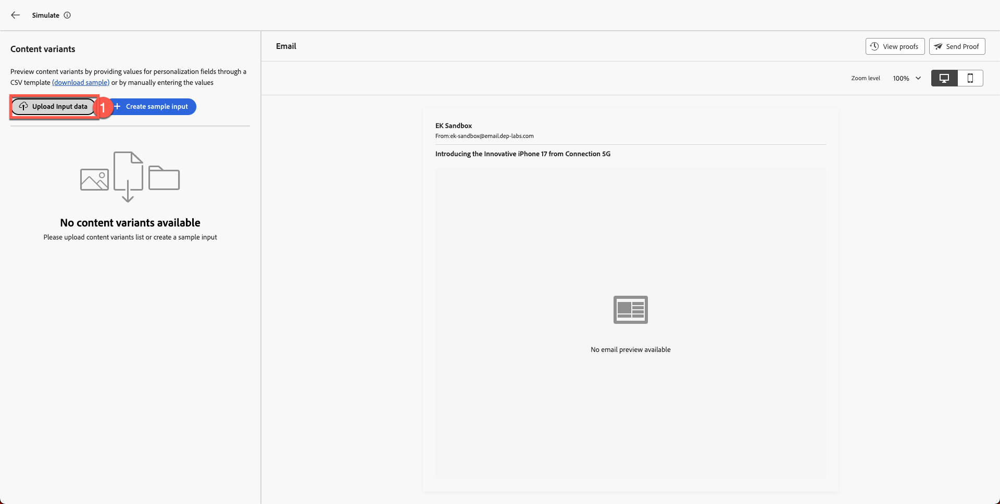
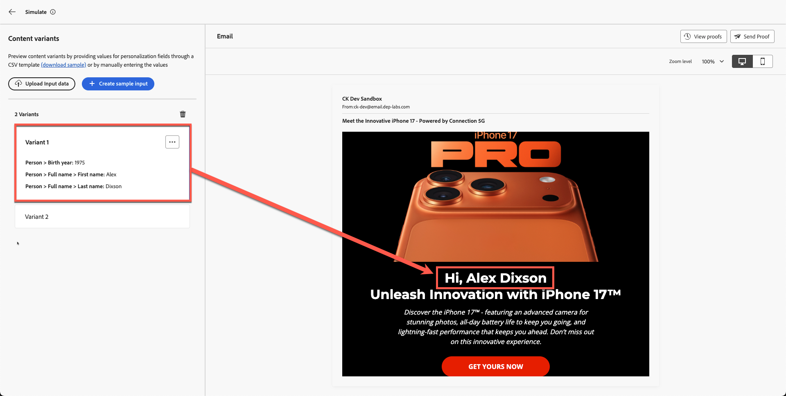

# Simulazione dei contenuti

**Scopo:** convalidare le varianti di personalizzazione, logica condizionale e contenuto utilizzando gli strumenti di simulazione e bozza di Adobe Journey Optimizer.

## Obiettivi di apprendimento

Al termine di questo modulo, sarai in grado di:

1. Carica e utilizza i dati del profilo di test per la simulazione.
1. Convalida campi personalizzati e logica delle varianti.
1. Verifica il comportamento di fallback per dati mancanti o senza corrispondenza.

## Introduzione

In questo modulo finale, eseguirai il test dell&#39;e-mail con **due varianti condizionali** utilizzando lo strumento di simulazione in Adobe Journey Optimizer.
Questo consente di visualizzare in anteprima come diversi clienti percepiranno il tuo messaggio personalizzato, garantendo precisione prima di lanciare la campagna.

Verrà utilizzato il file del profilo di test di esempio **sample.csv** dal toolkit.

## Aprire lo strumento di simulazione

1. Apri l’e-mail completata.
1. Fare clic su **Simula contenuto**.
1. Seleziona **Simula variante contenuto**.

Dopo alcuni secondi viene visualizzato un pannello di simulazione.

## Caricare i dati del profilo di test

1. Apri **sample.csv** dalla cartella toolkit.
   - **Alex** → di età superiore a 40 anni
   - **Jason** → di età inferiore a 40 anni
2. Fare clic su **Carica dati di input**.

3. Scegli **sample.csv** e fai clic su **Continua**.

AJO elabora il file e prepara le anteprime.

## Rivedi rendering variante

AJO mostra entrambe le varianti una accanto all’altra in base ai profili caricati.

**Risultati previsti:**

- **Alex** → vede **Variante 1** (età superiore a 40)

Se scorri verso l’alto puoi anche visualizzare campi personalizzati con il nome adesso, come puoi vedere di seguito.

- **Jason** → Visualizza **Variante 2** (Età Inferiore A 40)

Anche con il nome completo di Jason. Che figata!

## Convalida comportamento di fallback

**Fallback e impostazioni predefinite:** verifica che l&#39;e-mail gestisca correttamente eventuali dati mancanti o scenari di mancata corrispondenza. Ad esempio, simula un profilo con un campo dell’anno di nascita vuoto o che non sia idoneo per alcuna offerta mirata. L’anteprima deve mostrare un blocco di contenuto predefinito o un segnaposto sensibile invece di contenuto interrotto o vuoto. Se la simulazione mostra una sezione vuota in cui dovrebbe essere presente il contenuto, potrebbe essere necessario configurare un’offerta di fallback o un testo predefinito nella progettazione.

## Riassunto

In questo modulo, esegui correttamente le seguenti operazioni:

- Contenuto personalizzato simulato utilizzando profili di esempio
- Logica di cambio variante convalidata
- I campi personalizzati confermati vengono compilati correttamente

Ora sei pronto per il modulo successivo - **Allineamento marchio**,
dove valuterai l’e-mail in base alle linee guida del brand Connection 5G utilizzando l’intelligenza artificiale.
