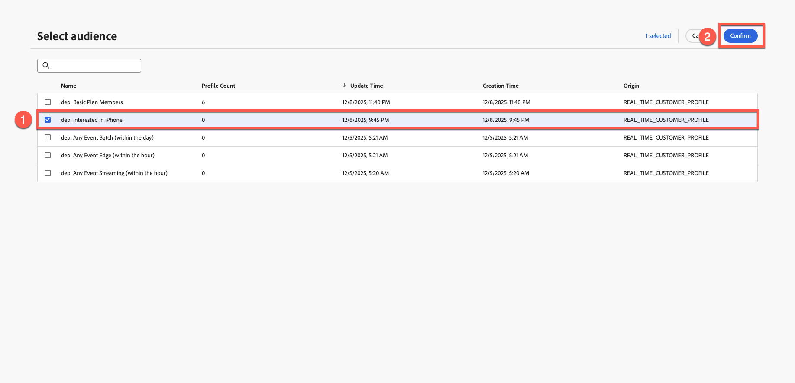
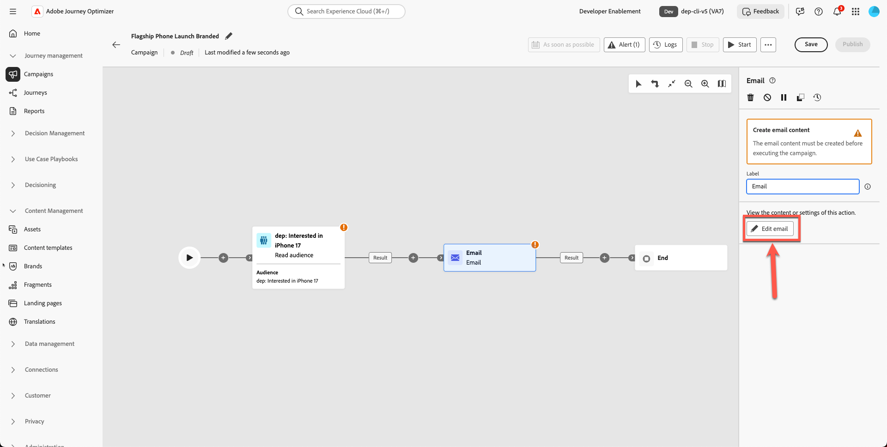
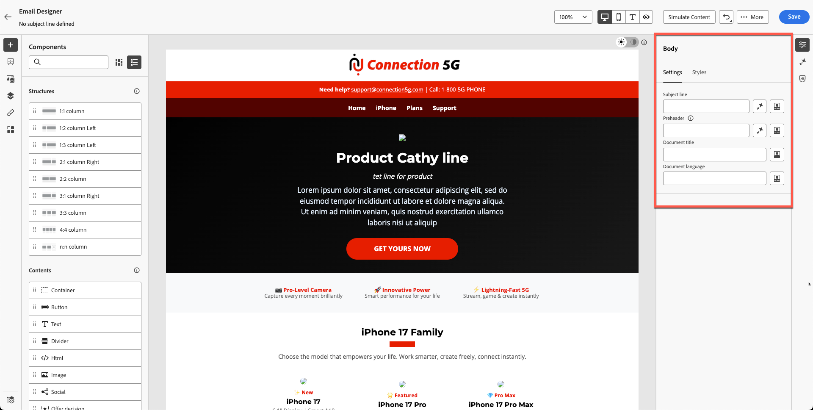
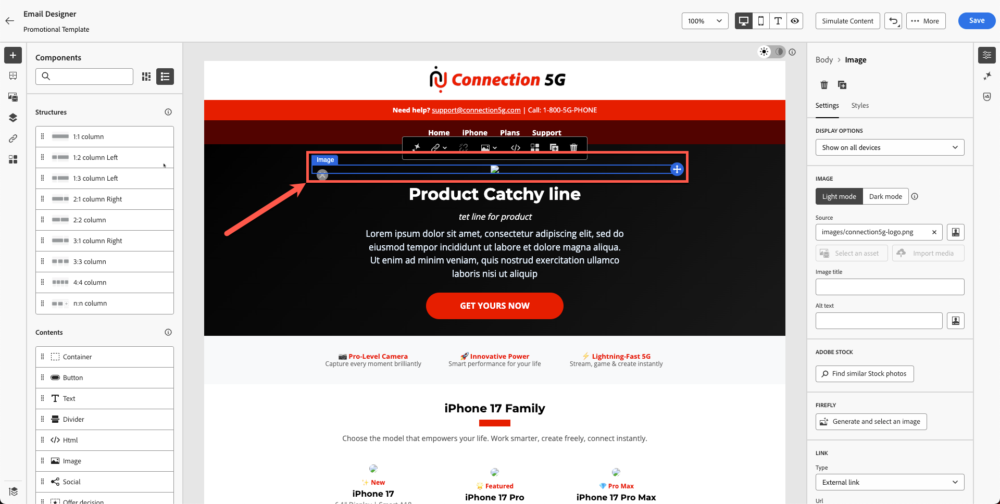
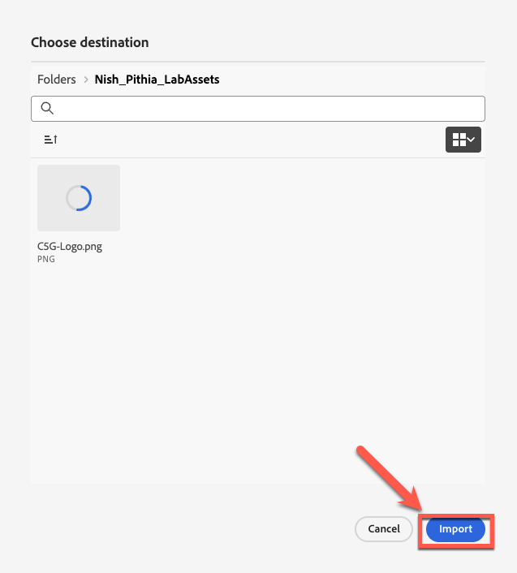
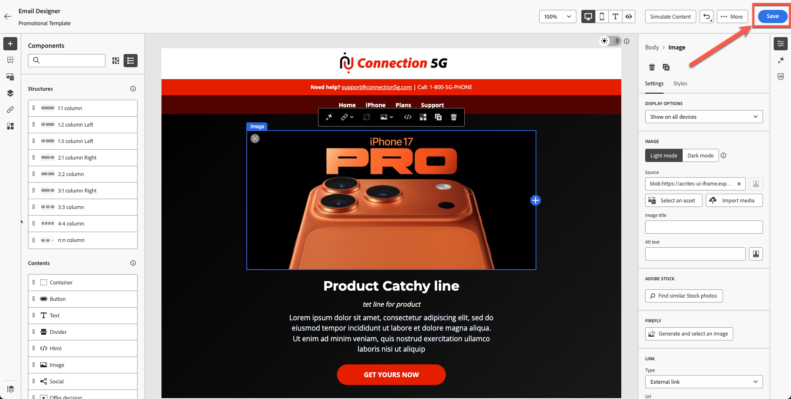

# Creazione dell’e-mail

## Creazione di contenuti con modelli

**Scopo:** scopri come creare modelli riutilizzabili in Adobe Journey Optimizer, quindi applicarli all&#39;interno di un&#39;e-mail reale all&#39;interno di una campagna.

## Obiettivi di apprendimento

Al termine di questo modulo, sarai in grado di:

1. Crea una nuova campagna e utilizza il nuovo modello di marchio.
1. Aggiornare le immagini principali, le immagini dei prodotti, i pulsanti e lo stile del layout.

## Creare e aggiornare l’e-mail in una campagna

### Obiettivo

In questo esercizio impareremo a applicare il modello creato a un’e-mail all’interno di un percorso. In uno scenario ideale, puoi utilizzare qualsiasi percorso o campagna esistente e sostituirne il contenuto e-mail con un modello standardizzato per garantire la coerenza del brand e un’esecuzione più rapida.

Questo passaggio illustra come riutilizzare i modelli nei diversi percorsi, consentendo ai team di aggiornare le progettazioni senza dover ricompilare le e-mail da zero.

## Creare una nuova campagna e-mail

1. Torna alla schermata principale e fai clic su **Gestione Percorsi → Campagne**.
2. Fai clic su **Crea campagna**

&#x200B;3. Seleziona &quot;**Orchestrazione - Marketing**&quot; e fai clic su **conferma**

&#x200B;4. Assegna un nome alla campagna `Flagship Phone Launch Branded`. Premere il pulsante **Salva**.

&#x200B;5. Fai clic sul segno **+** e seleziona l&#39;attività **Leggi pubblico**

&#x200B;6. Il passaggio successivo consiste nel selezionare la casella **&quot;Read Audience&quot;** e fare clic sull&#39;icona della cartella **Audience**

&#x200B;7. Seleziona il **dep: interessato al pubblico di iPhone 17** e fai clic sul pulsante &quot;**Aggiungi pubblico**&quot;

&#x200B;8. Seleziona entità - **dep-rel: Account cliente - cliente\_id** (o qualsiasi altro dato non rilevante per questa parte)
&#x200B;9. Aggiungi l&#39;**attività E-mail** facendo clic sul segno **+** e quindi seleziona **E-mail** dalle attività del canale.

&#x200B;10. Fai clic su **Modifica e-mail**.

&#x200B;11. Fai clic sulla **scheda Azione** e seleziona **la tua** configurazione e-mail. Nella sandbox potrebbe essere visualizzato come E-mail relazionale. (Seleziona qualsiasi)

&#x200B;12. Fai clic sulla **scheda Contenuto**

&#x200B;13. Fai clic su **Applica modello di contenuto**

&#x200B;14. Seleziona il modello **&quot;Modello promozionale&quot;** creato e fai clic su **Conferma**

&#x200B;15. Fai clic su **Modifica corpo dell&#39;e-mail**

&#x200B;16. Conferma che i nuovi blocchi di intestazione, protagonista, piè di pagina e contenuto vengano visualizzati correttamente.

## Sostituisci immagine protagonista e immagini del prodotto

Cambia le immagini dell&#39;eroe e del telefono. È necessario caricare il contenuto nelle risorse dalla cartella toolkit. Attualmente l’immagine del banner principale del prodotto è un segnaposto.

1. Fai clic sull’immagine del banner eroe rotta.

&#x200B;2. Rimuovi l’URL di origine temporaneo.

&#x200B;3. Fai clic su **Importa file multimediali**

&#x200B;4. Carica `hero.png` dal tuo toolkit. (puoi trascinare il file)

&#x200B;5. Fai clic su **Avanti,** seleziona **la cartella per le risorse** e premi **importa**

&#x200B;6. Il modello di e-mail verrà visualizzato correttamente. Viene visualizzato come segue. Fai clic su **&quot;Salva&quot;** per salvare i tuoi dati.

## Esercizio facoltativo

### Sostituisci immagini prodotto

Procedi con l’aggiornamento di tutte le immagini del prodotto (immagini fornite nella cartella toolkit) e aggiungi un bordo arrotondato a tuo piacimento. L’e-mail si presenta meglio senza collegamenti interrotti, come illustrato di seguito. Ripeti il processo per tutte le schede prodotto.

## Riassunto

In questo modulo, esegui correttamente le seguenti operazioni:

- È stata creata una nuova campagna tramite e-mail utilizzando il modello di marchio
- Sono state aggiornate le immagini protagonista e prodotto
- Stili migliorati

Ora puoi passare al modulo successivo - **Assistente AI e personalizzazione contenuti**, in cui utilizzerai AI per perfezionare il testo e generare automaticamente le immagini.
