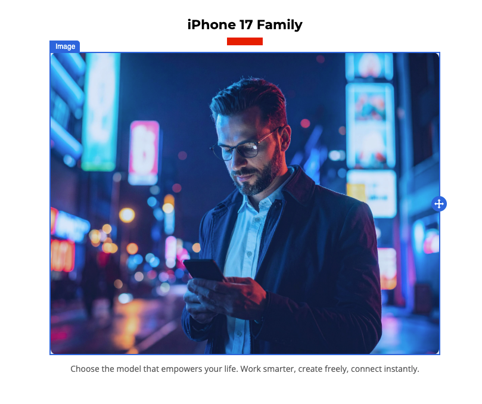
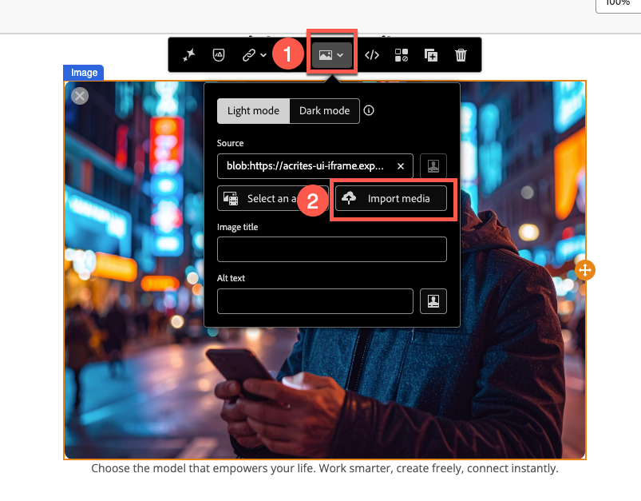
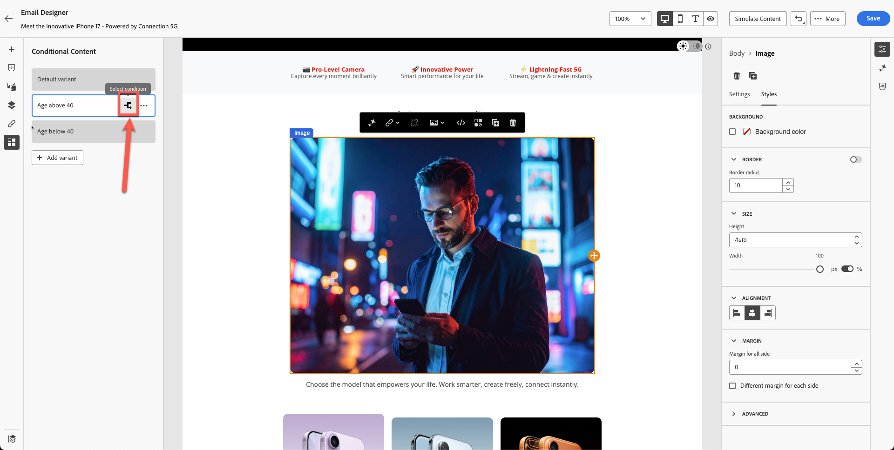
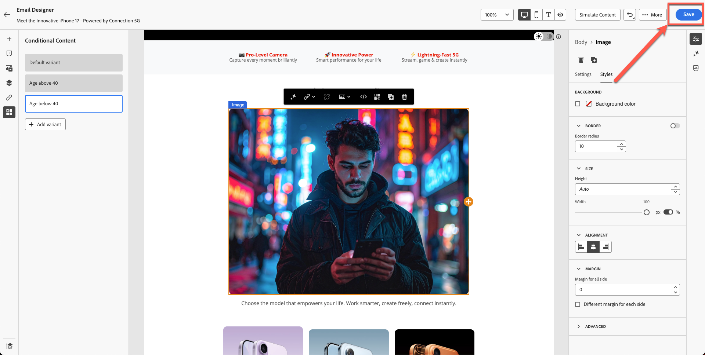

# Personalization e sperimentazione sui contenuti

**Scopo:** scopri come personalizzare il contenuto delle e-mail utilizzando gli attributi del profilo, creare varianti di contenuto dinamico e applicare la logica condizionale in Adobe Journey Optimizer.

## Obiettivi di apprendimento

Al termine di questo modulo, sarai in grado di:

1. Aggiungi campi di personalizzazione utilizzando gli attributi del profilo.
1. Utilizza la sintassi Editor di personalizzazione e Handlebars.
1. Crea varianti di contenuto dinamico in base alla logica del profilo.
1. Creare regole condizionali per blocchi di contenuto personalizzati.
1. Test del passaggio da una variante a un’altra in base ad attributi quali l’anno di nascita.

## Introduzione

La personalizzazione in Adobe Journey Optimizer consente esperienze uno-a-uno su larga scala.
In questo modulo:

- Inserisci testo personalizzato (nome e cognome)
- Creare varianti di contenuto basate su età
- Applicare la logica condizionale utilizzando gli attributi del profilo
- Prepara il contenuto per la simulazione nel modulo 7

Personalization in Adobe Journey Optimizer consente di creare esperienze cliente personalizzate e di forte impatto personalizzando dinamicamente i contenuti in base a profili, comportamenti e dati contestuali individuali. Sia che tu crei e-mail, notifiche o offerte personalizzate, gli strumenti e le tecniche forniti semplificano il collegamento del messaggio giusto alla persona giusta al momento giusto. Scopri come Personalization Editor, la sintassi Handlebars e i dati di Adobe Experience Platform funzionano insieme per dare vita alle tue idee, esplorare blocchi di contenuto riutilizzabili con frammenti di espressione e immergerti in funzioni di assistenza avanzate per sbloccare possibilità più profonde. Ogni argomento sviluppa le tue abilità passo dopo passo, assicurandoti di essere pronto a progettare percorsi personalizzati con sicurezza.

## Aggiungi personalizzazione di base

Questa parte dell’esercizio semplifica la personalizzazione. Aggiungi nome e cognome all’e-mail in base al profilo. Personalization si basa sui dati del profilo gestiti dallo schema Profilo individuale XDM che hai definito. Lo schema Profilo individuale XDM è l’unico schema utilizzabile per personalizzare il contenuto in Journey Optimizer.

1. Apri l’e-mail creata nei moduli precedenti.
2. Aggiungi un blocco di testo sopra il titolo principale con il contenuto: **Ciao,**
3. Fai clic sull&#39;icona **Personalizzazione**.

   

4. Cerca **F**&#x200B;**first Name**.

   

5. Fare clic su **+** per aggiungerlo all&#39;area delle espressioni.
6. Aggiungi uno **spazio** dopo il campo **Nome**.

   

7. Ripeti il processo in alto, ma questa volta cerca e aggiungi **Cognome**.

   La sintassi finale mostra le variabili di nome e cognome chiaramente separate.

   

8. Convalida il frammento. È disponibile un’opzione per salvare il contenuto come frammento. Questa è un’ottima opportunità per utilizzare Nome completo per la creazione di altri contenuti e-mail. Ignora e passa al passaggio successivo.
9. Fai clic su **Salva**

La visualizzazione è simile alla seguente. Le parentesi graffe sono costituite da variabili e ogni individuo riceve un’e-mail con il proprio nome.

A questo punto, sai come aggiungere la personalizzazione per i singoli profili.

## Introduzione al contenuto dinamico

I contenuti dinamici in Adobe Journey Optimizer ti consentono di creare messaggi personalizzati che si adattano perfettamente al tuo pubblico. Utilizzando le regole condizionali, puoi personalizzare le e-mail, gli SMS e le notifiche push in base agli attributi di profilo, all’iscrizione al pubblico o agli eventi in tempo reale. Che tu stia creando un messaggio di fallback per i casi in cui non siano soddisfatti criteri specifici o salvi regole riutilizzabili per coerenza, l’editor di personalizzazione e E-mail Designer offrono strumenti intuitivi per dare vita alle tue idee.

Questo è un caso d’uso perfetto per aggiungere contenuti condizionali all’e-mail e personalizzarla in base all’età dell’utente.

Consulta lo schema: hai **&quot;person.bornYear&quot;** come anno di nascita. Questo attributo può essere utile. Esegui il targeting e imposta una campagna in base all’età.

Per questo esercizio, creerai due varianti in base all’età. Una variante è destinata agli utenti di età superiore a 40 anni e l’altra agli utenti di età inferiore a 40 (forse a metà degli anni 20 e 30). Chiunque sia nato prima del 1986 è considerato sopra i 40 anni, mentre chiunque sia nato nel 1986 o successivamente è considerato sotto i 40.

**Logica età**

Verrà utilizzato l&#39;attributo di profilo `person.birthYear`.

| Gruppo di destinazione | Condizione |
| ------------ | ----------------- |
| Oltre 40 | bornYear \&lt; 1986 |
| Sotto i 40 | nascitaAnno >= 1986 |

## Creare due varianti di immagine

Ricordi questo blocco creato nel modulo precedente? La tua immagine è diversa dalla mia.

Create un&#39;altra immagine per le persone di età inferiore ai 40 anni (ricordate, avete creato un&#39;immagine Firefly di una persona di età inferiore ai 40 anni) e utilizzate questa immagine per questo esercizio.

1. Seleziona il blocco di immagine esistente. (Fare clic sull&#39;immagine) e fare clic su **Blocco condizionale**.
2. Fare clic su **Aggiungi variante**.

   

3. Rinomina la prima variante con **Età superiore a 40**.

   

4. Creare una nuova variante facendo clic sul pulsante **&quot;Aggiungi variante&quot;** e rinominarla in **Età inferiore a 40.**

   

5. Potresti potenzialmente creare un’immagine utilizzando Firefly visualizzando un messaggio di tipo &quot;ventenne&quot;. Tuttavia, per risparmiare tempo, nel toolkit è già presente un&#39;immagine denominata &quot;**variant-age-under-40.jpg**.
6. Fai clic sull’immagine e Importa file multimediali.

   

7. Seleziona l&#39;immagine **variant-age-below-40.jpg**. Importa il file facendo clic su **Avanti** e infine premi **Importa** nella cartella (dovresti trovarti già nella cartella per impostazione predefinita).

   

8. Prova a passare da una variante all’altra per vedere un’immagine diversa applicata.

Finora, hai creato il progetto ma non hai ancora applicato la logica. Il passaggio successivo applica la logica.

## Applicare la logica condizionale alle varianti

Entrambe le varianti sono pronte, ma non è stata ancora applicata la logica condizionale.

## Logica per &quot;Età superiore a 40 anni&quot;

1. Seleziona e passa il cursore del mouse sulla variante **Age sopra a 40**.
2. Fai clic sull&#39;icona **Logica condizionale**.

   

3. Crea una nuova condizione.

   

4. Cerca **anno** nell&#39;elenco degli attributi.
5. Trascina **Anno di nascita** nell&#39;area di lavoro.
6. Imposta condizione su:
   - **anno di nascita \&lt; 1986**

   

7. Denomina la condizione: **Età superiore a 40**
8. Aggiungi una descrizione - &quot;**Variante immagine per le persone che sono sopra 40**&quot;
9. Fai clic su **Aggiungi → Seleziona**.

## Logica per &quot;Età inferiore a 40 anni&quot;

1. Seleziona e passa il puntatore del mouse su **Età inferiore a 40** sezione.
2. Ripeti i passaggi ma modifica la logica in:
   - **anno di nascita >= 1986**

   

3. Denomina la condizione: **Età inferiore a 40**
4. Aggiungi la descrizione. &quot;**Variante immagine per le persone di età inferiore a 40**&quot;
5. Fai clic su **Aggiungi → Seleziona**.

## Convalida passaggio variante

Passa da una variante all’altra per garantire:

- Visualizzazione delle immagini corrette
- La logica viene applicata correttamente
- Nessuna variante viene visualizzata come &quot;Nessuna condizione applicata&quot;

Variante: **Età superiore a 40**

Variante: **Età inferiore a 40**

Fai clic sul pulsante &quot;**Salva**&quot; per salvare l&#39;e-mail.

## Riassunto

In questo modulo hai imparato come:

- Aggiungere campi di personalizzazione per la messaggistica uno-a-uno
- Creare varianti di immagini dinamiche
- Applicare regole condizionali in base all’età

Ora puoi passare al modulo successivo - **Simulazione del contenuto**, per testare entrambe le varianti.
