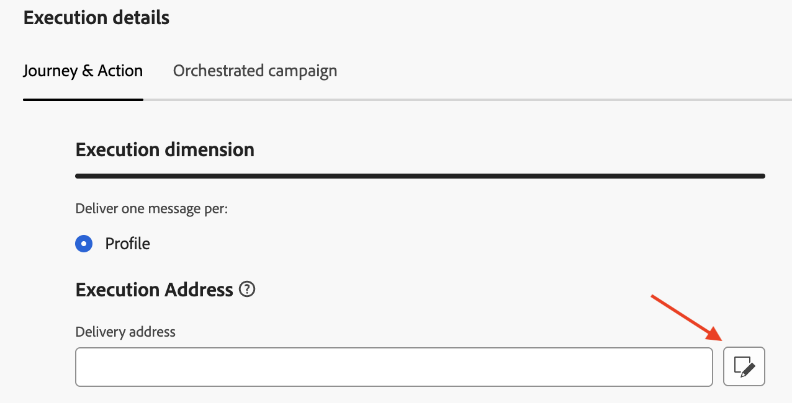
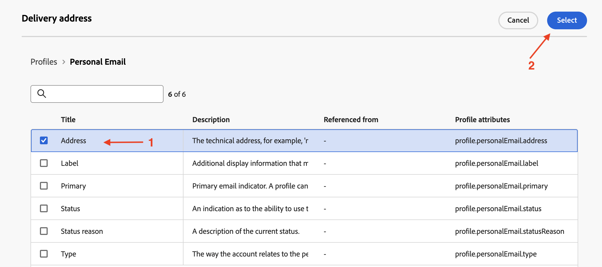
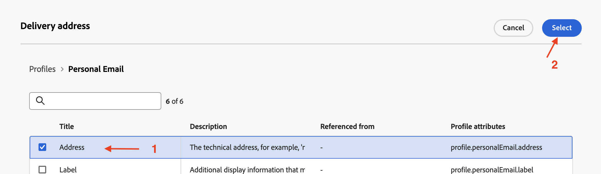

# Configura per profilo

## Obiettivo

Nei passaggi successivi verrà creata una configurazione del canale e-mail con Percorsi e campagne orchestrate utilizzando l’attributo profilo AEP `personalEmail.address`

## Creare la configurazione del canale

1. Passa a **Configurazioni canale** nel menu **Amministrazione → canali → Impostazioni generali**
2. Fai clic sul pulsante **Crea configurazione**

   

3. Nella procedura guidata Crea, imposta i seguenti valori:
   - **Nome:** `Profile-Email`
   - **Canale:** `Email`
   - **Azione di marketing:** `Email Targeting`

>[!NOTE]
>
>Quando si seleziona Email come canale, viene visualizzata una nuova sezione **Impostazioni e-mail**.

## Configurare il tipo di e-mail

Imposta il **Tipo di e-mail** su **Marketing**

## Configurare il sottodominio

Dal menu a discesa **Sottodominio**, seleziona **email.dep-labs.com**

## Configurare i dettagli del pool IP

Dal menu a discesa **Pool IP**, seleziona **marketing**

## Configurare l’annullamento dell’iscrizione all’elenco

1. Assicurati che l&#39;opzione di attivazione/disattivazione sia **abilitata** per l&#39;annullamento dell&#39;iscrizione a un elenco
1. Nell&#39;area delle preferenze per l&#39;annullamento dell&#39;iscrizione all&#39;elenco verificare che tutte le caselle di controllo siano **selezionate**
1. In Gestione collegamenti assicurarsi che **Adobe managed** sia selezionato
1. Per il livello di consenso, assicurati che sia impostato su **Canale**

## Configurare i parametri di intestazione

1. Impostare i campi seguenti:
   - **Nome mittente:** `DEP Labs`
   - **Da prefisso e-mail:** `dep`
   - **Risposta al nome:** `DEP Labs Support`
   - **Risposta all&#39;e-mail:** `reply@email.dep-labs.com`
   - **Prefisso e-mail errore:** `error`

## Configura e-mail Ccn

Lascia vuoto questo campo

>[!NOTE]
>
>Per conservare una copia delle e-mail inviate, puoi includere nell’invio un indirizzo e-mail in Ccn. Immetti l’indirizzo e-mail desiderato in modo che ogni e-mail venga inviata anche in copia per conoscenza nascosta a questo indirizzo Ccn. Il dominio dell’indirizzo Ccn non deve essere lo stesso di un sottodominio delegato ad Adobe. Questa funzione è facoltativa. *Come utilizzare Ccn per le e-mail*

## Configurare i parametri dei tentativi e-mail

Lascia le impostazioni predefinite di **Ore** impostate su **84**

## Configurare i parametri di tracciamento URL

Lascia le impostazioni predefinite

## Dettagli di esecuzione

1. Completare la sezione **Dettagli di esecuzione**. Nella scheda **Percorso e azione** -> **Dimensione esecuzione**, seleziona **Profilo** come **Source** e fai clic sull&#39;icona Modifica per **Indirizzo consegna** nella sezione **Indirizzo esecuzione**

   

2. Fai clic sulla cartella **E-mail personale** per aprirla

   

3. Fai clic sulla **casella di controllo** nel campo `Address`, quindi sul pulsante **Seleziona**

   

4. Per **Profilo**, `personalEmail.address` è ora configurato come **Indirizzo di consegna** nella sezione **Indirizzo di esecuzione**

   

5. Fai clic sulla scheda Campagna orchestrata e **seleziona** la casella di controllo Abilitato.

   

6. Sotto l’intestazione della dimensione di esecuzione configura quanto segue:
   - **Consegna un messaggio per:** `Target Dimension`
   - **Dimension di destinazione profilo:** `dep-rel: Customer Account - customer_id`

   

7. In Indirizzo di esecuzione configura quanto segue:
   - **Source:** `Profile`
   - **Indirizzo di consegna:** `click on the Edit icon`

   

8. Cercare e fare clic sulla cartella `Personal Email` per aprirla

   

9. Seleziona il campo `Address` all&#39;interno della cartella Posta personale e fai clic su **Seleziona**

   

10. Per la **campagna orchestrata**, **dep-rel: Account cliente - cliente\_id** è configurato come **Dimension di destinazione profilo** per la **dimensione di esecuzione** con **Indirizzo di esecuzione** con **Source** di **Profilo** e `personalEmail.address` come **Indirizzo di consegna**

>[!NOTE]
>
>Per le campagne orchestrate, esegui il targeting dell&#39;account cliente con un&#39;e-mail, quindi devi inviare solo *un messaggio per profilo*.  L&#39;indirizzo di esecuzione utilizzato proviene dal profilo stesso (ovvero ciò che viene memorizzato nel profilo di AEP nell&#39;attributo **personalEmail.address**)

## Rivedi e salva

1. Rivedi nuovamente tutti i dettagli per assicurarti che corrispondano.
1. Scorri verso l&#39;alto e fai clic su **Invia**.

>[!NOTE]
>
>È stato osservato che l’elaborazione della configurazione del canale e-mail richiede fino a 2 ore.  Che schifo!
>
>Continua con l’esercizio successivo mentre attendi l’elaborazione di questa configurazione di canale.

>[!TIP]
>
>🚀 Una volta che lo stato di configurazione del canale e-mail è **Attivo**, è pronto e può essere selezionato direttamente all&#39;interno di **Attività e-mail** in Orchestrated Campaigns.

## Riassunto

Ora hai visto come creare una configurazione del canale e-mail per utilizzare l’attributo di profilo AEP sia per i Percorsi che per le campagne orchestrate.
