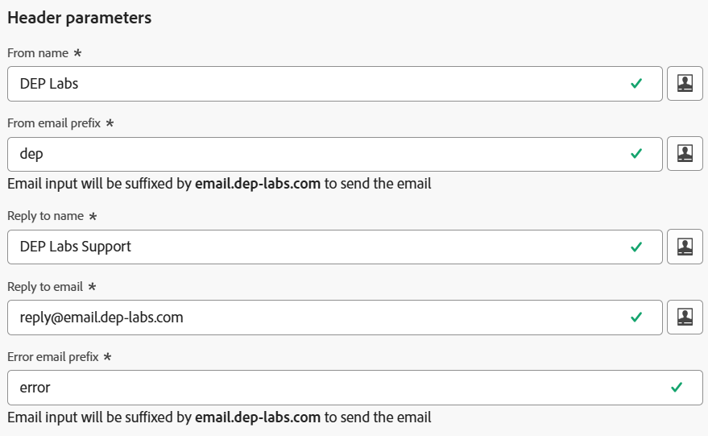

# Configura per relazionale

## Obiettivo

Nei passaggi successivi verrà creata una configurazione del canale e-mail da utilizzare solo con le campagne orchestrate, utilizzando l&#39;attributo `email` dello schema relazionale `dep-rel: Customer Account`

## Creare la configurazione del canale

1. Passa a **Configurazioni canale** nel menu **Amministrazione → canali → Impostazioni generali**
2. Fai clic sul pulsante **Crea configurazione**

   

3. Nella procedura guidata Crea, imposta i seguenti valori:
   - **Nome:** `Relational-Email`
   - **Canale:** `Email`
   - **Azione di marketing:** `Email Targeting`

>[!NOTE]
>
>Quando selezioni E-mail come canale, viene visualizzata una nuova sezione Impostazioni e-mail.

## Configurare il tipo di e-mail

Imposta il **Tipo di e-mail** su **Marketing**

## Configurare il sottodominio

Dal menu a discesa **Sottodominio**, seleziona **email.dep-labs.com**

## Configurare i dettagli del pool IP

Dal menu a discesa **Pool IP**, seleziona **marketing**

## Configurare l’annullamento dell’iscrizione all’elenco

1. Assicurati che l&#39;opzione di attivazione/disattivazione sia **abilitata** per l&#39;annullamento dell&#39;iscrizione a un elenco
1. Nell&#39;area delle preferenze per l&#39;annullamento dell&#39;iscrizione all&#39;elenco verificare che tutte le caselle di controllo siano **selezionate**
1. In Gestione collegamenti assicurarsi che **Adobe managed** sia selezionato
1. Per il livello di consenso, assicurati che sia impostato su **Canale**

## Configurare i parametri di intestazione

1. Impostare i campi seguenti:
   - **Nome mittente:** `DEP Labs`
   - **Da prefisso e-mail:** `dep`
   - **Risposta al nome:** `DEP Labs Support`
   - **Risposta all&#39;e-mail:** `reply@email.dep-labs.com`
   - **Prefisso e-mail errore:** `error`

## Configura e-mail Ccn

Lascia vuoto questo campo

>[!NOTE]
>
>Per conservare una copia delle e-mail inviate, puoi includere nell’invio un indirizzo e-mail in Ccn. Immetti l’indirizzo e-mail desiderato in modo che ogni e-mail venga inviata anche in copia per conoscenza nascosta a questo indirizzo Ccn. Il dominio dell’indirizzo Ccn non deve essere lo stesso di un sottodominio delegato ad Adobe. Questa funzione è facoltativa. *Come utilizzare Ccn per le e-mail*

## Configurare i parametri dei tentativi e-mail

Lascia le impostazioni predefinite di **Ore** impostate su **84**

## Configurare i parametri di tracciamento URL

Lascia le impostazioni predefinite

## Dettagli di esecuzione

1. Nella scheda Campagna orchestrata e **seleziona** la casella di controllo Abilitato.

   

2. In Dimensione di esecuzione configura quanto segue:
   - **Consegna un messaggio per:** `Target Dimension `
   - **Dimension di destinazione profilo:** `dep-rel: Customer Account - customer_id`

   

3. In Indirizzo di esecuzione configura quanto segue:
   - **Source:** `Target Dimension`
   - **Indirizzo di consegna:** `click on the Edit button`

   

4. Nel popup, fare clic nella cartella **dep-rel: Account cliente**

   

5. Seleziona **E-mail** e fai clic sul pulsante **Seleziona**

   

6. Al termine, i dettagli di esecuzione finali avranno un aspetto simile alla schermata seguente

>[!NOTE]
>
>Per le campagne orchestrate, esegui il targeting dell’account cliente con un’e-mail, quindi devi inviare un solo messaggio per Dimension di Target.  L&#39;indirizzo di esecuzione utilizzato proviene dal Dimension di destinazione stesso (ovvero ciò che è memorizzato nella tabella **dep-rel: Account cliente** per l&#39;indirizzo **email**)

## Rivedi e salva

1. Rivedi nuovamente tutti i dettagli per assicurarti che corrispondano.
1. Scorri verso l&#39;alto e fai clic su **Invia**.
1. Al termine, vedrai due configurazioni del canale e-mail, entrambe probabilmente in stato di &quot;elaborazione&quot;.

>[!WARNING]
>
>È stato osservato che l’elaborazione della configurazione del canale e-mail richiede fino a 2 ore.

## Riassunto

Ora hai visto come creare una configurazione del canale e-mail per utilizzare l’attributo dello schema relazionale per le campagne orchestrate.
