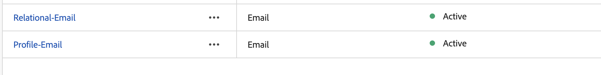

# In attesa dello stato attivo

>[!CAUTION]
>
>Prima di poter continuare con qualsiasi laboratorio futuro, è necessario assicurarsi che entrambe le configurazioni del canale e-mail siano visualizzate come **Attive**

>[!TIP]
>
> 🚀 Una volta che lo stato di configurazione del canale e-mail è **Attivo** puoi continuare 😅

## Riassunto

Ora hai visto come creare una configurazione del canale e-mail per utilizzare l’attributo dello schema relazionale per le campagne orchestrate.
