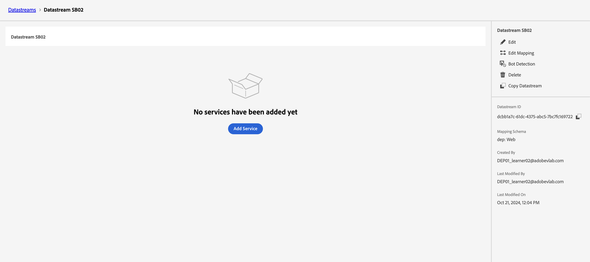

# Creare un flusso di dati

## Finalità di apprendimento

Crea e configura un flusso di dati con i servizi richiesti per abilitare l’elaborazione degli eventi di Edge.

Un flusso di dati definisce quali servizi lo utilizzeranno.

- Quando invii dati ad Edge specifichi quale Datastream utilizzare
- I dati inviati a questi flussi di dati possono quindi intervenire in base al servizio configurato
  - Adobe Experience Platform

## Creare un nuovo flusso di dati

1. Nella barra a sinistra sotto **Raccolta dati** fai clic su **Flussi di dati**
1. Quindi fai clic su **Nuovo flusso di dati** per crearne uno

## Configurare lo stream di dati

Configura lo stream di dati con le seguenti informazioni:

1. Nome -> **Datastream SB + \&lt;nome sandbox> (ovvero Datastream SB01)**
1. Schema di mappatura -> **dep: Web**
1. Attiva **su** tutte le opzioni in **Geolocalizzazione e ricerca di rete** per acquisire queste informazioni.
1. Al termine, fai clic sul pulsante **Salva**

>[!WARNING]
>
>Non fare clic su Salva e Aggiungi mappatura.  In caso contrario, è sufficiente annullare l&#39;operazione

Dopo aver salvato lo stream di dati, viene visualizzata la seguente schermata:

## Aggiungi servizio Adobe Experience Platform

Questo ti consente di inviare i dati all’hub e inviarli a un set di dati per i dati ricevuti da questo flusso di dati.

1. Fai clic sul pulsante blu **Aggiungi servizio** al centro della schermata

   

2. Configura i seguenti elementi:
   - **Servizio** -> `Adobe Experience Platform`
   - **Set di dati evento** -> `dep: Web`
   - **Set di dati profilo** -> `dep: Customer Account`
   - **Seleziona casella di controllo** -> `Offer Decisioning`
   - **Seleziona casella di controllo** -> `Adobe Journey Optimizer`
3. Al termine, fai clic su **Salva**

Il servizio verrà aggiunto allo stream di dati

**Copia** e **salva** il **ID Datastream** nel computer locale (verrà utilizzato in seguito in Postman)

## Riassunto

Dovresti disporre di un flusso di dati funzionante con il servizio Adobe Experience Platform configurato.
