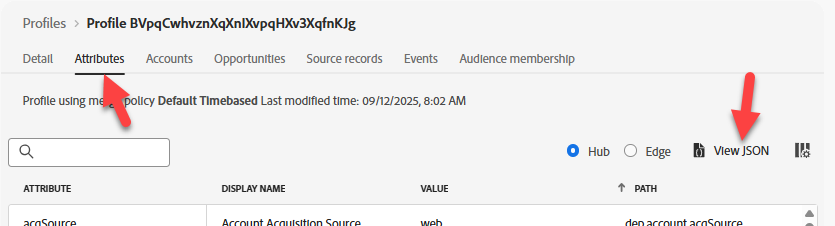

# Convalida profilo su hub

## Finalità di apprendimento

Verifica che l’evento abbia comportato un aggiornamento del profilo e la qualificazione dei segmenti in Profilo in tempo reale sull’hub.

## Cercare il profilo sull’hub

In Adobe Experience Platform, cerca il profilo appena inviato dall’evento appena inviato all’Edge Network.

1. Passa a **Cliente** -> **Profili** -> **Sfoglia** per eseguire la ricerca utilizzando le seguenti informazioni:
   - **Criterio di unione** -> `Default Timebased`
   - **Spazio dei nomi identità** -> `Email`
   - **Valore identità** -> `henry.creel@emailsim.io`
1. Fai clic su **Visualizza** per cercare il profilo


## Controlla il profilo dell’hub

1. Fai clic sul **ID profilo** per aprire il profilo
1. Fai clic prima sulla scheda **Attributi** e sul pulsante di scelta **Hub** per visualizzare il **profilo Hub**


## Convalida eventi

1. Fai clic su **Eventi** nella barra di navigazione superiore per visualizzare l&#39;evento appena inviato


## Convalidare segmenti

### Tramite JSON

1. Fai clic sull&#39;intestazione **Attributi** e visualizza **JSON**

   

2. Trova **segmentMembership**.  Deve essere simile al seguente (gli ID saranno diversi)

```json
  "segmentMembership": {
    "ups": {
      "ce0b8386-ef2a-4244-8ad0-1a72d6494181": {
        "status": "realized",
        "lastQualificationTime": "2025-12-15T23:11:49Z"
      },
      "8ce516fe-920a-4f9d-b92b-0403890a8491": {
        "status": "realized",
        "lastQualificationTime": "2025-12-12T15:01:01Z"
      }
    }
```

>[!NOTE]
>
>**Come leggere segmentMembership?**
>
>[https://experienceleague.adobe.com/en/docs/experience-platform/xdm/field-groups/profile/segmentation](https://experienceleague.adobe.com/en/docs/experience-platform/xdm/field-groups/profile/segmentation)
>
>**ups:** Questa è la chiave della mappa per diversi tipi di pubblico supportati da AEP.  La chiave ups contiene i tipi di pubblico creati dal Generatore di regole.  Altri tipi di pubblico saranno contenuti in altre chiavi (ad esempio, AAM).
>
>**lastQualificationTime** Timestamp dell&#39;ultima qualifica di questo profilo per il segmento
>
>**stato**
>
>*realized*: il profilo è idoneo per il segmento.
>*exited*: il profilo sta uscendo dal segmento come parte della richiesta corrente.
>
>

### Tramite interfaccia utente

1. Un modo più semplice per convalidare il profilo idoneo per i tipi di pubblico consiste nell&#39;esaminare la scheda **Appartenenza al pubblico** (dovresti vedere almeno questi):
   - dep: qualsiasi streaming di eventi (entro un’ora)
   - dep: qualsiasi Edge di eventi (entro un’ora)


>[!NOTE]
>
>**Perché non ci sono tipi di pubblico in batch?**
>
>Non dovresti visualizzare **dep: qualsiasi batch di eventi (entro il giorno)** qualificato per, in quanto i dati vengono trasmessi in streaming e la valutazione batch viene eseguita una volta al giorno.

## Riassunto

Nell’hub è presente un profilo qualificato per il pubblico previsto.
