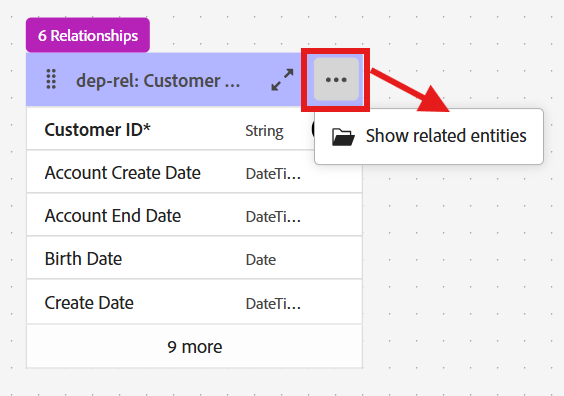

# Sfoglia schemi

## Obiettivo

Nei passaggi successivi spostarti nell’interfaccia utente per visualizzare gli schemi e le relative relazioni.  Questo è importante per acquisire familiarità con gli schemi e le relazioni disponibili durante la creazione della campagna.

## Visualizza schemi

Il modello dati relazionale Connection 5G è già stato creato. Per visualizzare gli schemi, vai alla pagina **Schemi -> Sfoglia** nell&#39;interfaccia utente.

Nella casella di ricerca immettere `dep-rel` per visualizzare tutti gli schemi.

>[!NOTE]
>
>Nota che il tipo di tutti gli schemi è *Relazionale*

## Visualizza diagramma relazioni

Con gli schemi XDM relazionali è possibile visualizzare facilmente il diagramma di relazione entità (ERD) selezionando qualsiasi schema e facendo clic sul pulsante Visualizza diagramma relazione.

Effettua le seguenti operazioni:

1. Fare clic sulla scheda **Relazioni** e quindi sul pulsante **Visualizza diagramma relazioni**

   

2. Fai clic su **Seleziona schemi**
3. Dal popup, selezionare `dep-rel: Customer Account` e quindi fare clic su **Conferma**

   

4. Nel RED, fai clic su **3 punti** e seleziona **Mostra entità correlate**

   

5. Visualizzare il documento ERD con tutte le tabelle direttamente correlate a dep-rel: Conto cliente. È possibile scaricare ERD come file PNG.

>[!TIP]
>
>Fantastico eh?!

## Riassunto

Ora puoi vedere quanto è facile navigare nell’interfaccia utente Schema e relazioni.  Puoi selezionare uno o più schemi specifici e navigare per visualizzare le relazioni utili per comprendere e utilizzare i dati nell’orchestrazione delle campagne.

Puoi trovare ulteriori [qui](https://experienceleague.adobe.com/it/docs/journey-optimizer/using/data-management/get-started-schemas) se sei interessato.
